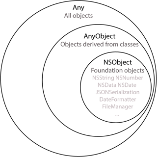

## Any와 AnyObject

- `Any`는 스위프트의 모든 데이터 타입을 사용할 수 있는 **카워드**입니다.
- `AnyObject`는 Any보다 한정적인 의미로 클래스의 인스턴스만 할당할 수 있는 **프로토콜** 입니다.

> NOTE: Any와 AnyObject는 될 수 있으면 사용하지 않는 편이 좋습니다. 그 이유는 타입에 엄격한 Swift 특성상 매번 타입 확인 및 변환을 해줘야 하는 과정이 필요하고 예기치 못한 오류 또한 발생할 수 있기 때문입니다.

#### 참고

- 야곰의 Swift
- [Zedd Blog](https://zeddios.tistory.com/213)

[돌아가기 > 배우는 내용](https://github.com/kbw2204/swiftNote)