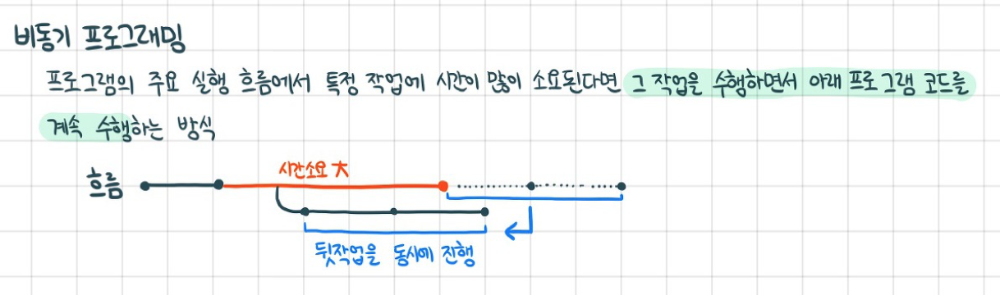
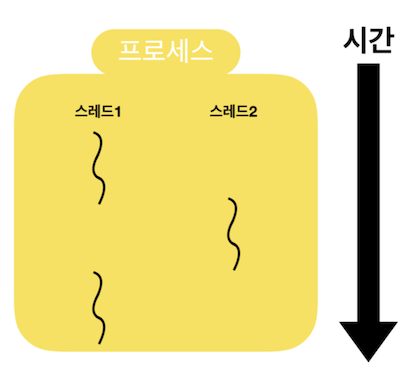
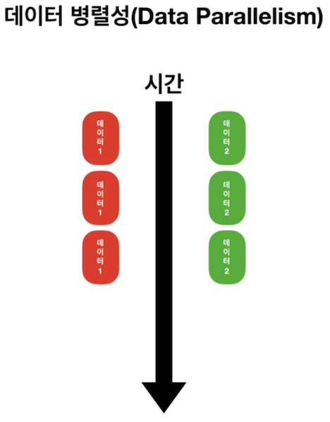
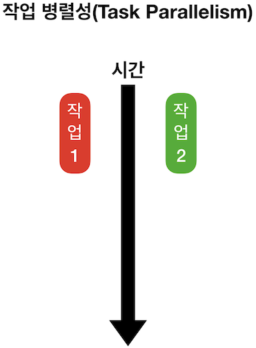
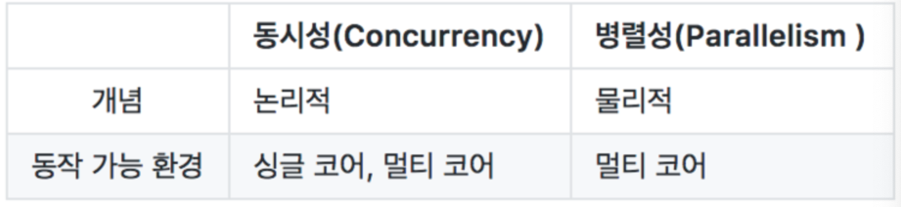
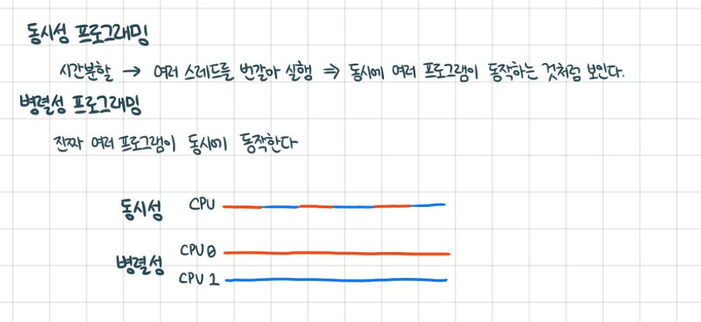

## 동기 프로그래밍과 비동기 프로그래밍

추가 작업할 것들

<li>비동기 처리기술 GCD, OperationQueue 확실하게 정리하기</li>

### 동기 프로그래밍이란..?
동기 프로그래밍은 현재 작업의 응답과 다음 작업의 요청의 타이밍을 서로 맞추는 것이다. 즉 한 작업이 끝나고 다음 작업이 될 수 있도록..
> 현재의 작업을 끝내고 다음 작업을 요청 하는 프로그램

### 그럼 `비동기 프로그래밍은??`

결과적으로 여러 작업을 처리 할 때 하나의 작업이 끝나기까지 `기다리지 않고` 별도의 공간에 맡겨둔 뒤 다음 코드를 실행하는 `병렬처리 방식`을 비동기 프로그래밍이라고 한다. 비동기 프로그래밍을 알기 위해 알아야 할 개념 중 하나가 쓰레드 이다.

> 여러 공간에서 병렬적으로 일하게 만들기(작업 큐에 넣어 다른 공간에 각각 스레드에서 수행시킴)

### 비동기 프로그래밍을 알기 위해 알아야 할 것들

- `프로세스`: 하나의 프로그램이 메모리에서 적재되어 실행되는 작업 단위

- `쓰레드`: 쓰레드는 하나의 프로세스 내에서 실행되는 `작업흐름의 단위`를 말한다. 프로그램 실행이 시작될 때부터 동작하는 쓰레드를 `메인 쓰레드`라고 하고, 그 외에 생성된 쓰레드를 `서브 쓰레드 or 세컨더리 쓰레드`라고 한다.
  - `멀디쓰레딩`: 보통 한 프로세스는 하나의 쓰레드를 가지고 있고 환경에 따라 여러 쓰레드를 동시에 실행할 수 있다. 이러한 방식을 `멀티쓰레딩`이라고 한다. 
- `코어`: 프로세서에서 코어는 주요 연산회로입니다. 싱글코어는 말 그대로 하나의 연산회로가 내장되어있는 것이고 듀얼코어는 두 개의 연산회로가 내장된 것을 뜻합니다. 또, 여러 개의 코어를 가진 프로세서를 멀티 프로세서라고 합니다.

### 동기 프로그래밍은..

요청과 그 결과가 동시에 일어나는.. 프로그래밍 이다.. 그렇기 때문에 한 작업이 요청을 하면 시간이 얼마나 걸리던지 요청한 자리에서 결과가 나올 때 까지 기다려야 하기 때문에 `병렬처리 방식에는 어울리지 않는다.` 즉 이름만 보면 동시에 실행되는 것 같지만 사실은 서로 번갈아 가면서 실행되는 방식..
> 즉 시간분할을 하여 여러 스레드를 번갈아가면서 실행한다! -> 병렬처리 같지만 사실 번갈아가면서다!

### 병렬(Parallelism) 프로그래밍

물리적으로 동시에 정확히 실행되는 것을 말한다. 멀티코어에서 멀티 쓰레드를 동작시키는 방식으로 `데이터 병렬성`과 `작업 병렬성`으로 구분된다.

- `데이터 병렬성` : 전체 데이터를 나누어 서브 데이터들로 만든 뒤, 서브 데이터들을 병렬 처리해서 작업을 빠르게 수행하는 방법.

- `작업 병렬성` : 서로 다른 작업을 병렬 처리하는 것

### 동시성과 병렬성의 차이

동시성 프로그래밍과 병렬성 프로그래밍 모두 비동기(Asynchronous) 동작을 구현할 수 있지만, 그 동작 원리가 다르다.

이 사진이 더 확 와닿는다..

> 동시성은 싱글코어(번갈아가면서 하면 되니깐..) 및 멀티코어에서 모두 구현할 수 있지만, 병렬성은 멀티 코어에서만(진짜 병렬이라..) 구현할 수 있다.

### IOS환경 동시성 프로그래밍 지원 종류

- `Grand Central Dispatch (GCD)` : 멀티 코어와 멀티 프로세싱 환경에서 최적화된 프로그래밍을 할 수 있도록 애플이 개발한 기술.
- `연산 대기열 (Operation Queue)` : 비동기적으로 실행되어야 하는 작업을 객체 지향적인 방법으로 사용
- `Thread` : 멀티스레드 프로그래밍을 위한 애플에서 제공하는 스레드 클래스

#### 참고

- [Thread - Apple Developer Doc](https://developer.apple.com/documentation/foundation/thread)
- [OperationQueue - Apple Developer](https://developer.apple.com/documentation/foundation/operationqueue)
- [개발 블로그](https://etst.tistory.com/114)

[돌아가기 > 배우는 내용](#배우는-내용)