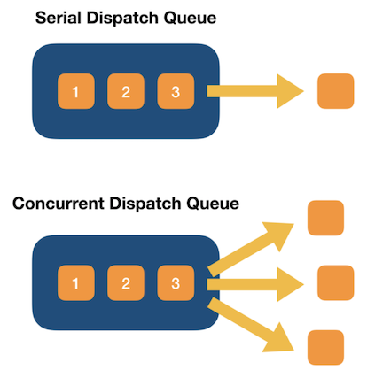

## DispatchQueue

> class DispatchQueue: DispatchObject

### DispatchQueue는 뭐야??

> 디스패치큐는 **작업을 연속적 or 동시에 진행**하기는 하지만, 언제나 **먼저 들어오면 먼저 나가는 순서로 실행**(FIFO 큐)됩니다. **Serial Dispatch Queue**(default)는 한 번에 하나의 작업만을 실행하며, 해당 작업이 대기열에서 제외되고 새로운 작업이 시작되기 전까지 기다립니다. 이와는 반대로 **Concurrent Dispatch Queue**는 이미 시작된 작업이 완료될 때까지 기다리지 않고 가능한 많은 작업을 진행합니다. **DispatchQueue의 장점**은 일반 스레드 코드보다 쉽고 효율적으로 코드를 작성할 수 있다는 점입니다.  디스패치큐는 GCD 기술의 일부 입니다.


### Grand Cetral Dispatch

> 줄여서 **GCD**.. 멀티코어와 멀티 프로세싱 환경에서 최적화된 프로그래밍을 할 수 있도록 애플이 개발한 기술.. 실행할 태스크를 Dispatch Queue에 추가하면 GCD는 태스크(작업)에 맞는 스레드를 자동으로 생성해서 실행하고, 작업이 종료되면 해당 스레드를 제거합니다.

### DispatchQueue 특징

- FIFO 큐
- 명확하고 쉬운 인터페이스
- 스레드 관리를 자동으로 해줍니다.
- 어셈블리 레벨에서 튜닝되어 빠른 동작 제공
- 메모리 면에서도 효율적(애플리케이션 메모리를 점유하지 않기 때문)
- 작업중 예외 발생시키지 않습니다.
- 비동기적으로 작업을 queue에 넣어도 데드락이 생기지 않는다.
- Serial DispatchQueue는 lock이나 여러 동기화 연산보다 더 효과적

### 대기열(Queue) 유형



- **Serial**
대기열(Queue)에 등록한 순서대로 작업을 실행합니다. 하나의 작업을 실행하고 실행이 끝날 때까지 대기열(Queue)에 있는 다른 작업을 미루고 있다가 이전 작업이 끝나면 실행합니다.
- **Concurrent**
실행 중인 작업이 끝나기를 기다리지 않고 대기열(Queue)에 있는 작업을 동시에 별도의 스레드를 사용하여 실행합니다. 즉, 병렬처리 방식입니다.
- **Main dispatch queue**
globally available serial queue that executes tasks on the application’s main thread..

### Dispatch Source

> **Dispatch Source**는 특정 시스템 이벤트들을 비동기적으로 처리하기 위한 메커니즘이다. Dispatch Source는 특정 시스템 이벤트가 발생했을 때 그 정보를 캡슐화하고, 이벤트가 일어날 때마다 특정 함수나 클로저를 DispatchQueue를 통해 실행하도록 해줍니다.

- 지원하는 시스템 이벤트
	- 타이머
	- 시그널 : [UNIX의 시그널](https://ko.wikipedia.org/wiki/유닉스_신호)을 의미
	- 파일 디스크립터 관련 이벤트
	- 프로세스 관련 이벤트
	- 그외 각종 커스텀 이벤트

### OperationQueue vs DispatchQueue

#### 1. [OperationQueue](https://developer.apple.com/library/archive/documentation/General/Conceptual/ConcurrencyProgrammingGuide/OperationObjects/OperationObjects.html#//apple_ref/doc/uid/TP40008091-CH101-SW1)

- Operation Queue는 작업 **우선순위와 준비 상태에 따라 대기중인 작업(object)**를 실행합니다.
- Operation Queue에서는 동시에 실행할 수 있는 연산(Operation)의 최대 수를 지정할 수 있습니다.
- Operation Queue에서는 연산(Operation)을 일시 중지, 다시 시작 및 취소를 할 수 있습니다.
- Operation Queue에서는 Objective-C 객체를 사용하여 작업을 캡슐화하고 수행하는 방법을 보여줍니다.

#### 2. [DispatchQueue](https://developer.apple.com/library/archive/documentation/General/Conceptual/ConcurrencyProgrammingGuide/OperationQueues/OperationQueues.html#//apple_ref/doc/uid/TP40008091-CH102-SW1)
	
- FIFO큐, **추가 된 순서대로 한 번에 하나의 작업**을 실행합니다.
- DispatchQueue는 C 기반 애플리케이션에서 태스크를 동시에 실행하는 방법을 보여줍니다.

### 둘 중에 어떤거 사용해야해?

- **Operation Queue** : 비동기적으로 실행되어야 하는 작업을 객체 지향적인 방법으로 사용하는 데 적합합니다. KVO(key Value Observing)를 사용해 작업 진행 상황을 감시하는 방법이 필요할 때도 적합합니다.
- **DispatchQueue** : 작업이 복잡하지 않고 간단하게 처리하거나 특정 유형의 시스템 이벤트를 비동기적으로 처리할 때 적합합니다. 예를 들면 타이머, 프로세스 등의 관련 이벤트입니다.

### 간단한 예제

```
// 1. 이미지를 다운로드하는 경우 이미지 다운로드가 완료될 때까지 모든 기능이 멈춰버리는 동기 메소드 임으로
// 이미지 다운로드같은 경우 백그라운드로 처리해준다. 아래 global메소드는 아무대서나 작동되는 것으로, 백그라운드로 작동됨.
DispatchQueue.global().async {
	guard let imageURL: URL = URL(string: friend.picture.thumbnail) else {return}
	guard let imageData: Data = try? Data(contentsOf: imageURL) else {return}
}

// 이미지 처리, tableview.reload() 와 같은 UI를 처리할 경우 비동기로 처리를 해줘야한다
DispatchQueue.main.async {
	cell.imageView?.image = UIImage(data: imageData)
	// or
	tableView.reload()
}
```

#### 참고

- [DispatchQueue - Apple Developer Documentation](https://developer.apple.com/documentation/dispatch/dispatchqueue)
- [DispatchQos - Apple Developer Documentation](https://developer.apple.com/documentation/dispatch/dispatchqos)
- [Dispatch - Apple Developer Documentation](https://developer.apple.com/documentation/dispatch)
- [Grand Central Dispatch - Wikipedia](https://en.wikipedia.org/wiki/Grand_Central_Dispatch)
- [DispatchQueue - Joshua blog](https://jcsoohwancho.github.io/2019-09-04-동시성-프로그래밍(1)-동시성-기본/)

[돌아가기 > 배우는 내용](https://github.com/kbw2204/swiftNote)