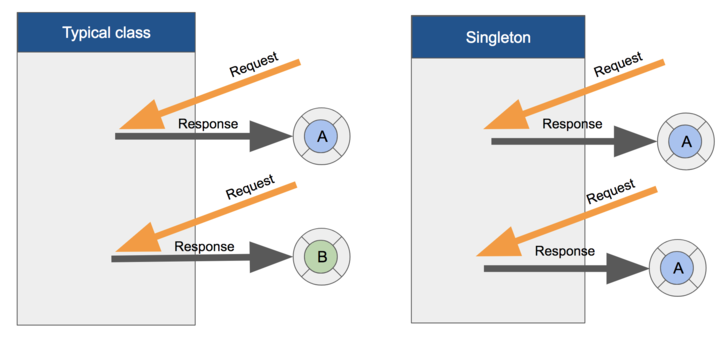

<details><summary>inbox</summary>
<li><a href = "#멀티스레드 환경에서 안전한 싱글턴 인스턴스 만드는 법"><code>안전한 싱글턴</code></a></li>
</details>

## 싱글턴

ios 애플리케이션 디자인 패턴 중 하나로 **'특정 클래스의 인스턴스가 오직 하나임을 보장하는 객체'를 의미한다.** 싱글턴은 애플리케이션이 요청한 횟수와는 관계없이 이미 생성된 같은 인스턴스를 반환한다. 즉 애플리케이션 내에서 특정 클래스의 인스턴스가 딱 하나만 있기 때문에 다른 인스턴스들이 공요해서 사용할 수 있다.

쉽게 말해서 싱글턴 디자인 패턴은 전역변수를 사용하지 않고 객체를 하나만 생성하여 생성된 객체를 어디서든지 참조할 수 있도록 하는 패턴이다.



### 싱글턴 사용 이유
1. 메모리 관리: 최초의 한번만 메모리를 할당한다는점(static)에서 고정된 메모리 영역에서의 사용으로 메모리 낭비 방지
2. 공유: 싱글턴으로 만들어진 클래스의 인스턴스는 전역 인스턴스이기 때문에 다른 클래스에서 데이터를 공유하기 쉽다.
3. 두 번째 이용부터 객체 로딩 시간이 줄어들어 성능향상
   
### 싱글턴의 단점은..?

1. 싱글턴 인스턴스가 너무 많은 데이터를 공유하거나 너무 응집되어 있으면 다른 클래스의 인스턴스들 간 결합도가 높아져 "개발-폐쇄 원칙"을 위배하게 됨 -> 객체 지향 설계 원칙 어긋난다.
2. 멀티스레드환경에서 동기화 처리를 안하면 인스턴스가 두개가 생성된다든지 하는 경우가 발생할 수 있다.

### 멀티스레드 환경에서 안전한 싱글턴 인스턴스 만드는 법

+ 추가작업

### 싱글턴 사용 예제소스
1. swift 파일을 하나 생성한다.
2. 우리가 알고있는 class를 작성한고, 필요시 관련 메소드를 작성해도 된다.
```
import Foundation

class Singleton {
    static let shared = Singleton()
    var name: String?
    var phoneNumber: String?
    
    func initialize() {
        // 초기화
        UserInformation.shared.name = ""
        UserInformation.shared.phoneNumber = ""
    }
}
```
3. 선언한 변수와 메소드들은 `Singleton.shared.name` 이런식으로 접근하여 사용한다.

### Cocoa 프레임워크에서의 싱클턴 디자인 패턴
> Cocoa 프레임워크에서 싱글턴 디자인 패턴을 활용하는 대표적인 클래스

*싱글턴 인스턴스를 반환하는 팩토리 메서드나 프로퍼티는 일반적으로 shared 라는 이름을 사용

- FileManager
	- 애플리케이션 파일 시스템을 관리하는 클래스
	- **FileManager.default**
- URLSession
	- URL 세션을 관리하는 클래스
	- **URLSession.shared**
- NotificationCenter
	- 등록된 알림의 정보를 사용할 수 있게 해주는 클래스
	- **NotificationCenter.default**
- UserDefaults
	- Key-Value 형태로 간단한 데이터를 저장하고 관리할 수 있는 인터페이스를 제공하는 데이터베이스 클래스
	- **UserDefaults.standard**
- UIAoolication
	- ios에서 실행되는 중앙제어 애플리케이션 객체
	- **UIApplication.shared**

#### 주의할 점
싱글턴 디자인 패턴은 애플리케이션 내의 특정 클래스의 인스턴스가 하나만 존재하기에, 불필요하게 여러 개 만들어질 필요가 없는 경우에 많이 쓰인다. 예를 들어서 환경설정, 네트워크 연결처리, 데이터 관리 등이 있다.

**하지만 멀티 스레드 환경에서 동시에 싱글턴 객체를 참조할 경우 원치 않는 결과를 가져올 수 있다.**

#### 참고
- [Singleton - Apple Developer](https://developer.apple.com/library/content/documentation/General/Conceptual/DevPedia-CocoaCore/Singleton.html)
- [Cocoa Design Patterns](https://developer.apple.com/documentation/swift/cocoa_design_patterns#//apple_ref/doc/uid/TP40014216-CH7-ID8)

[돌아가기 > 배우는 내용](#배우는-내용)