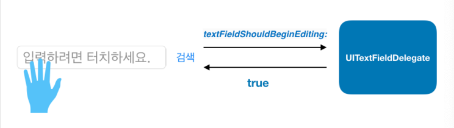

## Delegation
### Delegation.. 무슨 의미야..?
```
Delegation: [명사] 대표(자), 사절, 위임, 대리(자)
	    [동사](권한, 업무 등을) 위임하다, (대표를) 선정하다
```

### Delegation Design Pattern
> 하나의 객체가 다른 객체를 **대신해** 동작 또는 조정할 수 있는 기능
- Foundation, UIKit, AppKit, Cocoa Touch 등 애플의 프레임워크에서 광범위하게 활용 가능
- 주로 프레임워크 객체가 위임을 요청하며, 커스텀 컨트롤러 객체가 위임을 받아 특정 이벤트에 대한 기능을 구현
- 델리게이션 디자인 패턴은 커스텀 컨트롤러에서 세부 동작을 구현함으로써 동일한 동작에 다양한 대응을 할 수 있게 해줌


ex) UITextFieldDelegate는 UITextField의 객체의 구문을 편집하거나 관리하기 위해 아래와 같은 메서드를 정의함

```
// 대리자에게 특정 텍스트 필드의 문구를 편집해도 되는지 묻는 메서드
func textFieldShouldBeginEditing(UITextField)
	
// 대리자에게 특정 텍스트 필드의 문구가 편집되고 있음을 알리는 메서드
func textFieldDidBeginEditing(UITextField)

// 특정 텍스트 필드의 문구를 삭제하려고 할 때 대리자를 호출하는 메서드
func textFieldShouldClear(UITextField)

// 특정 텍스트 필드의 `Return` 키가 눌렸을 때 대리자를 호출하는 메서드
func textFieldShouldReturn(UITextField)
```

**델리게이트는 특정 상황에 대리자에게 메세지를 전달하고 그에 적절한 응답을 받기 위해 사용됨**




### DateSource
- Delegate가 사용자 인터페이스 제어에 관련된 권한을 위임받고
- **데이터소스는 데이터를 제어하는 기능을 위임받음**

### Protocol(프로토콜)
- 코코아터치에서 프로토콜을 사용해 델리게이션과 데이터소스를 구현할 수 있다.
- *객체간 소통을 위한 강력한 통신 규약으로 데이터나 메시지를 전달할 때 사용
- 프로토콜은 특별한 상황에 대한 역할을 정의하고 제시하지만, 세부기능은 미리 구현해두지 않는다.
- 구조체, 클래스, 열거형에서 프로토콜을 채택하고 특정 기능을 수행하기 위한 요구사항을 구현할 수 있다.


#### 참고
- [Cocoa Design Patterns](https://developer.apple.com/documentation/swift/cocoa_design_patterns#//apple_ref/doc/uid/TP40014216-CH7-ID8)
- [Delegation](https://docs.swift.org/swift-book/LanguageGuide/Protocols.html#//apple_ref/doc/uid/TP40014097-CH25-ID276)

[돌아가기 > 배우는 내용](https://github.com/kbw2204/swiftNote)