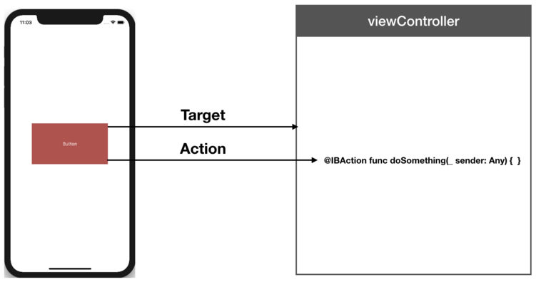

## Target-Action 디자인 패턴
> Target-Action 디자인 패턴에서 객체는 이벤트가 발생할 때 다른 객체에 메시지를 보내는 데 필요한 정보를 포함합니다. 액션은 특정 이벤트가 발생했을 때 호출할 메서드를 의미합니다. 이벤트 발생 시 전송된 메시지를 Action 메시지라고 하고, Target은 프레임워크 객체를 포함한 모든 객체가 될 수 있으나, 보통 컨트롤러가 되는 경우가 일반적입니다.



### 액션 메서드
> `IBAction`은 인터페이스 빌더가 메서드를 인지할 수 있도록 해줍니다.(스토리보드에 액션 메소드 연결할 때) `target-Action`을 사용할 땐 @objc를 앞에 붙혀서 #select에 사용할 수 있도록 합니다.
```
// 프로그래밍 방식
@objc func doSomething(_ sender: Any) {

}

// 인터페이스 빌더
@IBAction func doSomething(_ sender: Any) { 

}
```

#### 참고
- [UIControlEvent - UIKit](https://developer.apple.com/documentation/uikit/uicontrolevents)
- [UIControl - UIKit](https://developer.apple.com/documentation/uikit/uicontrol)

[돌아가기 > 배우는 내용](https://github.com/kbw2204/swiftNote)