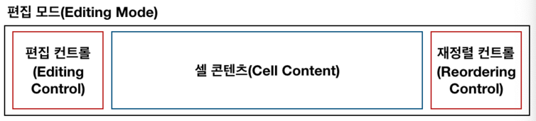
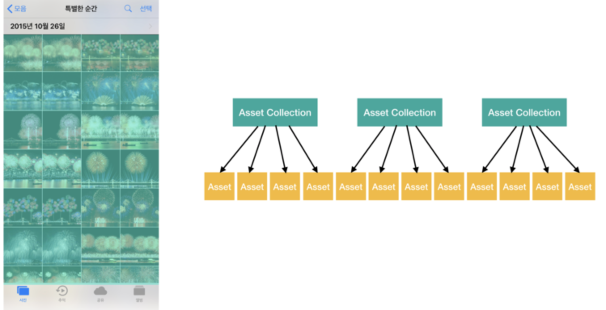

# iOS 프로그래밍 정리md

> [Edwith](https://www.edwith.org), Apple 개발자 문서에서 공부한 내용들을 정리해서 올리는 repo 입니다.

<li><a href = "./solution.md"><code>오류 해결책(오답노트)</code></a></li>
<li><a href = "https://github.com/kbw2204/swiftExtention"><code>Swift extension 모음</code></a></li>
<li><a href = "./cs/cs50.md"><code>CS 50(추가 정리)</code></a></li>

## 배우는 내용
<details><summary>Inbox</summary>
<li><a href = "#Human-Interface-Guideline"><code>Human Interface Guideline</code></a></li>
<li><a href = "#Any와-AnyObject"><code>Any, AnyObject</code></a></li>
</details>

<details><summary>FrameWork</summary>
<li><a href = "#photos-FrameWork"><code>Photos</code></a></li>
</details>

<details><summary>디자인 패턴</summary>
<li><a href = "#디자인-패턴이란"><code>디자인 패턴이란?</code></a></li>
<li><a href = "#Delegation"><code>Delegation Pattern</code></a></li>
<li><a href = "./Design Pattern/singleton.md"><code>Singleton</code></a></li>
<li><a href = "#Target-Action-디자인-패턴"><code>Targte-Action</code></a></li>
</details>

<details><summary>화면전환</summary>
<li><a href = "#네비게이션-인터페이스"><code>네비게이션 인터페이스</code></a></li>
<li><a href = "#Modal"><code>Modality</code></a></li>
</details>

<details><summary>UIKit</summary>
<li><a href = "#UITextField"><code>UITextField</code></a></li>
<li><a href = "#UIDatePicker"><code>UIDatePicker</code></a></li>
<li><a href = "#StackView"><code>UIStackView</code></a></li>
<li><a href = "#"><code>UIImagePickerController</code></a></li>
<li><a href = "#Gesture-Recognizer"><code>UIGestureRecognizer</code></a></li>
<li><a href = "#뷰의-상태변화-감지-메서드"><code>뷰의 생명주기</code></a></li>
<li><a href = "#UITableView"><code>UITableView</code></a></li>
<li><a href = "#UITableViewCell"><code>UITableViewCell</code></a></li>
<li><a href = "#UICollectionView"><code>UICollectionView</code></a></li>
<li><a href = "#UIAlertController"><code>UIAlertController</code></a></li>
<li><a href = "#UITabBarController"><code>UITabBarController</code></a></li>
<li><a href = "#"><code>UINavigationItem</code></a></li>
<li><a href = "#"><code>UIBarButtonItem</code></a></li>
<li><a href = "#UIScrollView"><code>UIScrollView</code></a></li>
<li><a href = "#UIActivityViewController"><code>UIActivityViewController</code></a></li>
<li><a href = "#뷰의-재사용"><code>View Reuse</code></a></li>
<li><a href = "#TableViewCell-Customize-만들기"><code>Table View Cell Customize</code></a></li>
<li><a href = "#Segue"><code>Segue</code></a></li>
</details>

<details><summary>Foundation</summary>
<li><a href = "#DateFormatter"><code>DateFormatter</code></a></li>
<li><a href = "#URLSession"><code>URLSession</code></a></li>
<li><a href = "#Notification"><code>Notification</code></a></li>
</details>

<details><summary>Swift</summary>
<li><a href = "./Swift/Optional.md"><code>옵셔널</code></a></li>
<li><a href = "#ARC"><code>ARC</code></a></li>
<li><a href = "#"><code>Dictionary의 활용</code></a></li>	
<li><a href = "#guard"><code>guard 사용법</code></a></li>
<li><a href = "#Codable"><code>Codable</code></a></li>
<li><a href = "#JSONDecoder-/-JSONEncoder"><code>JSONDecoder</code></a></li>
<li><a href = "#ATS"><code>ATS(App Transport Security)</code></a></li>
<li><a href = "#함수객체"><code>함수객체</code></a></li>
</details>

<details><summary>Concurrency Programming(실시간 프로그래밍)</summary>
<li><a href = "./Concurrency Programming/Asynchronous.md"><code>Asynchronous Programming</code></a></li>
<li><a href = "#OperationQueue"><code>OperationQueue</code></a></li>
<li><a href = "#DispatchQueue"><code>DispatchQueue</code></a></li>
</details>

<details><summary>Swift Type</summary>
<li><a href = "#"><code>String</code></a></li>
<li><a href = "#"><code>Array</code></a></li>
<li><a href = "#"><code>Dictionary</code></a></li>
<li><a href = "#Set"><code>Set</code></a></li>
<li><a href = "#Tuple"><code>Tuple</code></a></li>
<li><a href = "./Type/protocols.md"><code>Protocols</code></a></li>
</details>

<details><summary>Swift Standard Library</summary>
<li><a href = "#sort"><code>sort()</code></a></li>
</details>

<details><summary>강의별 정리 목차</summary>
<li><a href = "./lecture/project_2.md"><code>Project 2</code></a></li>
<li><a href = "./lecture/project_3.md"><code>Project 3</code></a></li>
<li><a href = "./lecture/project_4.md"><code>Project 4</code></a></li>
<li><a href = "./lecture/project_5.md"><code>Project 5</code></a></li>
</details>

## Human Interface Guideline
H.I.G는 앱을 개발할 때 필요한 디자인과 동작을 포함한 여러 규칙을 통하여 사용자가 인터페이스를 구성하는 방법에 대한 지침이다.
> 한마디로 가이드라인!
### 왜 H.I.G 문서를 읽어야 하나?
- 개발자가 아닌 사용자의 입장에서 애플리케이션을 바라보고 설계할 수 있다.
- 기준점을 제시하여 협업의 효율성 상승
- 이미 검증된 사용자 경험을 이해하는 과정

### ios Design 테마
- Clarity : 시스템 전체에서 텍스트는 모든 크기에서 읽을 수 있어야 하고, icon 또한 적절하게 써야 함.
- Deference : 유동적인 모션과 선명하고 아름다운 인터페이스는 콘텐츠를 이해하고 상호 작용하도록 도와줌. 일반적으로 콘텐츠는 전체 화면을 채우지만 반투명과 흐림은 종종 더 많은 것을 암시한다. 베젤 및 그림자의 사용을 최소화하여 인터페이스를 밝게 유지하면서 컨텐츠를 최우선한다.
- Depth : 뚜렷한 시각적 계층과 현실적인 동작은 계층을 전달하고 활력을 부여하며 이해를 돕는다. 접촉 및 발격 가능성은 즐거움을 높이고 기능 및 추가 컨텐츠에 대한 액세스를 가능하게 한다. 전환은 콘텐츠를 탐색할 때 깊이감을 제공한다.

### 디자인 원칙
- 심미 무결성
> ex) 사람들이 심각한 작업을 수행하는데 도움이되는 앱은 미묘하고 눈에 거슬리지 않는 그래픽, 표준 컨트롤 및 예측 가능한 동작을 사용하여 집중력을 유지할 수 있습니다. 반면에 게임과 같은 몰입형 앱은 재미 있고 흥분할 수 있는 매력적인 모습을 제공 할 수 있으며 동시에 발견을 장려합니다.
- 일관성
> 일관된 응용프로그램은 인터페이스 요소, 잘 알려진 아이콘, 스타일 및 통일된 용어를 사용하여 익숙한 표준 및 페러다임을 구현합니다. 이러한 앱은 사람들이 생각하는 방식으로 기능과 동작을 합니다.
- 직접 조작
> 컨텐츠를 화면으로 직접 조작하는 것은 사람들을 끌어들이고 이해를 돕습니다. 장치를 회전하거나 제스처를 사용하여 화면 콘텐츠에 영향을 줄 때 직접 조작을 경험합니다. 직접조작을 통해 즉각적이고 가시적인 행동 결과를 볼 수 있습니다.
- 피드백
> 피드백은 행동을 인정하고 사용자들에게 정보를 제공합니다. 진행률 표시와 같이 작성 상태를 전달하며 애니메이션 및 사운드는 작업 결과를 명확하게 보여줍니다.
- 은유
- 사용자 컨트롤
> 대화형 요소를 넣어 친숙하고 예측 가능하게 유지하고 작업이 이미 진행중인 경우에도 작업을 취소하기 쉽게함으로써 사람들이 통제 가능 상태에 있는것처럼 느낄 수 있게 합니다.

#### 참고
- [Human Interface Guideline](https://developer.apple.com/design/human-interface-guidelines/ios/overview/themes/)

[돌아가기 > 배우는 내용](#배우는-내용)

## 네비게이션 인터페이스

### 네비게이션 인터페이스란..
> 뷰 이동을 계층적 구조(드릴 다운 인터페이스)로 사용되는 인터페이스이다.


### 네비게이션 컨트롤러는 왜 쓰는거지..?
> 네비게이션 컨트롤러를 사용하게 되면 네비게이션 스택을 사용하여 다른 뷰 컨트롤러를 관리하게 되는데, 기본적으로 ios 화면전환은 stack과 같은 느낌이다.  인터페이스의 stack이란 화면이 바뀔 때마다 원래 있던 화면 위에 새 화면이 올라가는 형식인데 그래서 다시 이젠 화면으로 돌아갈 때엔 이전에 올렸던 화면을 빼야한다. 여기서 네이게이션 컨트롤러를 사용하면 뷰를 pop 하거나 push를 하기 용의해지는데, 뷰를 pop하게 되면 이전에 올라갔던 화면을 빼주는 역할을 하게 된다. + 추가요청..

### 네비게이션 스택의 팝과 푸쉬
1. 네비게이션 스택의 push
> 네비게이션 스택에 새로운 뷰 컨트롤러가 푸쉬되면서 인스턴스가 생성되고, 내비게이션 스택에 추가
~~~
self.navigationController?.pushViewController(viewController: UIViewController>, animated: true)
~~~

2. 네비게이션 스택의 pop
> 네비게이션 스택에 존재하는 뷰 컨트롤러가 팝 될 때 생성되었던 뷰컨트롤러의 인스턴스는 다른 곳에서 참조되고 있지 않다면 메모리에서 해제되고, 내비게이션 스택에서 삭제됨
~~~
self.navigationController?.popViewController(animated: true)
~~~

### UINavigationController 코드 사용법
```
// 루트 뷰 컨트롤러가 될 뷰 컨트롤러를 생성합니다.
let rootViewController = UIViewController()
// 위에서 생성한 뷰 컨트롤러로 내비게이션 컨트롤러를 생성합니다.
let navigationController = UINavigationController(rootViewController: rootViewController)
```

### 네비게이션 바 지우기
1. 스토리보드에서
> 
2. 코드
```
navigationController?.isNavigationBarHidden = true
```
#### 참고
- [UINavigationBar - UIKit](https://developer.apple.com/documentation/uikit/uinavigationbar)
- [UINavigationController - UIKit](https://developer.apple.com/documentation/uikit/uinavigationcontroller)

[돌아가기 > 배우는 내용](#배우는-내용)

## Modal
### Modal(모달)이란..?
> 화면 전환 기법! 하지만 화면전환(X) 화면위에띄우기(o)

사실, 화면을 전환한다기 보다는 이목을 집중해야 하는 화면을 다른 화면 위로 띄워(Presenting) 표현하는 방식이다.
- ex 1 ) alert 창을 띄울때(present)
- ex 2 ) 이메일이나 문자를 작성하는 화면같이 뜨는 창

그래서 모달은 내비게이션 인터페이스와는 달리 정보의 흐름을 가지고 화면을 이동한다기 보다는 꼭 이목을 끌어야하는 화면에서 사용한다. 내비게이션 인터페이스를 통해 화면을 표현하는 것과는 용도가 완전히 다르다고 볼 수 있다. 그래서 모달로 보이는 화면은 되도록 단순하고 사용자가 빠르게 처리할 수 있는 내용을 표현하는 것이 좋다. 

### 사용 방법
#### 1. StoryBoard
> ctrl버튼 누른상태에서 드래그(present)

#### 2. Code
```
self.present(ViewController, animated: true, completion: nil)
```

### 나타내기(Presenting) VS 보여주기(Showing a View Controller)

1. 보여주기(Showing a View Controller)
> SubView를 보여줄 때 적합, 프레젠테이션..?을 잘 처리 할 수 있음

2. 나타내기(Presenting)
> 모달 방식으로 뷰를 이동, 프레젠테이션을 처리 못 할 수도 있음

### 다른 스토리보드에서 정의된 뷰 나타내는 방법

```
let storyboard: UIStoryboard = UIStoryboard(name: "SecondStoryboard", bundle: nil)ㄴ
if let myViewController: MyViewController = storyboard.instantiateViewController(withIdentifier: "MyViewController") as? MyViewController {
	// 뷰 컨트롤러를 구성 합니다.
	
	// 뷰 컨트롤러를 나타냅니다.
	self.present(myViewController, animated: true, completion: nil)
}
```

[돌아가기 > 배우는 내용](#배우는-내용)


## 뷰의 상태변화 감지 메서드
### 뷰의 생명주기..
> 뷰가 나타기 전의 과정부터 사라지는 과정까지를 뷰의 생명주기 라고 한다.
#### 순서대로 총 5가지의 과정으로 뷰의 생명주기를 설명할 수 있다.
1. ViewDidLoad 
	- **뷰가 로드 되었을 때**
	-뷰가 처음 로딩 될 때 1회 호출되는 메소드로, **초기화 작업을 하기 좋은 시점**
2. viewWillAppear
	- **뷰가 뷰 계층에 추가되고 화면에 표시되기 직전에 호출**
	- 다른 뷰로 이동했다가 되돌아올 때 재호출 되므로, **화면이 나타날때마다 수행해야하는 작업**을 하기 좋은 시점
3. viewDidAppear
	- **뷰가 뷰 계층에 추가되어 화면에 표시되면 호출**
4. viewWillDisappear
	- **뷰가 뷰 계층에서 사라지기 직전 호출**
	- **뷰가 생성된 뒤 발생한 변화를 이전상태로 되돌리기 좋은 시점**
5. viewDidDisappear
	- **뷰가 뷰 계층에서 사라진 후 호출**
	- **뷰를 숨기는 것**과 관련된 추가적인 작업을 하기 좋은 시점
	- 시간이 오래 걸리는 작업은 하지 않는 것이 좋음


### 뷰의 레이아웃 변화 메서드
> 뷰가 생성된 후 bounds 및 위치 등의 레이아웃에 변화가 발생했을 때 호출되는 메서드

- func viewWillLayoutSubviews()
	- **뷰가 서브뷰의 레이아웃을 변경하기 직전에 호출되는 메서드**
	- 서브뷰의 에이아웃을 **변경하기 전**에 수행할 작업을 하기 좋은 시점
- func viewDidLayoutSubviews()
	- **서브뷰의 레이아웃이 변경된 후 호출되는 메서드**
	- 서브뷰의 레이아웃을 **변경 한 후** 추가적인 작업을 수행하기 좋은 시점

### ⭐️ 중요
#### 뷰 컨트롤러에서 위 메서드를 사용하기 위해 pverride 키워드를 명시하고 super를 꼭 호출할 것!

```
override func viewDidLoad() {
	super.viewDidLoad() 
	// view가 메모리에 적재된 시점에서 필요한 코드 작성
}
```

#### 참고
- [UIViewController - UIKit](https://developer.apple.com/documentation/uikit/uiviewcontroller)

[돌아가기 > 배우는 내용](#배우는-내용)


## 디자인 패턴이란

디자인 패턴이란 다양한 개발환경에서 비슷한 문제들이 발생할 수 있는데, 이러한 문제들을 해결하는 정형화된 해결책을 말합니다. 즉 개발에 있어서 문제를 해결했던 필터링된 템플릿이나 개발패턴이라고 할 수 있습니다.

### 디자인 패턴 장점

- 테스트된 솔루션
- 코드 통일
- 공통 어휘

### 디자인 패턴 종류

- 생성 패턴
  - Singleton
    - FileManager.default
    - URLSession.shared
    - NotificationCenter.default
    - UserDefaults.standard
    - UIApplication.shared
- 구조 패턴
  - MVC, MVP, MVVM


#### 참고
- [얄미대미 개발 블로그](https://m.blog.naver.com/PostView.nhn?blogId=jdub7138&logNo=220968244920&proxyReferer=https%3A%2F%2Fwww.google.co.kr%2F)
- [iOS 삽질 블로그](https://leejigun.github.io/Top_5_Design_Patterns)
- [edWith - Singleton](https://www.edwith.org/boostcourse-ios/lecture/16855/)

[돌아가기 > 배우는 내용](#배우는-내용)


## Delegation
### Delegation.. 무슨 의미야..?
```
Delegation: [명사] 대표(자), 사절, 위임, 대리(자)
	    [동사](권한, 업무 등을) 위임하다, (대표를) 선정하다
```

### Delegation Design Pattern
> 하나의 객체가 다른 객체를 **대신해** 동작 또는 조정할 수 있는 기능
- Foundation, UIKit, AppKit, Cocoa Touch 등 애플의 프레임워크에서 광범위하게 활용 가능
- 주로 프레임워크 객체가 위임을 요청하며, 커스텀 컨트롤러 객체가 위임을 받아 특정 이벤트에 대한 기능을 구현
- 델리게이션 디자인 패턴은 커스텀 컨트롤러에서 세부 동작을 구현함으로써 동일한 동작에 다양한 대응을 할 수 있게 해줌


ex) UITextFieldDelegate는 UITextField의 객체의 구문을 편집하거나 관리하기 위해 아래와 같은 메서드를 정의함

```
// 대리자에게 특정 텍스트 필드의 문구를 편집해도 되는지 묻는 메서드
func textFieldShouldBeginEditing(UITextField)
	
// 대리자에게 특정 텍스트 필드의 문구가 편집되고 있음을 알리는 메서드
func textFieldDidBeginEditing(UITextField)

// 특정 텍스트 필드의 문구를 삭제하려고 할 때 대리자를 호출하는 메서드
func textFieldShouldClear(UITextField)

// 특정 텍스트 필드의 `Return` 키가 눌렸을 때 대리자를 호출하는 메서드
func textFieldShouldReturn(UITextField)
```

**델리게이트는 특정 상황에 대리자에게 메세지를 전달하고 그에 적절한 응답을 받기 위해 사용됨**


### DateSource
- Delegate가 사용자 인터페이스 제어에 관련된 권한을 위임받고
- **데이터소스는 데이터를 제어하는 기능을 위임받음**

### Protocol(프로토콜)
- 코코아터치에서 프로토콜을 사용해 델리게이션과 데이터소스를 구현할 수 있다.
- *객체간 소통을 위한 강력한 통신 규약으로 데이터나 메시지를 전달할 때 사용
- 프로토콜은 특별한 상황에 대한 역할을 정의하고 제시하지만, 세부기능은 미리 구현해두지 않는다.
- 구조체, 클래스, 열거형에서 프로토콜을 채택하고 특정 기능을 수행하기 위한 요구사항을 구현할 수 있다.


#### 참고
- [Cocoa Design Patterns](https://developer.apple.com/documentation/swift/cocoa_design_patterns#//apple_ref/doc/uid/TP40014216-CH7-ID8)
- [Delegation](https://docs.swift.org/swift-book/LanguageGuide/Protocols.html#//apple_ref/doc/uid/TP40014097-CH25-ID276)

[돌아가기 > 배우는 내용](#배우는-내용)


## StackView
> 스택뷰는 여러 뷰들의 수평 또는 수직 방향으로 묶음으로 쉽게 관리할 수 있는 레이아웃의 인터페이스라 할 수 있다. 스택뷰와 오토레이아웃 기능을 활용하여 화면 크기에 따라 동적으로 적응할 수 있는 사용자 인터페이스를 만들 수 있다. 스택뷰의 레이아웃은 스택뷰의 `axis`, `distribution`, `alignment`, `spacing`과 같은 프로퍼티를 통해 조정한다.


### 스택뷰 사용방법
> 묶고싶은 뷰들을 alt키를 누른 상태로 다중클릭 후 Embed In Stack(하단 4개의 버튼 중 왼쪽 끝) 을 클릭 후 StackView 클릭

### UIStackView 클래스의 주요 프로퍼티
- `var arrangedSubviews` : 스택뷰의 정렬된 뷰의 배열. 스택뷰에 포함된 뷰들을 이 프로퍼티에 저장하고 관리한다.
- `var axis: UILayoutContraintAxis` : 레이아웃의 방향을 결정 ( 수직 vertical, 수평 horizontal)
- `var distribution : UIStackViewDistribution` : 스택뷰에 포함된 뷰가 스택뷰 내에서 어떻게 배치(분배)될지 결정
- `var spacing: CGFloat` : 스택뷰에 정렬된 뷰들 사이의 간격. (기본값 0.0)

### UIStackView 클래스의 주요 메서드
- `func addArrangeSubview(UIView)`: arrangedSubviews 배열에 마지막 요소에 뷰를 추가
- `func insertArrangedSubview(UIView)`: arrangedSubviews 배열의 특정 인덱스에 뷰를 추가
- `func removeArrangedSubview(UIView)`: 스택뷰의 arrangedSubviews 배열로부터 뷰를 제거

#### 참고
- [UIStackView - UIKit](https://developer.apple.com/documentation/uikit/uistackview)


[돌아가기 > 배우는 내용](#배우는-내용)


## Target-Action 디자인 패턴
> Target-Action 디자인 패턴에서 객체는 이벤트가 발생할 때 다른 객체에 메시지를 보내는 데 필요한 정보를 포함합니다. 액션은 특정 이벤트가 발생했을 때 호출할 메서드를 의미합니다. 이벤트 발생 시 전송된 메시지를 Action 메시지라고 하고, Target은 프레임워크 객체를 포함한 모든 객체가 될 수 있으나, 보통 컨트롤러가 되는 경우가 일반적입니다.


### 액션 메서드
> `IBAction`은 인터페이스 빌더가 메서드를 인지할 수 있도록 해줍니다.(스토리보드에 액션 메소드 연결할 때) `target-Action`을 사용할 땐 @objc를 앞에 붙혀서 #select에 사용할 수 있도록 합니다.
```
// 프로그래밍 방식
@objc func doSomething(_ sender: Any) {

}

// 인터페이스 빌더
@IBAction func doSomething(_ sender: Any) { 

}
```

#### 참고
- [UIControlEvent - UIKit](https://developer.apple.com/documentation/uikit/uicontrolevents)
- [UIControl - UIKit](https://developer.apple.com/documentation/uikit/uicontrol)

[돌아가기 > 배우는 내용](#배우는-내용)


## UIDatePicker
> 날짜 및 시간을 입력하는 컨트롤 이다. DatePicker를 사용하면 사용자가 지정한 날짜를 입력받을 수 있다.

### DatePicker의 주요 인터페이스 빌더 속성


- Mode : DatePicker안에 있는 내용을 뭘로 할건지 결정(Time, Date, Date and Time, Count Down Timer) 코드상으로 datePickerMode 프로퍼티를 사용하여 접근 가능
- Locale : DatePicker에 사용될 로케일. 코드상으로 locale 프로퍼티를 통해 접근 가능
- Date : DatePicker가 처음 보여주게 될 날짜 설정. 기본값 : 현재 날짜, 코드상으로 date 프로퍼티를 통해 접근 가능
- Constraints : Date 하단의 Minimum Date와 MaximumDate를 통해 DatePicker의 날짜 범위를 설정할 수 있다. 코드상으로 minimumDate, maximumdate 프로퍼티를 통해 설정 가능
- Timer : DatePicker의 표시되는 초기값. 코드상으로 countDownDuration 프로퍼티를 통해 접근 가능

### DatePicker 클래스의 주요 메서드
- func setDate(Date, animated: Bool) : datePicker 처음 표시 날짜 설정

### DateFormatter
DateFormatter은 날짜와 텍스트 표현 간 변환을 할 수 있게 해준다. DateFormatter의 인스턴스는 Date 객체의 문자열 표현을 생성하고, 날짜 및 시간의 텍스트 표현을 Date 객체로 변환한다.

### DateFormatter의 주요 프로퍼티와 메서드
- func date(from: String) : 주어진 문자열을 Date 객체(날짜와 시간)로 변환하여 반환
- func string(from: Date) : Date 객체를 문자열로 변환하여 반환
- func setLocalizedDateFormatFromTempleate(String) : 지정된 로케일을 사용하여 날짜 형식을 설정
- var dateStyle: DateFormatter.Style : DateFormatter의 날짜 형식
- var timeStyle: DateFormatter.Style: DateFormatter의 시간 형식
- var dateFormat: String!: 고정 형식 날짜 표현을 사용할 때의 날짜 형식
- var locale: Locale!: DateFormatter의 로케일
- var timeZone: TimeZone!: DateFormatter의 시간대

### 예제 코드
- 날짜 형식(Date 객체) -> 문자열 형식
```
import UIKit

let dateFormatter = DateFormatter()
dateFormatter.dateStyle = .full
dateFormatter.timeStyle = .none

let date = Date(timeIntervalSinceReferenceDate: 118800)

// US English Locale (en_US)
dateFormatter.locale = Locale(identifier: "en_US")
print(dateFormatter.string(from: date)) // Tuesday, January 2, 2001

// KOR Korean Locale (ko_KR)
dateFormatter.locale = Locale(identifier: "ko_KR")
print(dateFormatter.string(from: date)) // 2001년 1월 2일 화요일
```

- 문자열 형식 -> 날짜 형식
```
import UIKit

let dateFormatter = DateFormatter()

let dateString = "1970-01-01 08:03:30 +0000"
dateFormatter.dateFormat = "yyyy-MM-dd HH:mm:ss ZZZ"
print(dateFormatter.date(from: dateString)!) // 1970-01-01 08:03:30 +0000
```
#### 참고
- [UIDatePicker - UIKit](https://developer.apple.com/documentation/uikit/uidatepicker)
- [Date - Foundation](https://developer.apple.com/documentation/foundation/date)
- [DateFormatter - Foundation](https://developer.apple.com/documentation/foundation/dateformatter)


[돌아가기 > 배우는 내용](#배우는-내용)


## Gesture Recognizer
> 여러 제스처 관련 이벤트를 인식 시킬 때 사용한다. 특정 제스처 이벤트가 일어날 때 마다 각 Target에 맞는 Action 메시지를 보내어 제스처 관련 이벤트(#select(objc func))를 처리할 수 있다.

### UIGestureRecognizer의 하위 클래스
아래의 7가지의 UIGestureRecognizer 하위 클래스를 통해 여러 제스처를 인식할 수 있다.

1. UITapGestureRecognizer : 싱글탭 또는 멀티탭 제스처
2. UIPinchGestureRecognizer : 핀치(Pinch) 제스처
3. UIRotationGestureRecognizer : 회전 제스처
4. UISwipeGestureRecognizer : 스와이프(swipe) 제스처
5. UIPanGestureRecognizer : 드래그(drag) 제스처
6. UIScreenEdgePanGestureRecognizer : 화면 가장자리 드래그 제스처
7. UILongPressGestureRecognizer : 롱프레스(long-press) 제스처

### 제스처 추가하기
```
// 제스처 생성
let tapRecognizer = UITapGestureRecognizer(target: self, action: #selector(액션 메소드))

// 생성한 제스처를 View에 추가
self.view.addGestureRecognizer(tapRecognizer)

...
// 액션 메소드
@objc func tapView(gestureRecognizer: UIGestureRecognizer){
	print("Tap")
}
```

#### 참고
- [UIGestureRecognizer - UIKit](https://developer.apple.com/documentation/uikit/uigesturerecognizer)


[돌아가기 > 배우는 내용](#배우는-내용)


## UITextField
> 주로 사용되는 메소드는 입력 종료 후 키보드 내리기, 입력하는 동안 발생하는 메소드가 있다.
### 키보드 숨기기 (다른 부위 tap 시)
```
override func viewDidLoad() {
        super.viewDidLoad()
        // 제스처 등록
        let tapViewGesture: UITapGestureRecognizer = UITapGestureRecognizer(target: self, action: #selector(tapView(_:)))
        self.view.addGestureRecognizer(tapViewGesture)
}


@objc func tapView(_ sender: UIView) {
        // textField 작성이 끝났단 메소드
        self.view.endEditing(true)
}
```
### 입력시 발생하는 메소드
```
@IBAction func textFieldEditingChanged(_ sender: UITextField) {
        //Action
}
```
### TextField Delegate
사용자가 텍스트필드를 통한 작업을 할 때 이와 관련된 이벤트들을 델리게이트 객체에게 알리고 이를 사용하여 여러 이벤트를 처리할 수 있다.
- 링크 : [UITextFieldDelegate](https://developer.apple.com/documentation/uikit/uitextfielddelegate)

UITextField 클래스의 주요 프로퍼티
- var delegate: UITextFieldDelegate?: 텍스트 필드의 델리게이트 객체
- var text: String?: 텍스트 필드에 보여지는 문자열
- var placeholder: String?: 텍스트 필드에 아무것도 입력되어 있지 않을 때 기본으로 보이게 되는 문자열
- var font: UIFont?: 폰트를 설정
- var textColor: UIColor?: 텍스트의 색상을 설정
- var textAlignment: NSTextAlignment: 텍스트의 정렬을 설정
- var isEditing: Bool: 현재 텍스트 필드가 편집 모드에 있는지 나타냅니다.
- var background: UIImage?: 텍스트 필드가 enable 되어 있을 때의 배경 이미지
- var disabledBackground: UIImage?: 텍스트 필드가 disabled 되어 있을 때의 배경 이미지를 나타냅니다.
- var clearButtonMode: UITextFieldViewMode: 텍스트 필드의 텍스트를 모두 지울 수 있는 컨트롤을 텍스트 필드에 나타나게 할 수 있다.

### UITextFieldDelegate 프로토콜의 주요 메서드

- func textFieldShouldBeginEditing(UITextField): 델리게이트 객체에게 텍스트 필드에서 텍스트 편집을 시작을 요청합니다.
- func textFieldDidBeginEditing(UITextField): 델리게이트에게 텍스트 필드에서 텍스트 편집이 시작되었음을 델리게이트 객체에게 알립니다.
- func textField(UITextField, shouldChangeCharactersIn: NSRange, replacementString: String): 델리게이트 객체에게 현재 텍스트의 수정을 요청합니다.
- func textFieldShouldEndEditing(UITextField): 델리게이트 객체에게 텍스트 편집 중지를 요청합니다.

#### 참고
- [UITextField - UIKit](https://developer.apple.com/documentation/uikit/uitextfield)

[돌아가기 > 배우는 내용](#배우는-내용)


## UITableView

> `테이블뷰`는 하나의 열과 여러 줄의 행을 지닌 수직적 스크롤이 가능한 cell의 모임이다. `cell`이란 테이블뷰의 하나의 행을 말하며 이러한 cell들을 `section`을 이용해 시각적으로 나눌 수 있다. 추가적으로 `header`와 `footer`에 이미지나 텍스트를 추가해 추가정보를 보여줄 수 있다.


### 테이블뷰 만드는 방법

1. tableView, TableViewCell 추가


2. tableViewCell 클릭 후 cellId 설정


3. 인터페이스 만들기 (cell 부분은 tableViewCell.swift 에서 드래그앤드랍)


4. 코드 작성
> ViewController.swift

~~~
import UIKit

class ViewController: UIViewController, UITableViewDelegate, UITableViewDataSource {

    @IBOutlet var tableView: UITableView!
    let cellId = "cellId"
	// cell에 넣을 임시 값
    let data = ["1", "2", "3"]
    override func viewDidLoad() {
        super.viewDidLoad()
        // delegate, dataSource 추가
        self.tableView.delegate = self
        self.tableView.dataSource = self
    }
    func tableView(_ tableView: UITableView, numberOfRowsInSection section: Int) -> Int {
        // cell 갯수 리턴
        return self.data.count
    }
    // cell
    func tableView(_ tableView: UITableView, cellForRowAt indexPath: IndexPath) -> UITableViewCell {
        let cell = self.tableView.dequeueReusableCell(withIdentifier: cellId, for: indexPath) as! TableViewCell
        cell.titleLabel.text = self.data[indexPath.row]
        return cell
    }
}
~~~

> tableViewCell.swift
~~~
import UIKit

class TableViewCell: UITableViewCell {

    @IBOutlet var titleLabel: UILabel!
    
}
~~~

### 테이블 뷰 스타일
- 일반 테이블뷰
	- 더이상 나눠지지 않는 연속적인 행의 리스트(계시판 테이블뷰)
	- 색인을 통한 빠른 탐색을 하거나 옵션을 선택할 때 좋다.
- 그룹 테이블뷰
	- 섹션을 기준으로 그룹화되어있는 리스트 형태
	- 정보를 특정 기준에 따라 개념적으로 구분할 때 적합
	- 사용자가 정보를 빠르게 이해하는 데 도움(전화번호부 ㄱㄴㄷ순 정리)

### reloadData() VS reloadSection()

1. reloadData()
```
func reloadData()
```

> 셀, 섹션 머리글 및 바닥 글, 익덱스 배열 등 (테이블 or Collection)을 구성하는 데 사용되는 모든 데이터를 다시 로드함

2. reloadSection()
```
// 지정된 애니메이션 효과를 사용하여 지정된 섹션을 다시 로드
func reloadSections(_ sections: IndexSet, 
with animation: UITableView.RowAnimation)
```

> Table or Collection 의 데이터 소스에 지정된 **섹션**에 대해 새로운 셀을 요청. 


#### 참고

- [UITableView - UIKit](https://developer.apple.com/documentation/uikit/uitableview)

[돌아가기 > 배우는 내용](#배우는-내용)


## UITableViewCell

### TableViewCell 구조

- 콘텐츠 영역 : 셀의 왼쪽 부분에서 주로 문자열, 이미지와 혹은 고유 식별자 등이 입력
- 액세서리뷰 영역 : 셀의 오른쪽 작은 부분은 액세서리뷰로 상세보기, 재정렬, 스위치 등과 같은 컨트롤 객체가 위치


테이블뷰를 편집모드(Editing Mode)로 변경시 아래와 같은 구조로 변경
- 재정렬이 가능한 경우, 재정렬 컨트롤이 액세서리뷰에 나타난다. 재정렬 컨트롤을 눌러 셀을 드래그하면 위아래로 순서 변경 가능




### 셀 콘텐츠 프로퍼티
- `textLabel: UILabel` : 주제목 레이블
- `detailTextLabel: UILabel` : 부제목 레이블
- `imageView: UIImageView` : 이미지뷰


### TableViewCell Customize 만들기

1. 커스텀셀을 위한 swift 파일 하나를 만든다.

```
import UIKit

class TableViewCell: UITableViewCell {
    // 사용할 것들 정의
    @IBOutlet var imgView: UIImageView!
    @IBOutlet var name: UILabel!
}
```

2. cell을 Storyboard의 cell에 class를 연결해주고, cell 인터페이스를 꾸며준다.

3. 사용하려는 tableView에 연동된 위치에 tableview 의 cell 정의 부분을 커스텀 셀로 지정해준다.

```
 func tableView(_ tableView: UITableView, cellForRowAt indexPath: IndexPath) -> UITableViewCell {
        
    guard let cell = self.TableView.dequeueReusableCell(withIdentifier: cellId, for: indexPath) as? TableViewCell else {
            fatalError("Could not dequeue cell with identifier: TableViewCell")
        }

        return cell
    }
```


#### 참고

- [UITableViewCell - UIKit](https://developer.apple.com/documentation/uikit/uitableviewcell)
- [TableView Programming Guide for ios](https://developer.apple.com/documentation/uikit/views_and_controls/table_views)
- [Tables - Views - ios Human Interface Guideline](https://developer.apple.com/design/human-interface-guidelines/ios/views/tables/)


[돌아가기 > 배우는 내용](#배우는-내용)

## 뷰의 재사용

> ios 기기는 한정된 메모리를 가지고 애플리케이션을 구동하기 때문에, 뷰를 재사용함으로써 메모리를 절약하고 성능 또한 향상시킬 수 있다.

예

- UITableViewCell
- UICollectionViewCell

### 재사용 원리

1. 테이블뷰 및 컬렉션뷰에서 셀을 표시하기 위해 데이터 소스에 뷰(셀) 인스턴스를 요청
2. 데이터 소스는 요청마다 새로운 셀을 만드는 대신 재사용 큐 (Reuse Queue)에 재사용을 위해 대기하고있는 셀이 있는지 확인 후 있으면 그 셀에 새로운 데이터를 설정하고, 없으면 새로운 셀을 생성
3. 테이블뷰 및 컬렉션뷰는 데이터 소스가 셀을 반환하면 화면에 표시
4. `사용자가 스크롤을 하게 되면 일부 셀들이 화면 밖으로 사라지면서 다시 재사용 큐에 들어감`
5. 위의 1번부터 4번까지의 과정이 계속 반복.


#### 참고

- [UITableView - UIKit](https://developer.apple.com/documentation/uikit/uitableview)


[돌아가기 > 배우는 내용](#배우는-내용)

## Segue

> `Segue`는 스토리보드에서 뷰 컨트롤러 사이의 `화면전환`을 위해 사용하는 `객체`이다. 

### 주요 프로퍼티
- `var source: UIViewController` : 세그에 전환을 요청하는 뷰 컨트롤러
- `var destination: UIViewController` : 전환될 뷰 컨트롤러
- `var identifier: String?` : 세그 객체의 식별자입니다.

### 주요 메서드

~~~
// 세그값을 설정함
performSegue(withIdentifier: "Segue 이름", sender: 전달할 값)

// 위 메소드가 발생하면 Segue값과 sender를 인자로 하는 메소드가 실행됨.
override func prepare(for segue: UIStoryboardSegue, sender: Any?) {
        if segue.identifier == "movieSegue" {
            guard let indexPath = sender as? IndexPath else {
                return
            }
            // 목적지를 설정하여
            let vc = segue.destination as? MovieInfoViewController
            // 해당 ViewController에 값을 전달할 수 있음
            vc?.navigationItem.title = MovieData.shared.movies[indexPath.row].title
            vc?.movieId = MovieData.shared.movies[indexPath.row].id
        }
    }
~~~

### Segue 연결 방법

1. `스토리보드`에서 `버튼과 같은 객체`를 클릭 후 `ctrl` 키를 누른 상태에서 이동하고 싶은 뷰에 `드래그 엔 드랍` 합니다.
2. Segue의 종류를 선택합니다.(기본: show)


#### 참고

- [UIStoryboardSegue - UIKit](https://developer.apple.com/documentation/uikit/uistoryboardsegue)


[돌아가기 > 배우는 내용](#배우는-내용)

## Codable

스위프트 4 버전에서는 스위프트의 인스턴스를 다른 데이터 형태로 변환하고 그 반대의 역할을 수행하는 방법을 제공합니다. 스위프트의 인스턴스를 다른 데이터 형태로 변환할 수 있는 기능을 Encodable 프로토콜로 표현하였고, 그 반대의 역할을 할 수 있는 기능을 Decodable로 표현해 두었습니다. 그 둘을 합한 타입을 Codable로 정의해 두었습니다.

> Swift의 인스턴스를 다른데이터로 변환하는 Encodable과 그 반대기능인 Decodable, 이 둘을 합한게 Codable!


```
typealias Codable = Decodable & Encodable
```

### 인코딩과 디코딩

- `인코딩(Encoding)`은 정보의 형태나 형식을 표준화, 보안, 처리 속도 향상, 저장 공간 절약 등을 위해서 다른 형태나 형식으로 변환하는 처리 혹은 그 처리 방식
- `디코딩(Decoding)`은 인코딩의 반대 작업을 수행하는 것

#### Decodable : Swift 타입의 인스턴스로 `디코딩`할 수 있는 프로토콜

#### Encodable : Swift 타입의 인스턴스를 `인코딩`할 수 있는 프로토콜

### 선언 예제

#### Codable

> `Codable`은 JSON 파일 형식을 Swift로 사용할 수 있도록 해주는 `타입`이다. 사용하기 위해선 JSON 파일의 Key값이 일치해야 사용이 가능하다.

```
struct People: Codable {
    var name: String
    var phoneNumber: String
    var age: Int
    var website: URL?
}
```

#### CodingKey

> 쓰는 이유! ~ > JSON 파일의 key 값이 같아야 Codable를 사용할 수 있는데, 이 key값이 Swift 코딩 스타일과 다를경우... 이를 맞춰주기 위해서 ! 사용합니다 ~_~

```
struct Landmark: Codable {
    var name: String
    var foundingYear: Int
    var location: Coordinate
    var vantagePoints: [Coordinate]
    
    enum CodingKeys: String, CodingKey {
        case name = "title"
        case foundingYear = "founding_date"
        
        case location
        case vantagePoints
    }
}
```

### 사용법

> JSON 파일을 읽을 swift 파일을 하나 선언한 후 Codable과 같이 선언을 하는데, JSON 파일 keyValue값 형식에 맞춰서 작성해 준 다음 다음에 배울 JSON파일을 swift 파일을 통해서 읽어주면 된다.

### Swift 코딩 스타일이란..?

```
1. class, enum 의 이름은 대문자 카멜표기법을 사용한다. 
2. enum의 case이름은 소문자 카멜표기법을 사용한다.
```

#### 참고

- [Codable - Swift Standard Library](https://developer.apple.com/documentation/swift/codable)
- [Encodable - Swift Standard Library](https://developer.apple.com/documentation/swift/encodable)
- [Decodable - Swift Standard Library](https://developer.apple.com/documentation/swift/decodable)
- [CodingKey - Swift Standard Library](https://developer.apple.com/documentation/swift/codingkey)

[돌아가기 > 배우는 내용](#배우는-내용)

## JSONDecoder / JSONEncoder

> JSON 파일을 Swift에서 읽고 쓸 수 있게 하는 것, Swift 4부터 JSONDecoder가 Codable 프로토콜을 지원하기 때문에, 이를 이용해서 JSON 형식으로 인코딩 및 디코딩을 할 수 있다.

### JSONEncoder 예제

Codable 프로토콜을 준수하는 GroceryProduct 구조체의 인스턴스를 JSON 데이터로 인코딩하는 방법.

```
struct GroceryProduct: Codable {
    var name: String
    var points: Int
    var description: String?
}

let pear = GroceryProduct(name: "Pear", points: 250, description: "A ripe pear.")

let encoder = JSONEncoder()
encoder.outputFormatting = .prettyPrinted

do {
	let data = try encoder.encode(pear)
	print(String(data: data, encoding: .utf8)!)
} catch {
	print(error)
}

// ----- 출력
 {
   "name" : "Pear",
   "points" : 250,
   "description" : "A ripe pear."
 }

// Tip : encoder.outputFormatting = .prettyPrinted 설정하면 들여쓰기를 통해 가독성이 좋게 출력해줍니다.
```

### JSONDecoder 예제

JSON 데이터를 Codable 프로토콜을 준수하는 GroceryProduct 구조체의 인스턴스로 디코딩하는 방법입니다.

```
struct GroceryProduct: Codable {
    var name: String
    var points: Int
    var description: String?
}

/// 스위프트 4 버전부터 """를 통해 여러 줄 문자열을 사용할 수 있습니다.
let json = """
{
    "name": "Durian",
    "points": 600,
    "description": "A fruit with a distinctive scent."
}
""".data(using: .utf8)!

let decoder = JSONDecoder()

do {
	let product = try decoder.decode(GroceryProduct.self, from: json)
	print(product.name)
} catch {
	print(error)
}
// ----- 출력 
"Durian"

// 출처 : edwith
```

#### 참고

- [JSONEncoder - Foundation](https://developer.apple.com/documentation/foundation/jsonencoder)
- [JSONDecoder - Foundation](https://developer.apple.com/documentation/foundation/jsondecoder)

[돌아가기 > 배우는 내용](#배우는-내용)


## photos FrameWork

> ios photos FrameWork를 사용해서 쉽게 사진 라이브러리를 포함한 사진 및 비디오에 직접 접근할 수 있다.

### FrameWork란 뭐야..?

소프트웨어의 구체적인 부분에 해당하는 설계와 구현을 재사용이 가능하게끔 일련의 협업화된 형태로 클래스들을 제공하는 것

> 라이브러리랑 비슷하지만, 결국 둘다 쉽게 재사용할 수 있는 것이고.. FrameWork는 전체적인 틀 이라 할 수있고, 라이브러리는 기능을 당담하는 부품같은 것이라 할 수있다.

### Photos FrameWork의 특징 및 개념

Photos FrameWork에는 ios 및 tvOS에서 사용자의 사진 라이브러리와 직접 작업하기 위한 여러가지 기능들이 있다.

- 에셋


- 에셋 컬렉션


- 컬렉션 리스트


- 객체 가져오기 및 변경요청
    - `Photos FrameWork 모델 클래스(PHAsset, PHAssetCollection, PHCollectionList)의 인스턴스`는 사진 애플리케이션에서 `에셋`(이미지, 비디오, 라이브 포토), `에셋 컬렉션`(앨범, 특별한 순간) 및 `사용자가 작업하는 항목`을 `나타냅니다`. 
    - 해당 객체를 사용하여 작업해야 하는 데이터를 가져와서 에셋 및 컬렉션 작업을 할 수 있습니다. 변경 요청을 하려면 변경 요청 객체를 만들고 이를 공유 PHPhotoLibrary 객체에 명시적으로 알려줍니다. 이 아키텍처를 사용하면 다수의 스레드 혹은 다수의 애플리케이션과 동일한 에셋을 사용하여 쉽고 안전하며 효율적으로 작업할 수 있습니다.
- 변경을 관찰
- Photos 애플리케이션의 기능들을 지원
- 에셋과 미리보기 로딩 및 캐싱
- 에셋 콘텐츠 편집

### Photos 프레임워크 전체적인 큰 틀

> PHAssetCollection(앨범 뭉탱이) ~ PHCollection(앨범) ~ PHAsset(사진) ~(ImageManager를 통해 이미지 추출) UIImage()

즉 이미지를 사용할려면 맨 꼭대이긴 앨범뭉탱이(PHAssetCollection)을 가져와야 하고, 그 중에서 특정앨범을(PHCollection)을 선택해서 그 앨범 안에 있는 사진(PHAsset - > UIImage)를 가져와서 사용하는 메커니즘..


### Photos 관련 객체

- Photos 라이브러리 상호작용
    - `PHPhotoLibrary` : 사용자의 사진 라이브러리에 대한 접근 및 변경을 관리하는 공유 객체.
- 에셋 검색과 조사
    - `PHAsset` : 사진 라이브러리의 이미지, 비디오, 라이브 포토를 나타낸다.
    - `PHAssetCollection` : 특별한 순간, 사용자정의 앨범 또는 스마트 앨범과 같은 사진, 에셋 그룹을 나타낸다.
    - `PHCollectionList` : 특별한 순간, 사용자정의 앨범, 특별한 순간들 연도와 같은 에셋 컬렉션이 포함된 그룹을 나타낸다.
    - `PHCollection` : 에셋 컬렉션 및 컬렉션 리스트의 추상 수퍼 클래스
    - `PHObject` : 모델 객체(에셋 및 컬렉션)의 추상 수퍼 클래스
    - `PHFetchResult` : 가져오기 메서드에서 반환된 에셋 또는 컬렉션의 정렬된 목록
    - `PHFetchOptions` : 에셋 또는 컬렉션 객체를 가져올 때 Photos에서 반환하는 결과에 필터링, 정렬 등 영향을 주는 옵션
- 에셋 콘텐츠 로딩
    - `PHImageManager` : 미리보기 썸네일 및 에셋과 전체 크기의 이미지 또는 비디오 데이터를 검색하거나 생성하는 방법을 제공
    - `PHCachingImageManager` : 많은 에셋을 일괄적으로 미리 로딩하기 위해 최적화된 에셋과 관련된 섬네일 및 전체 크기의 이미지 또는 비디오 데이터를 검색하거나 생성하는 방법을 제공
    - `PHImageRequestOptions` : 이미지 매니저로부터 요청한 에셋 이미지의 영향을 주는 옵션들
    - `PHVideoRequestOptions` : 이미지 매니저로부터 요청한 비디오 에셋 데이터의 영향을 주는 옵션들
    - `PHLivePhotoRequestOptions` : 이미지 매니저로부터 요청한 라이브 포토 에셋의 영향을 주는 옵션들
    - `PHLivePhoto` : 캡처 직전과 직후 순간의 움직임 및 소리가 포함된 라이브 사진을 표현
- 변경 요청
    - `PHAssetChangeRequest` : 사진 라이브러리 변경 블록(클로저)에서 사용하기 위해 에셋의 생성, 삭제, 메타 데이터 수정할 변경 요청 객체
    - `PHAssetCollectionChangeRequest` : 사진 라이브러리 변경 블록(클로저)에서 사용하기 위해 에셋 컬렉션을 생성, 삭제, 수정할 변경 요청 객체
    - `PHCollectionListChangeRequest` : 사진 라이브러리 변경 블록(클로저)에서 사용하기 위해 컬렉션 리스트 생성, 삭제, 수정할 변경 요청 객체
- 에셋 콘텐츠 수정
    - `PHContentEditingInput` : 편집할 에셋의 이미지, 비디오, 라이브 포토의 콘텐츠에 대한 정보와 접근 권한을 제공하는 컨테이너
    - `PHContentEditingOutput` : 에셋의 사진, 비디오, 라이브 포토의 콘텐츠를 편집한 결과를 제공하는 컨테이너
    - `PHAdjustmentData` : 편집 효과를 재구성하거나 되돌릴 수 있는 에셋의 사진, 비디오, 라이브 포토 콘텐츠의 수정사항에 대한 설명들
- Adjustment Data
    - `PHContentEditingInputRequestOptions` : 에셋의 콘텐츠를 수정하도록 요청할 때 이미지, 비디오 데이터전송에 영향을 주는 옵션
    - `PHLivePhotoEditingContext` : 라이브 포토의 사진, 비디오, 오디오 콘텐츠를 수정하기 위한 편집 세션
    - `PHLivePhotoFrame` : 편집 컨텍스트에서 라이브 포토의 단일 프레임에 대한 이미지 콘텐츠를 제공하는 컨테이너
- 변경사항 관찰
    - `PHPhotoLibraryChangeObserver` : 사진 라이브러리에서 발생한 변경사항을 알리기 위해 구현할 수 있는 프로토콜
    - `PHChange` : 사진 라이브러리에서 발생한 변경사항에 대한 설명
    - `PHObjectChangeDetails` : 에셋 또는 컬렉션 객체에서 발생한 변경사항에 대한 설명
    - `PHFetchResultChangeDetails` : 가져오기 결과에 나열된 에셋 또는 컬렉션 객체에서 발생한 변경사항에 대한 설명
- 에셋 리소스 작업
    - `PHAssetResource` : 사진 라이브러리의 사진, 비디오, 라이브 포토 에셋과 관련된 기본 데이터 리소스
    - `PHAssetCreationRequest` : 사진 라이브러리 변경 블록(클로저)에서 사용하기 위해 기본 데이터 리소스에서 새로운 에셋을 생성하라는 요청
    - `PHAssetResourceCreationOptions` : 기본 리소스에서 새로운 에셋을 만드는데 영향을 주는 옵션들
    - `PHAssetResourceManager` : 애샛과 관련된 리소스에 대한 기본 데이터 저장소에 접근하는 방법을 제공
    - `PHAssetResourceRequestOptions` : 에셋 리소스 관리자가 요청한 기본 에셋 데이터 전달에 영향을 주는 옵션


#### 참고

- [Photos](https://developer.apple.com/documentation/photos)
- [PhotosUI](https://developer.apple.com/documentation/photosui)

[돌아가기 > 배우는 내용](#배우는-내용)


## OperationQueue

> class OperationQueue: NSObjectm

### OperationQueue란..?

OperationQueue는 작업 우선 순위와 준비 상태에 따라 대기중인 객체를 실행합니다. 가장 중요한 요소는 주어진 작업이 다른 작업이 끝나는 것에 의존하는 지의 여부입니다. 프로그래머는 이러한 의존성을 설정하여 복잡한 실행 순서 그래프를 구성할 수도 있습니다. 작업 대기열에 추가 된 후에는 작업이 끝났다고보고 될 때까지 작업이 대기열에 남아 있습니다. 작업이 추가 된 후에는 대기열에서 직접 작업을 제거 할 수 없습니다. 완료되지 않은 작업으로 OperationQueue를 일시중단하면 메모리 누수가 발생할 수 있습니다.

**+** OperationQueue에 들어가는 작업은 반드시 Operation 객체의 인스턴스여야만 합니다. 이는 수행하고자 하는 작업과 데이터를 캡슐화한 객체입니다. 다만 Operation은 추상 클래스이기 때문에, 시스템이 제공하는 Operation 타입의 구체 클래스를 쓰거나 직접 서브클래싱을 해서 써야합니다. Operation객체는 KVO(Key-Value Observing)을 위한 프로퍼티들을 제공하여 주기 때문에, 이를 통해 작업의 진행상황을 모니터링 할 수 있습니다. 또한 OperationQueue 자체는 여러 작업을 동시에 수행하지만, 의존성을 설정하는 것으로 순차적으로 실행하게 만들 수도 있습니다.


### 사용 예시

```
OperationQueue.main.addOperation {
	// 소스코드 작성
	// UI 업데이트 작업은 main쓰레드에서 작업해야함.
 }
 
 // DispatchQueue 라는 것도 있음
 DispatchQueue.main.async {
	// 소스코드 작성, 이건 위에것과 다르게 직방으로 먼저 실행됨..
 }
```

### OperationQueue의 주요 메서드 / 프로퍼티

#### 특정 Operation Queue 가져오기

- `current` : 현재 작업을 시작한 Operation Queue를 반환
```
class var current: OperationQueue? { get }​
```

- `main` : 메인 스레드와 연결된 Operation Queue를 반환합니다.

```
class var main: OperationQueue { get }​
```

#### Queue(대기열)에서 동작(Operation) 관리

- `addOperation(_:)` : 연산 객체(Operation Object)를 대기열(Queue)에 추가.

```
func addOperation(_ op: Operation)
```

- `addOperations(_:waitUntilFinished:)` : 연산 객체(Operation Object) 배열을 대기열(Queue)에 추가

```
func addOperations(_ ops: [Operation], waitUntilFinished wait: Bool)
```

- `addOperation(_:)` : 전달한 클로저를 연산 객체(Operation Object)에 감싸서 대기열(Queue)에 추가

```
func addOperation(_ block: @escaping () -> Void)
```

- `cancelAllOperations()` : 대기 중이거나 실행 중인 모든 연산(Operation)을 취소

```
func cancelAllOperations()
```

- `waitUntilAllOperationsAreFinished()` : 대기 중인 모든 연산(Operation)과 실행 중인 연산(Operation)이 모두 완료될 때까지 현재 스레드로의 접근을 차단

```
func waitUntilAllOperationsAreFinished()
```

#### Operation 실행 관리

- `maxConcurrentOperationCount` : 동시에 실행할 수 있는 연산(Operation)의 최대 수

```
var maxConcurrentOperationCount: Int { get set }​
```

- `qualityOfService` : 대기열 작업을 효율적으로 수행할 수 있도록 여러 우선순위 옵션을 제공

```
var qualityOfService: QualityOfService { get set }
```

#### Operation 중단

- `isSuspended` : 대기열(Queue)의 연산(Operation) 여부를 나타내기 위한 부울 값입니다. false인 경우 대기열(Queue)에 있는 연산(Operation)을 실행하고, true인 경우 대기열(Queue)에 대기 중인 연산(Operation)을 실행하진 않지만 이미 실행 중인 연산(Operation)은 계속 실행됩니다.

```
var isSuspended: Bool { get set }
```

#### Queue의 구성

- `name` : Operation Queue의 이름

```
var name: String? { get set }​
```


#### 참고

- [OperationQueue - Foundation](https://developer.apple.com/documentation/foundation/operationqueue)
- [Operation - Foundation](https://developer.apple.com/documentation/foundation/operation)
- [DispatchQueue - Joshua blog](https://jcsoohwancho.github.io/2019-09-04-동시성-프로그래밍(1)-동시성-기본/)

[돌아가기 > 배우는 내용](#배우는-내용)


## UIScrollView

> 스크롤 할 수 있는 뷰, UIViewController 의 크기가 큰 뷰, 가로 or 세로로 스크롤 가능

### 주요 프로퍼티

- `delegate` : 스크롤뷰 객체의 델리게이트
```
weak var delegate: UIScrollViewDelegate? { get set }
```
- 콘텐츠 크기 및 offset 관리
    - contentSize : 콘텐츠뷰의 크기
    ```
    var contentSize: SGSize{ get set }
    ```
    - contentOffset: 콘텐츠뷰의 원점이 스크롤뷰의 원점에서 offset된 지점
    ```
    var contentOffset: CGPoint { get set }
    ```
    - setContentOffset(_:anomated:): 스크롤뷰의 원점에 대한 콘텐츠뷰의 offset 설정
    ```
    func setContentOffset(_ contentOffset: CGPoint, animated: true)
    ```
- 콘텐츠 삽입 동작 관리
    - contentInset: 콘텐츠뷰와 안전 영역 또는 스크롤뷰 가장자리에 간격
    ```
    var contentInset: UIEdgeInsets{ get set }
    ```
- 스크롤뷰 구성
    - isScrollEnabled: 스크롤링이 사용 가능한지 아닌지를 결정하는 Bool 값
    ```
    var isScrollEnabled: Bool{ get set }
    ```
    - isDirectionalLockEnabled: 스크롤이 특정 방향으로 고정할지를 결정하는 Bool 값
    ```
    var isDirectionalLockEnabled: Bool {get set}
    ```
    - isPagingEnabled: 스크롤뷰에서 `Paging`을 사용할 수 있는 여부를 결정하는 Bool값
    ```
    var isPagingEnabled: Bool {get set}
    ```
    - scrollsToTop: 스크롤 할 수 있는 제스처를 사용할지를 결정하는 Bool값
    ```
    var scrollsToTop: Bool{get set}
    ```
    - bounces: 스크롤뷰가 가장자리를 통과해서 다시 튀어나오는지 제어하는 Bool값
    ```
    var bounces: Bool{get set}
    ```
    - alwaysBounceVertical: `세로` 스크롤이 콘텐츠뷰의 끝에 도달할 때 튀어 오르기가 항상 발생하는지를 결정하는 Bool값
    ```
    var alwaysBounceVertical: Bool{get set}
    ```
    - alwaysBounceHorizontal: `가로` 스크롤이 콘텐츠뷰의 끝에 도달할 때 튀어 오르기가 항상 발생하는지를 결정하는 Bool값
    ```
    var alwaysBounceHorizontal: Bool{get set}
    ```
- 스크롤링 상태 가져오기
    - isTracking: 사용자가 스크롤을 시작하기 위해 콘텐츠를 터치한 여부를 반환
    ```
    var isTracking: Bool{get set}
    ```
    - isDragging: 사용자가 콘텐츠를 스크롤하고 있는지 나타내는 Bool 값
    ```
    var isDragging: Bool{get set}
    ```
    - isDecelerating: 사용자가 손가락을 떼었을 때 콘텐츠가 스크롤뷰에서 움직이지 않고 있는지를 반환
    ```
    var isDecelerating: Bool{get set}
    ```
    - decelerationRate: 사용자가손가락을 뗀 후의 감속도를 결정하는 부동 소수점 값
    ```
    var deceleratingRate: CGFloat{get set}
    ```
- 스크롤 인디케이터 및 새로고침 제어 관리
    - indicatorStye: 스크롤 인디케이터의 스타일
    ```
    var indicatorStyle: UIScrollViewIndicatorStyle {get set}
    ```
    - showsHorizontalScrollIndicator: 가로 스크롤 바 표시 여부를 제어하는 Bool 값
    ```
    var showsHorizontalScrollIndicator: Bool{get set}
    ```
    - showsVerticalScrollIndicator: 세로 스크롤 바 표시 여부
    ```
    var showsVerticalScrollIndicator: Bool{get set}
    ```
- 특정 위치로 스크롤
    - scrollRectToVisible(_: animated:) 콘텐츠의 특정 위치로 스크롤 하여 화면에 표시
    ```
    func scrollRectToVisible(_rect: CGRect, animated: Bool)
    ```
- 확대 및 축소
    - panGestureRecognizer: 팬 제스처를 제어하기 위한 제스처 인스턴스
    ```
    var panGestureRecognizer: UIPinchGestureRecognize?
    ```
    - zoomScale: 스크롤뷰 콘텐츠에 적용되는 현재 비율
    ```
    var zoomScale: CGFloat{ get set }
    ```
    - maximumZoomScale: 스크롤뷰 콘텐츠에 적용되는 최대 비율
    ```
    var maximumZoomScale: CGFloat{get set}
    ```
    - minimumZoomScale: CGFloat{get set}
    ```
    var minimumZoomScale: CGFloat{get set}
    ```
    - isZoomBoucing: 확대 및 축소가 지정한 배율 제안을 초과했음을 나타내는 Bool 값
    ```
    var isZoomBoucing: Bool{get set}
    ```
    - isZooming: 콘텐츠뷰가 현재 확대 or 축소되어 있는지를 나타내는 Bool 값
    ```
    var isZooming: Bool{get}
    ```
    - zoom(to:animated:): 콘텐츠 특성 영역 확대
    ```
    func zoom(to rect: CGRect, animated: Bool)
    ```
    - setZoomScale(_:animated:): 현재 배율을 지정
    ```
    func setZoomScale{_scale: CGFlat, animated: Bool}
    ```
- 키보드 관리
    - keyboardDismissMode: 스크롤뷰에서 드래그가 시작될 때 키보드가 해체되는 방식
    ```
    var keyboardDismissMode: UIScrollViewKeyboardDismissMode
    ````
### UISCrollViewDelegate 프로토콜
 - 스크롤 및 드래그
    - scrollViewDidScroll(_:): 콘텐츠뷰를 스크롤 할 때 델리게이트에 알림
    ```
    optional func scrollViewDidScroll(_scrollView: UIScrollView)
    ```
    - scrollViewWillBeginDragging(_:): 스크롤뷰에서 콘텐츠 스크롤을 시작할 시점을 델리게이트에 알림
    ```
    optional func scrollViewWillBegingDragging(_scrollView: UICrollView)
    ```
    - scrollViewDidEndDragging(_:WillDecelerate):  스크롤뷰의 드래그가 끝났을 때 델리게이트에 알림
    ```
    optional func scrollViewDidEndDragging(_ scrollView: UIScrollView)


#### 참고

- [OperationQueue - Foundation](https://developer.apple.com/documentation/foundation/operationqueue)
- [Operation - Foundation](https://developer.apple.com/documentation/foundation/operation)

[돌아가기 > 배우는 내용](#배우는-내용)


## UIActivityViewController

> 공유버튼 눌렀을시 나오는 알림창 컨트롤러다.. 

### 사용 예제 소스

```
// 공유할 이미지 Array
var imageToShare = [UIImage]()

//  activityViewController 만들어 준다.
let activityViewController = UIActivityViewController(activityItems: imageToShare, applicationActivities: nil)

// 타입을 정해준 뒤
activityViewController.excludedActivityTypes = [UIActivity.ActivityType.addToReadingList, UIActivity.ActivityType.assignToContact]
// present 해준다.
self.present(activityViewController, animated: true, completion: nil)
```


#### 참고

- [UIActivityItem Source - UIKit](https://developer.apple.com/documentation/uikit/uiactivityitemsource)
- [UIActivityViewController - UIKit](https://developer.apple.com/documentation/uikit/uiactivityviewcontroller)
- [UIActivity - UIKit](https://developer.apple.com/documentation/uikit/uiactivity)


[돌아가기 > 배우는 내용](#배우는-내용)


## UIAlertController

> 알림 또는 경고창을 띄우는 Controller이다.


### 종류

#### 1. Alert


#### 2. ActionSheet


### UIAlertAction.Style

- default: 기본 스타일
- cancel: 취소하거나 유지 등 변경사항 없을 경우 적용하는 스타일
- destructive: 경고

#### 1. Alert의 Action 스타일


#### 2. ActionSheet의 Action 스타일


### Alert 사용 구분 예

#### 1. Alert 사용 예
- 중요한 액션을 하기 전 경고가 필요한 경우
- 액션을 취소할 기회를 ���공해야 하는 경우
- 사용자의 작업을 한 번 더 확인하거나 삭제 등의 작업을 수행하거나 문제 사항을 알릴 때
- 결정이 필요한 중요 정보를 표시할 경우

#### 2. ActionSheet 사용 예
- 사용자가 고를 수 있는 액션 목록이 여러 개일 경우
- 새 작업 창을 열거나, 종료 여부 확인 시
- 사용자의 결정을 되돌리거나 그 동작이 중요하지 않을 경우

### 사용 예시

```
// 1. 컨트롤러를 정의해줌
let alertController: UIAlertControll = UIAlertController(title: "Title", message: "Message", preferredStyle: style)

// 2. 컨트롤러에 넣을 버튼을 만들어준다. 타입 종류는 3가지, default, cancel, destructive 가 있음
// handler 부분이 있는데, 이부분에 액션이 실행 성공시 작동하는 부분을 설정해 줄 수 있음, 필요없을시 handler부분에 nil 넣어주면 됨
let okAction: UIAlertAction = UIAlertAction(title: "OK", style: UIAlertAction.Style.default, handler: {(action: UIAlertAction) in
	print("OK pressed")
})

// 3. 만들어준 Action을 컨트롤러에 추가해줌
alertController.addAction(okAction)

// alertController가 화면에 나타날 수 있도록 present 해준다.
self.present(alertController, animated: true, completion: {
	print("Alert controller shown")
})
```

### 주요 메서드

`func addTextField(configurationHandler: (UITextField) -> Void?)`

### 주의할 점

UIAlertController안에 있는 Action 중, `Style.cancel`은 하나만 존재해야 한다. 그 이유는... **못찾겠다..ㅋ.. 하면 오류뜨는데;**


#### 참고

- [UIAlertController - UIKit](https://developer.apple.com/documentation/uikit/uialertcontroller)
- [UIAlertAction - UIKit](https://developer.apple.com/documentation/uikit/uialertaction)

[돌아가기 > 배우는 내용](#배우는-내용)


## UITabBarController

> Inherits From: UIViewController

### 생성 방법 (in Storyboard)

#### 1. View 끼리 묶기 ( View 다중 선택 후)


#### 2. TabBarController에서 View 추가하기


### 인스펙터창 관련..

- translucent: 탭 막대가 반투명인지 여부를 나타내는 부울 값입니다.


### 생성 방법 (programmatically)

```
import UIKit

class TabBarControllerByCode: UIViewController {
    override func viewDidLoad() {
        super.viewDidLoad()
        // tabBarController 정의
        let tabBarController: UITabBarController = UITabBarController()
        // 추가할 뷰들 정의..
        let firstV = ViewController()
        firstV.title = "firstView"
        firstV.view.backgroundColor = UIColor.orange
        firstV.tabBarItem = UITabBarItem(tabBarSystemItem: .favorites, tag: 0)
        
        let VC = UIViewController()
        VC.title = "secondView"
        VC.view.backgroundColor = UIColor.black
        VC.tabBarItem = UITabBarItem(tabBarSystemItem: .bookmarks, tag: 1)
        // 적용
        let controllers = [firstV, VC]
        tabBarController.viewControllers = controllers
        tabBarController.viewControllers = controllers.map{
            UINavigationController(rootViewController: $0)
        }
        self.view.addSubview(tabBarController.view)
        self.addChild(tabBarController)
    }
}
```

### 사용중인 tabBar 기존 설정 변경하기 예제

```
func initialize() {
	guard let tabBar = self.tabBarController?.tabBar else {
		return
	}
	// 선택되지 않은 탭 색상 변경
	tabBar.unselectedItemTintColor = UIColor(red: 1, green: 1, blue: 1, alpha: 0.7)
}
```

### [UITabBarControllerDelegate(링크)](https://developer.apple.com/documentation/uikit/uitabbarcontrollerdelegate)

> 사용자가 탭바 인터페이스와 상호작용할 때, 탭바 컨트롤러 객체는 이 상호작용에 관한 알림(notification)을 델리게이트 인스턴스로 보낸다. 

- 사용자가 탭을 선택하지 못하게 하거나,
- 탭을 선택한 후 추가 작업을 수행하거나, 
- 탭 관련 사항을 모니터링하고 사용자화할 때 델리게이트를 활용..


#### 참고

- [UITabBarController - UIKit](https://developer.apple.com/documentation/uikit/uitabbarcontroller)
- [UITabBarControllerDelegate - UIKit](https://developer.apple.com/documentation/uikit/uitabbarcontrollerdelegate)
- [Haman Interface Guidelines for iOS - Tab Bars](https://developer.apple.com/design/human-interface-guidelines/ios/bars/tab-bars/)

[돌아가기 > 배우는 내용](#배우는-내용)


## DispatchQueue

> class DispatchQueue: DispatchObject

### DispatchQueue는 뭐야??

> 디스패치큐는 **작업을 연속적 or 동시에 진행**하기는 하지만, 언제나 **먼저 들어오면 먼저 나가는 순서로 실행**(FIFO 큐)됩니다. **Serial Dispatch Queue**(default)는 한 번에 하나의 작업만을 실행하며, 해당 작업이 대기열에서 제외되고 새로운 작업이 시작되기 전까지 기다립니다. 이와는 반대로 **Concurrent Dispatch Queue**는 이미 시작된 작업이 완료될 때까지 기다리지 않고 가능한 많은 작업을 진행합니다. **DispatchQueue의 장점**은 일반 스레드 코드보다 쉽고 효율적으로 코드를 작성할 수 있다는 점입니다.  디스패치큐는 GCD 기술의 일부 입니다.


### Grand Cetral Dispatch

> 줄여서 **GCD**.. 멀티코어와 멀티 프로세싱 환경에서 최적화된 프로그래밍을 할 수 있도록 애플이 개발한 기술.. 실행할 태스크를 Dispatch Queue에 추가하면 GCD는 태스크(작업)에 맞는 스레드를 자동으로 생성해서 실행하고, 작업이 종료되면 해당 스레드를 제거합니다.

### DispatchQueue 특징

- FIFO 큐
- 명확하고 쉬운 인터페이스
- 스레드 관리를 자동으로 해줍니다.
- 어셈블리 레벨에서 튜닝되어 빠른 동작 제공
- 메모리 면에서도 효율적(애플리케이션 메모리를 점유하지 않기 때문)
- 작업중 예외 발생시키지 않습니다.
- 비동기적으로 작업을 queue에 넣어도 데드락이 생기지 않는다.
- Serial DispatchQueue는 lock이나 여러 동기화 연산보다 더 효과적

### 대기열(Queue) 유형


- **Serial**
대기열(Queue)에 등록한 순서대로 작업을 실행합니다. 하나의 작업을 실행하고 실행이 끝날 때까지 대기열(Queue)에 있는 다른 작업을 미루고 있다가 이전 작업이 끝나면 실행합니다.
- **Concurrent**
실행 중인 작업이 끝나기를 기다리지 않고 대기열(Queue)에 있는 작업을 동시에 별도의 스레드를 사용하여 실행합니다. 즉, 병렬처리 방식입니다.
- **Main dispatch queue**
globally available serial queue that executes tasks on the application’s main thread..

### Dispatch Source

> **Dispatch Source**는 특정 시스템 이벤트들을 비동기적으로 처리하기 위한 메커니즘이다. Dispatch Source는 특정 시스템 이벤트가 발생했을 때 그 정보를 캡슐화하고, 이벤트가 일어날 때마다 특정 함수나 클로저를 DispatchQueue를 통해 실행하도록 해줍니다.

- 지원하는 시스템 이벤트
	- 타이머
	- 시그널 : [UNIX의 시그널](https://ko.wikipedia.org/wiki/유닉스_신호)을 의미
	- 파일 디스크립터 관련 이벤트
	- 프로세스 관련 이벤트
	- 그외 각종 커스텀 이벤트

### OperationQueue vs DispatchQueue

#### 1. [OperationQueue](https://developer.apple.com/library/archive/documentation/General/Conceptual/ConcurrencyProgrammingGuide/OperationObjects/OperationObjects.html#//apple_ref/doc/uid/TP40008091-CH101-SW1)

- Operation Queue는 작업 **우선순위와 준비 상태에 따라 대기중인 작업(object)**를 실행합니다.
- Operation Queue에서는 동시에 실행할 수 있는 연산(Operation)의 최대 수를 지정할 수 있습니다.
- Operation Queue에서는 연산(Operation)을 일시 중지, 다시 시작 및 취소를 할 수 있습니다.
- Operation Queue에서는 Objective-C 객체를 사용하여 작업을 캡슐화하고 수행하는 방법을 보여줍니다.

#### 2. [DispatchQueue](https://developer.apple.com/library/archive/documentation/General/Conceptual/ConcurrencyProgrammingGuide/OperationQueues/OperationQueues.html#//apple_ref/doc/uid/TP40008091-CH102-SW1)
	
- FIFO큐, **추가 된 순서대로 한 번에 하나의 작업**을 실행합니다.
- DispatchQueue는 C 기반 애플리케이션에서 태스크를 동시에 실행하는 방법을 보여줍니다.

### 둘 중에 어떤거 사용해야해?

- **Operation Queue** : 비동기적으로 실행되어야 하는 작업을 객체 지향적인 방법으로 사용하는 데 적합합니다. KVO(key Value Observing)를 사용해 작업 진행 상황을 감시하는 방법이 필요할 때도 적합합니다.
- **DispatchQueue** : 작업이 복잡하지 않고 간단하게 처리하거나 특정 유형의 시스템 이벤트를 비동기적으로 처리할 때 적합합니다. 예를 들면 타이머, 프로세스 등의 관련 이벤트입니다.

### 간단한 예제

```
// 1. 이미지를 다운로드하는 경우 이미지 다운로드가 완료될 때까지 모든 기능이 멈춰버리는 동기 메소드 임으로
// 이미지 다운로드같은 경우 백그라운드로 처리해준다. 아래 global메소드는 아무대서나 작동되는 것으로, 백그라운드로 작동됨.
DispatchQueue.global().async {
	guard let imageURL: URL = URL(string: friend.picture.thumbnail) else {return}
	guard let imageData: Data = try? Data(contentsOf: imageURL) else {return}
}

// 이미지 처리, tableview.reload() 와 같은 UI를 처리할 경우 비동기로 처리를 해줘야한다
DispatchQueue.main.async {
	cell.imageView?.image = UIImage(data: imageData)
	// or
	tableView.reload()
}
```

#### 참고

- [DispatchQueue - Apple Developer Documentation](https://developer.apple.com/documentation/dispatch/dispatchqueue)
- [DispatchQos - Apple Developer Documentation](https://developer.apple.com/documentation/dispatch/dispatchqos)
- [Dispatch - Apple Developer Documentation](https://developer.apple.com/documentation/dispatch)
- [Grand Central Dispatch - Wikipedia](https://en.wikipedia.org/wiki/Grand_Central_Dispatch)
- [DispatchQueue - Joshua blog](https://jcsoohwancho.github.io/2019-09-04-동시성-프로그래밍(1)-동시성-기본/)

[돌아가기 > 배우는 내용](#배우는-내용)


## URLSession

### URLSession이란..?

```
class URLSession: NSObject
```

URLSession은 HTTP/HTTPS를 통해 data를 주고받는 API를 제공하는 클래스입니다. 이 API는 인증 지원을 위한 많은 델리게이트 메서드를 제공하며, 애플리케이션이 실행 중이지 않거나 일시 중단된 동안 백그라운드 작업을 통해 콘텐츠를 다운로드하는 것을 수행하기도 합니다. 

**Requset**
서버로 요청을 보낼 때 어떤 (HTTP)메서드를 사용할 것인지, 캐싱 정책은 어떻게 할 것인지 등의 설정을 할 수 있습니다.

**Response**
URL 요청의 응답을 나타내는 객체입니다.

### Session의 유형

URLSession API는 3가지 유형의 세션을 제공합니다. 이 타입은 URLSession 객체가 소유한 configuration 프로퍼티 객체에 의해 결정됩니다.

- **Default** : 기본 세션은 URL 다운로드를 위한 다른 파운데이션 메서드와 유사하게 동작합니다. 디스크에 저장하는 방식입니다.
- **Ephemeral**(임시) : 기본 세션과 유사하지만, 디스크에 어떤 데이터도 저장하지 않고, 메모리에 올려 세션과 연결합니다. 따라서 애플리케이션이 세션을 만료시키면 세션과 관련한 데이터가 사라집니다.
- **Background** : 백그라운드 세션은 별도의 프로세스가 모든 데이터 전송을 처리한다는 점을 제외하고는 기본 세션과 유사합니다.

```
// 사용 예시
let session: URLSession = URLSession(configuration: .default)
```

### URLSessionTask이란..?

```
class URLSessionTask: NSObject
```
**URLSessionTask**는 **세션 작업 하나를 나타내는** 추상클래스 입니다. 하나의 세션 내에서 아래와 같은 3가지 작업 유형을 할 수 있습니다.

- **URLSessionDataTask**
HTTP의 각종 메서드를 이용해 서버로부터 응답 데이터를 받아서 Data 객체를 **가져오는** 작업을 수행합니다.
- **URLsessionUploadTask**
애플리케이션에서 웹 서버로 Data 객체 또는 파일 데이터를 **업로드**하는 작업을 수행합니다. 주로 HTTP의 POST 혹은 PUT 메서드를 이용합니다.
- **URLSessionDownloadTask**
서버로부터 데이터를 **다운로드** 받아서 파일의 형태로 저장하는 작업을 수행합니다. 애플리케이션의 상태가 대기 중이거나 실행 중이 아니라면 **백그라운드 상태에서도 다운로드가 가능**합니다.


### SessionTask 상태 제어

- cancel(): 작업 취소
- resume(): 일시중단된 경우 다시 시작
- suspend(): 작업을 일시중단
- state: 작업의 상태를 반환
```
var state: URLSessionTask.State{ get }
```
- priority: 작업의 우선순위 설정, 반환. 0.0 ~ 1.0 사이값
```
var priority: Float { get set }
```

### 사용 예제

```
guard let url: URL = URL(string: "URL") else {return}
    
let session: URLSession = URLSession(configuration: .default)
// 가져올 땐 dataTask(), 업로드일 땐 uploadTask(), 다운로드 downloadTask()
let dataTask: URLSessionTask = session.dataTask(with: url) { (data: Data?, response: URLResponse?, error: Error?) in
        
	if let error = error {
		print(error.localizedDescription)
			return
	}
	// 가져온 data
	guard let data = data else {return}
}
dataTask.resume()
```

#### 참고

- [URLSession - Foundation](https://developer.apple.com/documentation/foundation/urlsession)
- [URLSessionTask - Foundation](https://developer.apple.com/documentation/foundation/urlsessiontask)

[돌아가기 > 배우는 내용](#배우는-내용)


## Notification

### Notification이란..?

```
struct Notification
```

- **Notification**은 등록된 Notification에 NotificationCenter를 통해 정보를 전달하기 위한 구조체 입니다. 즉 NotificationCenter를 통해 등록된 모든 관찰자들에게 정보를 브로드캐스트하는 컨테이너.

### 주요 프로퍼티

- name: 알람을 식별하는 Tag(필수)

```
var name: Notification.Name
```

> Notification.Name은 NSString의 Wrapper이기 때문에, NSString또는 swift의 String을 이용해 원하는 이름을 줄 수 있습니다. 또한 여러 시스템 프리셋을 제공해서, 필요한 시스템 이벤트를 쉽게 구독하여 받아볼 수 있습니다.

- object: 발송자가 옵저버에게 보내려고 하는 객체. 주로 발송자 객체를 전달하는 데 쓰임

```
var object: Any?
```

- userInfo: 노티피케이션과 관련된 값 or 객체의 저장소..?

```
var userInfo: [AnyHashable: Any]? 
```

### NotificaionCenter

```
class NotificationCenter: NSObject 
```

> 등록 된 관찰자에게 정보를 브로드 캐스트 할 수있는 알림 발송 메커니즘.

- **NotificationCenter**는 등록된 옵저버에게 동시에 Notification을 전달하는 Class 입니다.  NotificationCenter 클래스는 Notification을 발송하면 NotificationCenter에서 메세지를 전달한 옵저버의 처리할 때까지 대기합니다. 즉 흐름이 **동기적**(synchronous)으로 흘러가고 이를 비동기적으로 사용하려면 NotificationQueue를 사용하면 됩니다.
- **NotificationCenter**는 Notification을 전달하는 매커니즘이 담긴 객체로, 모든 애플리케이션은 싱글턴 형태로 기본 NotificationCenter를 제공합니다. 사용자는 이 싱글턴 객체를 참조해, **addObserver** 메소드를 통해서 클로저 자체를 Center에 등록하거나, 객체를 옵저버로 등록할 수 있습니다. 또한 post 메소드를 호출해서 Notification을 전달하도록 요청할 수도 있습니다. 또 더이상 옵저버가 필요 없어진 상황에서는 **removeObserver** 메소드를 호출할 수도 있습니다.

> 등록된 옵저버의 수가 많아질수록, NotificationCenter가 Notification을 보내는 시간이 길어집니다. 이를 고민할 정도로 느려졌다면, Notification을 적절히 카테고리화하여 여러개의 Center를 만드는 것도 고려해볼만 합니다.

> Notification은 단일 앱 안에서만 동작하도록 설계되어 있습니다. 여러 앱 간에 메시지를 보내기 위해서는 DistributedNotificationCenter를 사용해야 합니다. 하지만 해당 클래스가 iOS에는 없기 때문에 앱 개발자들에게는 고려 대상이 아닙니다.

### 개요 설명 (개발자 문서)

개체는 알림 센터에 등록 NSNotification하여 또는 메서드를 사용하여 알림 ( 개체) 을받습니다.
객체가 관찰자로 자신을 추가하면 수신 할 알림을 지정합니다. 따라서 객체는 여러 가지 다른 알림에 대한 관찰자로 자신을 등록하기 위해이 메서드를 여러 번 호출 할 수 있습니다.
addObserver(_:selector:name:object:)addObserver(forName:object:queue:using:)
실행중인 각 앱에는 default알림 센터가 있으며 특정 상황에서 통신을 구성하기 위해 새 알림 센터를 만들 수 있습니다.
알림 센터는 단일 프로그램 내에서만 알림을 전달할 수 있습니다. 다른 프로세스에 알림을 게시하거나 다른 프로세스에서 알림을 받으려면 대신 사용하십시오.DistributedNotificationCenter

### 예제1(일반 노티피케이션)

#### - 옵저버 등록
```
// 등록
NotificationCenter.default.addObserver(self, selector: #selector(didRecieveTestNotification(_:)), name: NSNotification.Name("TestNotification"), object: nil)
 
 // 실행 될 메소드
@objc func didRecieveTestNotification(_ notification: Notification) {
	print("Test Notification")
 }
```
#### - 발송자
```
// 예를들어서
func request() {
	NotificationCenter.default.post(name: NSNotification.Name("TestNotification"), object: nil, userInfo: nil)​
}
// 이렇게 작성되어 있으면 @objc func이 실행됬음 하는 부분에 호출 해주면 노티를 보내고
// 등록된  NotificationCenter에서 노티를 받고 작동이 됨. 
request() 
```

### 예제2(User Info 정보를 담은 노티피케이션)

#### - 옵저버 등록
```
// 등록
NotificationCenter.default.addObserver(self, selector: #selector(didReceiveTestNotification(_:)), name: NSNotification.Name("TestNotification"), object: nil)

// 메소드
@objc func didReceiveTestNotification(_ notification: Notification) {
 		guard let testString: String = notification.userInfo?["TestString"] as? String else { return }
         print("testString :", testString)
 }​
```

#### - 발송자
```
let userInfo: [AnyHashable: Any] = ["TestString":"Hi"]

NotificationCenter.default.post(name: NSNotification.Name("TestNotification"), object: nil, userInfo: userInfo)​
```

### 추가 핸들러 func 만들기 예제

```
let handler: (UIAlertAction) -> Void
handler = { (action: UIAlertAction) in
 ...
 }
```


#### 참고

- [Notification - Foundation](https://developer.apple.com/documentation/foundation/notification)
- [NotificationCenter - Foundation](https://developer.apple.com/documentation/foundation/notificationcenter)
- [NotificationQueue - Foundation](https://developer.apple.com/documentation/foundation/notificationqueue)
- [Notification - Joshua Blog](https://jcsoohwancho.github.io/2019-08-23-NotificationCenter-살펴보기/)


[돌아가기 > 배우는 내용](#배우는-내용)


## ATS

### ATS란..?
> ATS는 App Transport Security의 약자로써, 앱과 웹 서비스의 통신 간 보안 향상을 위한 기능으로 ios에선 9.0, macOS 에선 10.11 부터 적용 가능합니다. **모든 인터넷 통신 시 안전한 프로토콜을 사용하도록 보장하는 것으로, 사용자의 민감한 정보가 유출되는 것을 방지할 수 있다.**

### 언제 써??
> 앱 개발시 인터넷을 이용하는 기능을 사용할 경우.. info 파일에 해당 도메인을 추가시켜 줘야 한다.

### 사용방법

~~~
// info.plist 파일에 복붙
 <key> NSAppTransportSecurity </key> 
 <dict>
 	<key> NSAllowsArbitraryLoads </key> 
 	<true/> 
 </dict>​
~~~


위 방법은 모든 HTTP 통신을 허용한다는 의미로써 ATS 기능을 비활성 해주는 설정값이다.. 본격적으로 ATS를 설정할려면 아래 코드와 같이 특정 도메인을 지정해 줄 수 있다.

~~~
 <key>NSAppTransportSecurity</key>
 <dict>
     <key>NSExceptionDomains</key>
     <dict>
         <key>www.abc.com</key>
         <dict>
             <key>NSTemporaryExceptionAllowsInsecureHTTPLoads</key>
             <true/>
         </dict>
     </dict>
 </dict>​
 
 ~~~
 
   
  
  
  
  [돌아가기 > 배우는 내용](#배우는-내용)


## UICollectionView

  > UITableView와 비슷하게 cell도 가지고 있지만, 수직만 있는 UITableView와는 다르게  수직 수평 둘다 되는것이 UICollectionView! 그래서 layout 잡는게 더 까다롭다..

  > 참고로 UITableView에서의 indexPath.row가 UICollectionView에선 indexPath.**item**이다.

  

### UIVIewController에서 사용시 준비물

1. delegate, datesource가 필요하다.(스토리보드상에서 추가해주거나, code의 viewDidLoad 메소드에 추가시켜주자)

~~~
override func viewDidLoad() {
    self.collectionView.delegate = self
    self.collectionView.dataSource = self
}
~~~

2. 필수 메소드 2종을 추가..(numberOfItemsInSection, cellForItemAt)

### UICollectionView의 자주사용하는 layout 설정값

~~~
func flowLayoutInit() {
        let cellItemForRow: CGFloat
        guard let layout = self.photosCollectionView.collectionViewLayout as? UICollectionViewFlowLayout else {
            return
        }
        if UIDevice.current.orientation.isLandscape == false {
            // 새로
            cellItemForRow = 3
            guard let optionalBindingWidth = self.width else {
                return
            }
            let width = (optionalBindingWidth - (cellItemForRow - 1) * 5) / cellItemForRow
            layout.itemSize = CGSize(width: width, height: width)
        } else {
            cellItemForRow = 8
            guard let optionalBindingHeight = self.height else {
                return
            }
            let width = (optionalBindingHeight - (cellItemForRow - 1) * 5) / cellItemForRow
            layout.itemSize = CGSize(width: width, height: width)
        }
        layout.sectionInset = UIEdgeInsets.zero
        layout.minimumInteritemSpacing = 5
        layout.minimumLineSpacing = 5
        layout.invalidateLayout()
        self.collectionView.collectionViewLayout = layout
    }
~~~

[돌아가기 > 배우는 내용](#배우는-내용)

## guard

> guard문은 마치 if문처럼 생겼는데, 비슷하게 이해하면 된다. guard 이후의 값이 잘 대입이 되어서 true이면, 옵셔널 변수의 값이 있다는 뜻이고, false가 나올 경우 else 문으로 빠져서 값 대입을 못하게 해준다. 

### code
~~~
// 옵셔널로 선언된 변수를 사용할 때
var image: UIImage?

...
// 옵셔널 변수값이 있는지 없는지 모르기 때문에 guard문을 사용해 안전하게 사용해준다.
guard let img = image else {
    return
}
~~~

[돌아가기 > 배우는 내용](#배우는-내용)

## 함수객체

> 함수객체는 고차함수(map, reduce, filter)를 적용 할 수 있는 컨테이너 타입.. 

Swift에서의 함수객체
- Array
- Dictionary
- set

등이 있다.

[돌아가기 > 배우는 내용](#배우는-내용)

## Tuple

Swift의 타입들은 대부분 Struct 구조이다. tuple도 역시 Struct, 구조체이며 Type이다.
단 **Array와의 차이점**은 **여러가지 "타입"을 한꺼번에 묶어서 사용할 수 있다는 점**이다. function type까지 담을 수 있다.

~~~
func run() -> Bool { return true}
var tuple = ("love", 23, true)
var anotherTuple = (1,(tuple), run())
~~~

### tuple 사용법


이렇게 변수명에 .을 찍으면 인덱스 별로 값에 접근 할 수 있다.
**추가적으로** 값에 이름을 설정해 줄 수 있는데, 이름을 설정해주면 인덱스 값 대신 이름으로 값에 접근할 수 있다.


#### 참고

- [zedd 블로그](https://zeddios.tistory.com/238)

[돌아가기 > 배우는 내용](#배우는-내용)

## Set

> 정렬되지 않은 고유 한 요소 모음.

- Swift Standard Libray의 Collection Type
- 순서 X
- 중복 X
인 Collection 이다.

### 선언 방법

~~~
var setString = Set<String>()
// 이미 선언했을 시 초기화
setString = []
//Set 선언시
var setString: Set = []
~~~

> NOTE: Set이라고 명시를 안해주면 Array로 인식..

### insert

~~~
// insrt
setString.insert("e")
// 중복값 x
setString.insert("a")
~~~

> NOTE: set은 중복된 값을 허용하지 않기 때문에 중복값은 변화가 없다.

### remove

<code>mutating func remove(_ member: String) -> String?</code>

~~~
// remove, 값을 리턴함
print(setString.remove("e"))
// 없는값이라면 nil 반환
print(setString.remove("e"))
~~~

### Searching

<code>func contains(_ member: String) -> Bool</code>

~~~
// set에 특정 항목이 포함되어 있는데 contains 메소드를 통해 확인 가능
print(setString.contains("b")) // true
~~~

<code>func hasPrefix(_ prefix: String) -> Bool</code>

```
// 첫부분으로만 시작되는 요소들만 걸러냄
print(a.filter{ $0.hasPrefix("안녕")}) // ["안녕하세요"]
// 첫부분이 아니면 안됨..
print(a.filter{ $0.hasPrefix("하세")}) // []
```

### 기타 메소드

```
//count, isEmpty
print(setString.isEmpty) // true
print(setString.count) // 4
// for 문 사용 가능
for c in setString {
    print(c) // bcad(순서x)
}
```

### Set만의 특별한 메소드!

Set이 곧 집합이기 때문에 집합의 연산 가능..GOD..


```
// setString = a,b,c,d
var a: Set = ["안녕하세요", "b", "c","배고파요"]
// 교집합
print(setString.intersection(a)) // ["b", "c"]
// 합집합
print(setString.union(a)) // ["a", "안녕하세요", "c", "배고파요", "b", "d"]
// 합집합 - 교집합
print(setString.symmetricDifference(a)) // ["a", "배고파요", "안녕하세요", "d"]
// 여집합
print(setString.subtracting(a)) // ["d", "a"]
```

### Set의 집합 동등 비교


<code>func isSubset(of other: Set<String>) -> Bool</code>

```
let employees: Set = ["Alicia", "Bethany", "Chris", "Diana", "Eric"]
let attendees: Set = ["Alicia", "Bethany", "Diana"]
//{}가 of 안에 있을때
attendees.isSubset(of: employees) // true
```

<code>func isSuperset(of other: Set<String>) -> Bool</code>

```
let employees: Set = ["Alicia", "Bethany", "Chris", "Diana", "Eric"]
let attendees: Set = ["Alicia", "Bethany", "Diana"]
// of 가 {}.의 안에 있을때
employees.isSuperset(of: attendees) // true
```

<code>func isDisjoint(with other: Set<String>) -> Bool</code>

```
let employees: Set = ["Alicia", "Bethany", "Chris", "Diana", "Eric"]
let attendees: Set = ["Alicia", "Bethany", "Diana"]
// 공통 값 없을때
alone.isDisjoint(with: employees) // true
```

#### 참고

- [Apple Documentation](https://developer.apple.com/documentation/swift/set)
- [zedd 블로그](https://zeddios.tistory.com/131)
- [쌈스의 개발 블로그](https://woongsios.tistory.com/13)
- [INSWAG 블로그](https://atelier-chez-moi.tistory.com/23)

[돌아가기 > 배우는 내용](#배우는-내용)


## ARC

ARC는 Automatic Reference Counting의 약자로 **자동으로 메모리를 관리해주는 방식**입니다. ARC는 더이상 필요하지 않는 클래스의 인스턴스를 메모리에서 해제하는 방식으로 동작합니다.

### 필요 이유

struct과 같은 값 타입은 값을 전달할 때마다 값을 복사해 전달하는것과 달리 class와 같은 참조 타입은 하나의 인스턴스가 참조를 통해 참조가 되기 떄문에 언제 메모리에서 해제되는지가 중요합니다.

### ARC 참조 카운팅 시점

자바에도 ARC와 같은 메모리 관리 기법으로 가비지 컬렉션이 있는데, 가비지 컬렉션과는 달리 ARC는 컴파일 시점에서 동작하여 참조 카운팅을 추적하여 0이 되는 시점에 자동으로 해지합니다.

### 장점과 단점

- 장점
  - 컴파일 당시 이미 인스턴스의 해제 시점이 정해져 있어서 인스턴스가 언제 메모리에서 해제될지 예츨할 수가 있습니다.
  - 컴파일 당시 이미 인스턴스의 해제 시점이 정해져 있기 때문에 메모리 관리를 위한 시스템 자원을 추가할 필요가 없습니다.
- 단점
  - ARC의 자동 규칙을 모르고 사용하면 인스턴스가 메모리에서 영영 해제되지 않을 수가 있습니다.

> NOTE: 그렇기 때문에 원하는 방향으로 메모리 관리가 이우어지려면 ARC에 명확한 힌트를 주는게 중요합니다.

### ARC 작동 방식

클래스의 새로운 인스턴스를 만들 때 마다 ARC는 인스턴스에 대한 정보를 정장하기 위해 메모리 덩어리를 할당한다.
이 메모리는 인스턴스의 저장 프로퍼티와 연관된 값과 함께 인스턴스의 타입에 관한 정보를 유지한다.
인스턴스가 더이상 필요하지 않을 때 ARC는 메모리를 다른 목적으로 사용할 수 있도록 인스턴스에 의해 사용된 메모리를 해제한다.
> 클래스 인스턴스가 더 이상 필요하지 않을 때 메모리 공간을 가지지 않는 것을 보장한다.

**하지만** ARC가 사용중에 있는데 인스턴스를 할당 해제하면 인스턴스의 프로퍼티 접근이나 인스턴스 메소드의 더 이상 호출할 수 없다. 만약 접근한다면 크래쉬가 난다.

그래서 필요한 인스턴스가 사라지지 않는지 확인해야 하고,
ARC는 각 클래스 인스턴스에 현재 참조중인 프로퍼티, 상수, 변수를 추적한다. ARC는 인스턴스에 대해 활성화된 참조가 하나라도 있다면 할당을 해제하지 않는다.

프로퍼티, 상수, 변수에 클래스 인스턴스를 할당할 때마다 프로퍼티, 상수, 변수는 인스턴스에 강한 참조(strong reference)를 만들게 된다.
그 참조는 **강한 참조**로 호출되기 때문에, 인스턴스를 강하게 유지하여 강한 참조가 남아 있는 만큼은 메모리 할당을 해지하지 않는다.

### 강한참조

인스턴스가 계속해서 남아있어야 하는 명분을 만들어 주는 것이 바로 **강한참조(Strong)**이다. 인스턴스는 참조 횟수가 0이 되는 순간 메모리에서 해제되는데, 강한참조를 사용하게 되면, 참조횟수가 1 증가합니다. 또한 강한참조를 사용하는 프로퍼티, 변수, 상수 등에 nil을 할당해주면 원래 자신에게 할당되어 있던 인스턴스의 참조 횟수가 1 감소합니다.
> 참조의 디폴트값은 강한참조입니다. 즉 클래스 타입의 프로퍼티, 변수, 상수 등을 선언 할 때 식별자를 명시하지 않으면 강한참조를 합니다.

### 강한참조 순환문제

강한참조의 규칙을 모르고 복합적으로 강한참조를 사용한다면 문제가 발생할 수 있습니다. 인스턴스끼리 서로가 서로를 강한참조를 할 때 **강한참조 순환**이 일어나는데,
이렇게 되면 이 순환 참조에 연관된 객체들은 레퍼런스 카운트가 0에 도달하지 않게 되어 메모리 누수가 발생하게 됩니다. **그래서**
Swift와 같이 ARC를 기반으로 하는 메모리 관리 모델에서는 어떻게 하면 강한 순환 참조를 발생시키지 않도록 하느냐가 메모리 관리의 해결책이고 이를 해결하기 위한 방법으로 **약한참조(weak)** 방법이 있습니다.

### 약한참조(weak)

약한참조는 강한참조와 달리 자신이 참조하는 인스턴스의 참조 횟수를 증가시키지 않습니다. 참조타입의 프로퍼티나 변수의 선언 앞에 weak 키워드를 써주면 그 프로퍼티나 변수는 자신이 참조하는 인스턴스를 약한참조합니다.

약한참조는 참조하는 인스턴스를 강하게 유지하지 않는 참조이며,
다른 인스턴스의 생명주기가 짦을 때 사용합니다.
참조하고 있는 인스턴스를 강하게 유지하지 않기 때문에,
약한 참조로 참조하는 동안 인스턴스가 메모리 해제되는 것이 가능하고
참조하는 인스턴스가 메모리에서 해제되면,
ARC는 자동으로 약한참조를 nil로 설정합니다.
> NOTE: ARC가 약한 참조를 nil로 설정했을 때, 프로퍼티 옵저버는 호출되지 않습니다.

> NOTE: 약한참조는 상수에서 쓰일 수 없습니다. 만약 자신이 참조하던 인스턴스가 메모리에서 해제된다면 nil이 할당될 수 있어야 하기 때문입니다. 그래서 약한참조를 할 때는 자신의 값을 변경할 수 있는 변수로 선언해야 합니다. 

### unowned

언노운 또한 마찬가지로 객체가 할당될 때 레퍼런스 카운트를 증가시키지 않습니다.(이 키워드는 논옵셔널 타입에만 된다)
특이한 점은 객체가 ARC에 의해 메모리가 헤제되더라도 해당 객체 값이 존재하는 것으로 인지하여, 해당 객체에 액세스를 할 경우 런타임 오류를 발생시킨다..고 하네요..

> 음.. 그럼 언노운은 왜쓰는걸까?.. =_=


#### 참고

- 야곰의 Swift 책
- [Hyejun Jang 블로그](http://jhyejun.com/blog/memory-management-arc)

[돌아가기 > 배우는 내용](#배우는-내용)


## sort()

컬렉션 정렬 메소드 이다. Element가 Comparable 프로토콜을 준수해야만 사용 할 수 있다. 비슷한 걸로 `sort()와` `sorted()`가 있는데 두 차이점은 아래에서 설명하겠다.

### 사용 방법

```
var students = ["Kofi", "Abena", "Peter", "Kweku", "Akosua"]
students.sort() // 기본 오름차순
print(students)
// Prints "["Abena", "Akosua", "Kofi", "Kweku", "Peter"]"

// 내림차순 시
students.sort(by: >)
print(students)
// Prints "["Peter", "Kweku", "Kofi", "Akosua", "Abena"]"
```
시간 복잡도는  O(nlog n)

### sorted()랑 차이점은..?
`sort()`는 해당 컬렉션이 실제로 정렬이 되었지만, `sorted()`는 실제로 수정되는 것이 아닌 **정렬된 복제본은 만들어서 리턴**해준다.(그렇기 때문에 메모리 사용량이 두배로..)

#### 참고

- [apple Documentation](https://developer.apple.com/documentation/swift/array/1688499-sort#)

[돌아가기 > 배우는 내용](#배우는-내용)

## Any와 AnyObject

- `Any`는 스위프트의 모든 데이터 타입을 사용할 수 있는 **카워드**입니다.
- `AnyObject`는 Any보다 한정적인 의미로 클래스의 인스턴스만 할당할 수 있는 **프로토콜** 입니다.

> NOTE: Any와 AnyObject는 될 수 있으면 사용하지 않는 편이 좋습니다. 그 이유는 타입에 엄격한 Swift 특성상 매번 타입 확인 및 변환을 해줘야 하는 과정이 필요하고 예기치 못한 오류 또한 발생할 수 있기 때문입니다.


#### 참고

- 야곰의 Swift
- [Zedd Blog](https://zeddios.tistory.com/213)

[돌아가기 > 배우는 내용](#배우는-내용)