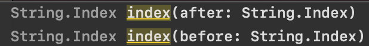

## String 제대로 알고 가자! ##

### Swift에서의 코딩테스트.. ###

개발자로 취업을 하려면 코딩테스트는 꼭 넘어야 할 관문 중 하나인데,
특히 iOS 직무로 취업을 하려면,, 코딩테스트를 풀 언어가 아무래도 Swift로 짜면 좋겠죠?.. 쭉 Swift를 사용할 거니깐..
> iOS 직무로 시험보는데 왜 Swift로 안짯냐는 얘기를 들었단 썰을 들은 적이 있습니다.. 아무래도 쭉 공부할 언어인데 안쓴다니 코딩테스트를 합격한다 해도 면접에서 참 애매하겠네요 ㅠ

아직도 기억나는데,, 제가 처음으로 iOS 개발 직무에서 서류를 합격하고 코딩테스트를 난생 처음으로 시험봐봤는데, 학교에서 배웠던 C로는 짤 수 있겠는데 Swift로 작성하려다가 scanf 하나 못써서 떨어진 기억이 있습니다.. 지금까지 연습앱만 만들어봤지 2년동안 Swift를 공부하면서 커맨드창에서 값을 입력받아본 적이 없더라구요.. textField에서 입력받았었지.. 그래서 본격적으로 Swift로 코딩테스트를 보기 위해 공부하기 시작했는데, String 부분이 참 애매하더라구요 ..ㅠ

### String 제대로 알고 가자! ###

그럼 왜 애매하냐..? 면.. String은 Array가 아니기 때문에 다른 언어와 다르게 [] 괄호를 통해 값접근이 안되요!
예를들어서.. C언어 같은 경우 "Hello" 라는 문자열을 배열로 받아버려서 str[1] 이런식으로 하면 e가 리턴되는 식으로 접근이 가능한데, Swift는 String이란 타입이 있어서 해당 인덱스로 접근하는건 똑같긴 하지만... 접근 방법이 달라요..

음.. Hello 에서 index값이 1인 곳을 접근하려면 이렇게 접근해요..

text[text.index(text.startIndex, offsetBy: 1)]

원래는 text[i] 에서 끝날 것을.. Swift에서의 index는 *.index(*.startIndex, offsetBy: i) 로 해줘야 합니다..

이것 말고도 여러가지 인덱스 접근방법이 있는데, 그건 지금부터 차차 알아보겠습니다!

### String의 기본 사용법 ###

우선 String의 기본 사용법!

String은 숫자처럼 + 기호를 통해 붙혀 쓸수 있어요! 어떤 의미냐면..

```
let text1: String = "my name is "
let text2: String = "apeach"
let result: String = text1 + text2 + ".."
// my name is apeach..
```

이런식으로 붙혀 사용이 가능합니다!
또.. 배열에서 크기를 구할때 count를 사용했던 것 처럼.. string도 count 메소드로 구할 수 있어요..
```
let text: String = "love"
print(text.count) // 4
```

또한 for문으로 각각 뿌려줄 수도 있어요.. 참고로 Swift에서의 print문은 \n 포함이에요..

```
let text: String = "love"
for char in text {
	print(char)
}
// l
// o
// v
// e
```

이렇게.. 꼭 배열처럼 작동하는 녀석이... index에서 말성을 부려요... ㅠ _ㅜ

### String 짜증나는 index 접근.. ###

음.. String에서 특정 index에 접근할 때 필요한건 index 접근 방법인데,
index의 타입은 String.Index 에요.
StringIndex값을 얻을 수 있는 방법은 여러가지가 있는데,

그냥 textString변수의 i번째 인덱스값을 원할땐

```
textString.startIndex, offsetBy: i) // return String.Index
```

이렇게 접근하면 맘편하긴 한데 확실한 개념을 알고갈려면

이런메소드가 있어요



before와 after의 차이는 해당 index값 기준으로 이전값을 쓸건지, 이후값을 쓸건지 인데, 이거의 인자값도 String.Index죠?.. 그래서 한번 더 써줘야 해요
String의 String.Index값을 얻는 방법은 딱 2가지에요. 첫번째 인덱스, 마지막 인덱스.. 그 안에서 offsetBy를 통해 몇번째  떨어진 값을 쓸건지 결정해주는 거에요.. 즉

```
let *: String = "love" // 원래는 *를 변수명으로 선언할 수 없어요. 쉬운작성을 위해 이렇게 적었...
*[*.index(after: *.startIndex)] // o
*[*.index(after:*.endIndex)]
// err,  endIndex의 경우 마지막 인덱스 값 +1을 리턴하기 때문에 다음값이기 때문에 범위초과

*[*.index(before: *.startIndex)] // err. 첫번째 인덱스의 이전값이기 때문에 범위초과
*[*.index(before: *.endIndex)] // e
```

after와 before가 왜 있는지 감이 오시나요?.. 접근할 수 있는건 startIndex, endIndex 뿐이기 때문에 특히 endIndex로 얻은 값은 인덱스값에 +1을 한 값을 얻기 때문에(아마도 마지막 ₩0 포함이라 그럴거에요) before를 통해 사용해야 하고, after는.. 어딘가 쓰임새가 있겠죠?... ㅋㅋㅋ;;;


### String안에 범위값으로 접근하기! ###

이제 남은건 범위에요!! Range.. 예를들어서 String인 Text값의 인덱스 1부터 3까지의 값을 얻고 싶을때! 어떻게 해야 할까요??

답은 String.Index ... String.Index 를 해주면 되요..


ㅠㅠㅠㅠㅠㅠㅠㅠㅠㅠㅠㅠㅠㅠㅠㅠㅠㅠㅠㅠㅠㅠㅠㅠㅠㅠㅠㅠ

아니 String.Index 하나 쓰는데도 저리 길었는데.. 그걸 연속 2번이나...

복잡하겠지만... 숨은그림찾기라 생각하고 열심히 적어줘야해요...


```
// 인덱스 0 ~ 마지막까지 range
let a: String = "abcdefg"
let start: String.Index = a.index(a.startIndex, offsetBy: 0)
let end: String.Index = a.index(before: a.endIndex)
print(a[start...end] // abcdefg
print(a[start..<end] // abcdef
```

복잡하죠?.. 저도 항상 헷깔려서... 안쓰다 보면 다시 보게되는 것 같아요..

이번기회에 저도 정리가 되는 시간이 됬네요.. 마지막으로 이런 복잡한걸 쉽게 사용할 수 있는 익스텐션을 소개하고 마무리 하겠습니다요..

### String 관련 extention ###

### String 범위 출력

```
extension String {
    subscript(r: Range<Int>) -> String {
        let start = self.index(self.startIndex, offsetBy: r.lowerBound)
        let end = self.index(self.startIndex, offsetBy:  r.upperBound)
        
        return String(self[start..<end])
    }
}

let str = "iOS Developer"

print(str[0..<3])   // iOS
print(str[4..<str.count]) // Developer
```

### String 해당범위 나누기 -> Array

```
extension String {
    func split(at index: Int) -> [String] {
        let pivot = self.index(self.startIndex, offsetBy: index)
        let u = self.prefix(upTo: pivot)
        let v = self.suffix(from: pivot)
        
        return [String(u), String(v)]
    }
}

let str: String = "123456"
var arr: [String] = str.split(at: 3)
//["123", "456"]
```

그럼 이만.. 좋은 하루 되세용..