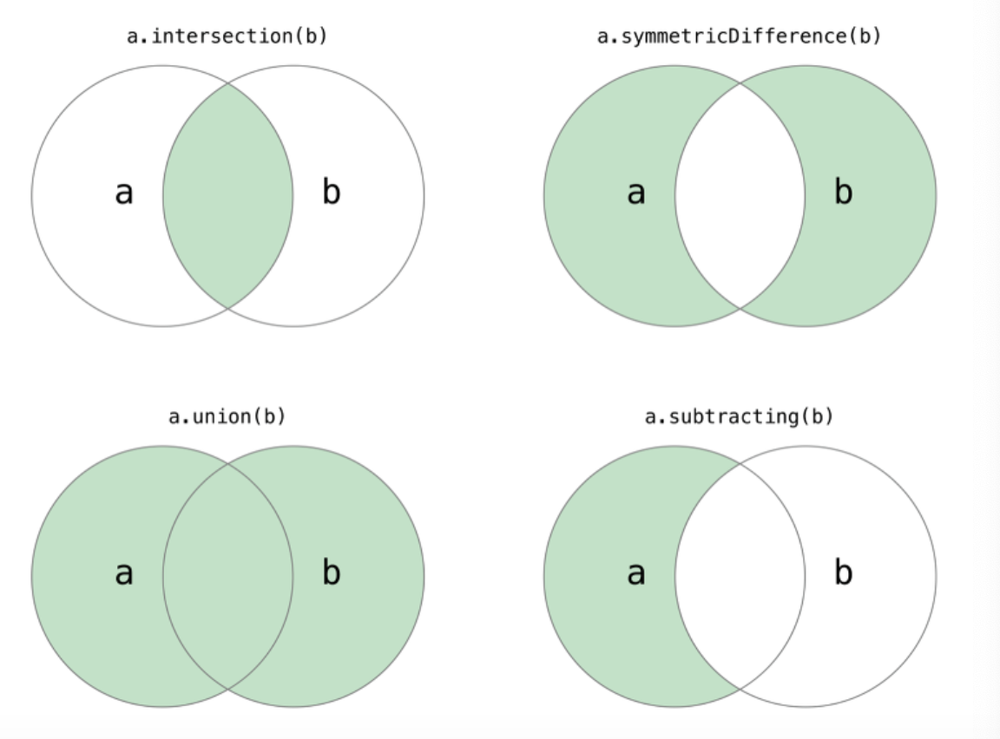
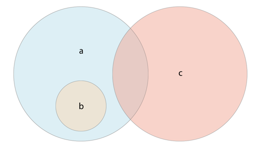

## Set

> 정렬되지 않은 고유 한 요소 모음.

- Swift Standard Libray의 Collection Type
- 순서 X
- 중복 X
인 Collection 이다.

### 선언 방법

~~~
var setString = Set<String>()
// 이미 선언했을 시 초기화
setString = []
//Set 선언시
var setString: Set = []
~~~

> NOTE: Set이라고 명시를 안해주면 Array로 인식..

### insert

~~~
// insrt
setString.insert("e")
// 중복값 x
setString.insert("a")
~~~

> NOTE: set은 중복된 값을 허용하지 않기 때문에 중복값은 변화가 없다.

### remove

<code>mutating func remove(_ member: String) -> String?</code>

~~~
// remove, 값을 리턴함
print(setString.remove("e"))
// 없는값이라면 nil 반환
print(setString.remove("e"))
~~~

### Searching

<code>func contains(_ member: String) -> Bool</code>

~~~
// set에 특정 항목이 포함되어 있는데 contains 메소드를 통해 확인 가능
print(setString.contains("b")) // true
~~~

<code>func hasPrefix(_ prefix: String) -> Bool</code>

```
// 첫부분으로만 시작되는 요소들만 걸러냄
print(a.filter{ $0.hasPrefix("안녕")}) // ["안녕하세요"]
// 첫부분이 아니면 안됨..
print(a.filter{ $0.hasPrefix("하세")}) // []
```

### 기타 메소드

```
//count, isEmpty
print(setString.isEmpty) // true
print(setString.count) // 4
// for 문 사용 가능
for c in setString {
    print(c) // bcad(순서x)
}
```

### Set만의 특별한 메소드!

Set이 곧 집합이기 때문에 집합의 연산 가능..GOD..



```
// setString = a,b,c,d
var a: Set = ["안녕하세요", "b", "c","배고파요"]
// 교집합
print(setString.intersection(a)) // ["b", "c"]
// 합집합
print(setString.union(a)) // ["a", "안녕하세요", "c", "배고파요", "b", "d"]
// 합집합 - 교집합
print(setString.symmetricDifference(a)) // ["a", "배고파요", "안녕하세요", "d"]
// 여집합
print(setString.subtracting(a)) // ["d", "a"]
```

### Set의 집합 동등 비교



<code>func isSubset(of other: Set<String>) -> Bool</code>

```
let employees: Set = ["Alicia", "Bethany", "Chris", "Diana", "Eric"]
let attendees: Set = ["Alicia", "Bethany", "Diana"]
//{}가 of 안에 있을때
attendees.isSubset(of: employees) // true
```

<code>func isSuperset(of other: Set<String>) -> Bool</code>

```
let employees: Set = ["Alicia", "Bethany", "Chris", "Diana", "Eric"]
let attendees: Set = ["Alicia", "Bethany", "Diana"]
// of 가 {}.의 안에 있을때
employees.isSuperset(of: attendees) // true
```

<code>func isDisjoint(with other: Set<String>) -> Bool</code>

```
let employees: Set = ["Alicia", "Bethany", "Chris", "Diana", "Eric"]
let attendees: Set = ["Alicia", "Bethany", "Diana"]
// 공통 값 없을때
alone.isDisjoint(with: employees) // true
```

#### 참고

- [Apple Documentation](https://developer.apple.com/documentation/swift/set)
- [zedd 블로그](https://zeddios.tistory.com/131)
- [쌈스의 개발 블로그](https://woongsios.tistory.com/13)
- [INSWAG 블로그](https://atelier-chez-moi.tistory.com/23)

[돌아가기 > 배우는 내용](https://github.com/kbw2204/swiftNote)