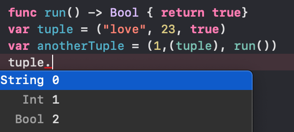
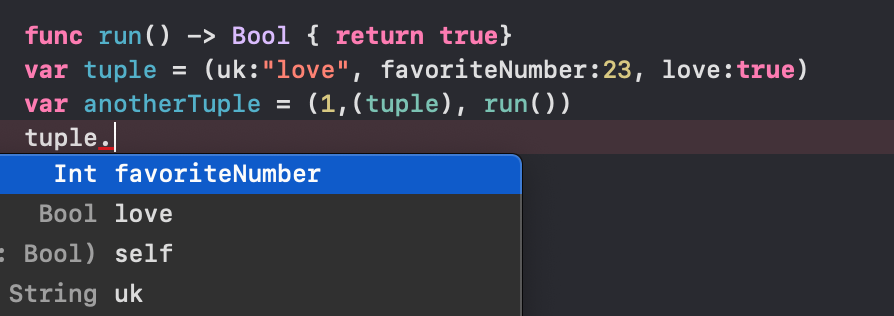

## Tuple

Swift의 타입들은 대부분 Struct 구조이다. tuple도 역시 Struct, 구조체이며 Type이다.
단 **Array와의 차이점**은 **여러가지 "타입"을 한꺼번에 묶어서 사용할 수 있다는 점**이다. function type까지 담을 수 있다.

~~~
func run() -> Bool { return true}
var tuple = ("love", 23, true)
var anotherTuple = (1,(tuple), run())
~~~

### tuple 사용법

이렇게 변수명에 .을 찍으면 인덱스 별로 값에 접근 할 수 있다.
**추가적으로** 값에 이름을 설정해 줄 수 있는데, 이름을 설정해주면 인덱스 값 대신 이름으로 값에 접근할 수 있다.

#### 참고

- [zedd 블로그](https://zeddios.tistory.com/238)

[돌아가기 > 배우는 내용](https://github.com/kbw2204/swiftNote)