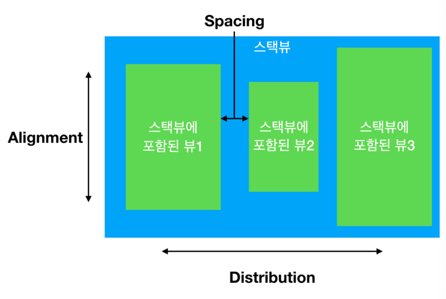

## StackView
> 스택뷰는 여러 뷰들의 수평 또는 수직 방향으로 묶음으로 쉽게 관리할 수 있는 레이아웃의 인터페이스라 할 수 있다. 스택뷰와 오토레이아웃 기능을 활용하여 화면 크기에 따라 동적으로 적응할 수 있는 사용자 인터페이스를 만들 수 있다. 스택뷰의 레이아웃은 스택뷰의 `axis`, `distribution`, `alignment`, `spacing`과 같은 프로퍼티를 통해 조정한다.

### 스택뷰 사용방법
> 묶고싶은 뷰들을 alt키를 누른 상태로 다중클릭 후 Embed In Stack(하단 4개의 버튼 중 왼쪽 끝) 을 클릭 후 StackView 클릭

### UIStackView 클래스의 주요 프로퍼티
- `var arrangedSubviews` : 스택뷰의 정렬된 뷰의 배열. 스택뷰에 포함된 뷰들을 이 프로퍼티에 저장하고 관리한다.
- `var axis: UILayoutContraintAxis` : 레이아웃의 방향을 결정 ( 수직 vertical, 수평 horizontal)
- `var distribution : UIStackViewDistribution` : 스택뷰에 포함된 뷰가 스택뷰 내에서 어떻게 배치(분배)될지 결정
- `var spacing: CGFloat` : 스택뷰에 정렬된 뷰들 사이의 간격. (기본값 0.0)

### UIStackView 클래스의 주요 메서드
- `func addArrangeSubview(UIView)`: arrangedSubviews 배열에 마지막 요소에 뷰를 추가
- `func insertArrangedSubview(UIView)`: arrangedSubviews 배열의 특정 인덱스에 뷰를 추가
- `func removeArrangedSubview(UIView)`: 스택뷰의 arrangedSubviews 배열로부터 뷰를 제거

#### 참고
- [UIStackView - UIKit](https://developer.apple.com/documentation/uikit/uistackview)

[돌아가기 > 배우는 내용](https://github.com/kbw2204/swiftNote)