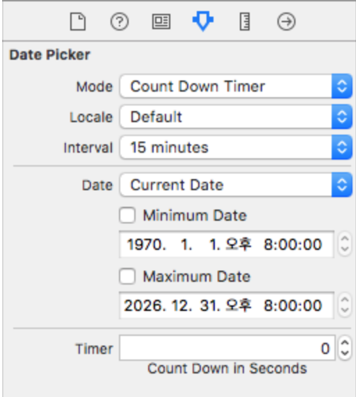

## UIDatePicker
> 날짜 및 시간을 입력하는 컨트롤 이다. DatePicker를 사용하면 사용자가 지정한 날짜를 입력받을 수 있다.

### DatePicker의 주요 인터페이스 빌더 속성


- Mode : DatePicker안에 있는 내용을 뭘로 할건지 결정(Time, Date, Date and Time, Count Down Timer) 코드상으로 datePickerMode 프로퍼티를 사용하여 접근 가능
- Locale : DatePicker에 사용될 로케일. 코드상으로 locale 프로퍼티를 통해 접근 가능
- Date : DatePicker가 처음 보여주게 될 날짜 설정. 기본값 : 현재 날짜, 코드상으로 date 프로퍼티를 통해 접근 가능
- Constraints : Date 하단의 Minimum Date와 MaximumDate를 통해 DatePicker의 날짜 범위를 설정할 수 있다. 코드상으로 minimumDate, maximumdate 프로퍼티를 통해 설정 가능
- Timer : DatePicker의 표시되는 초기값. 코드상으로 countDownDuration 프로퍼티를 통해 접근 가능

### DatePicker 클래스의 주요 메서드
- func setDate(Date, animated: Bool) : datePicker 처음 표시 날짜 설정

### DateFormatter
DateFormatter은 날짜와 텍스트 표현 간 변환을 할 수 있게 해준다. DateFormatter의 인스턴스는 Date 객체의 문자열 표현을 생성하고, 날짜 및 시간의 텍스트 표현을 Date 객체로 변환한다.

### DateFormatter의 주요 프로퍼티와 메서드
- func date(from: String) : 주어진 문자열을 Date 객체(날짜와 시간)로 변환하여 반환
- func string(from: Date) : Date 객체를 문자열로 변환하여 반환
- func setLocalizedDateFormatFromTempleate(String) : 지정된 로케일을 사용하여 날짜 형식을 설정
- var dateStyle: DateFormatter.Style : DateFormatter의 날짜 형식
- var timeStyle: DateFormatter.Style: DateFormatter의 시간 형식
- var dateFormat: String!: 고정 형식 날짜 표현을 사용할 때의 날짜 형식
- var locale: Locale!: DateFormatter의 로케일
- var timeZone: TimeZone!: DateFormatter의 시간대

### 예제 코드
- 날짜 형식(Date 객체) -> 문자열 형식
```
import UIKit

let dateFormatter = DateFormatter()
dateFormatter.dateStyle = .full
dateFormatter.timeStyle = .none

let date = Date(timeIntervalSinceReferenceDate: 118800)

// US English Locale (en_US)
dateFormatter.locale = Locale(identifier: "en_US")
print(dateFormatter.string(from: date)) // Tuesday, January 2, 2001

// KOR Korean Locale (ko_KR)
dateFormatter.locale = Locale(identifier: "ko_KR")
print(dateFormatter.string(from: date)) // 2001년 1월 2일 화요일
```

- 문자열 형식 -> 날짜 형식
```
import UIKit

let dateFormatter = DateFormatter()

let dateString = "1970-01-01 08:03:30 +0000"
dateFormatter.dateFormat = "yyyy-MM-dd HH:mm:ss ZZZ"
print(dateFormatter.date(from: dateString)!) // 1970-01-01 08:03:30 +0000
```
#### 참고
- [UIDatePicker - UIKit](https://developer.apple.com/documentation/uikit/uidatepicker)
- [Date - Foundation](https://developer.apple.com/documentation/foundation/date)
- [DateFormatter - Foundation](https://developer.apple.com/documentation/foundation/dateformatter)


[돌아가기 > 배우는 내용](https://github.com/kbw2204/swiftNote)