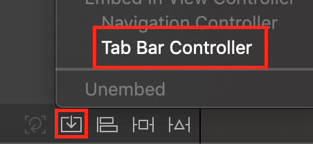
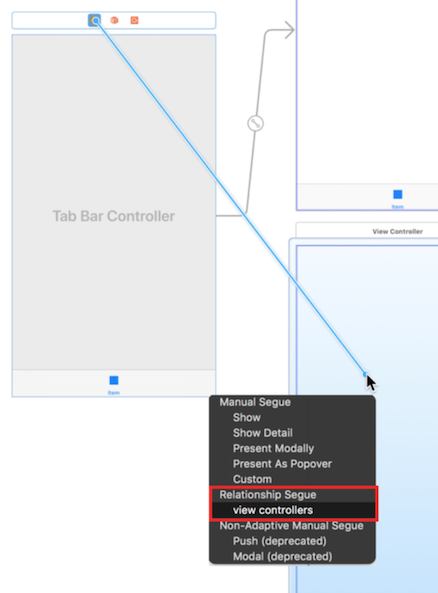

## UITabBarController

> Inherits From: UIViewController

### 생성 방법 (in Storyboard)

#### 1. View 끼리 묶기 ( View 다중 선택 후)



#### 2. TabBarController에서 View 추가하기



### 인스펙터창 관련..

- translucent: 탭 막대가 반투명인지 여부를 나타내는 부울 값입니다.

### 생성 방법 (programmatically)

```
import UIKit

class TabBarControllerByCode: UIViewController {
    override func viewDidLoad() {
        super.viewDidLoad()
        // tabBarController 정의
        let tabBarController: UITabBarController = UITabBarController()
        // 추가할 뷰들 정의..
        let firstV = ViewController()
        firstV.title = "firstView"
        firstV.view.backgroundColor = UIColor.orange
        firstV.tabBarItem = UITabBarItem(tabBarSystemItem: .favorites, tag: 0)
        
        let VC = UIViewController()
        VC.title = "secondView"
        VC.view.backgroundColor = UIColor.black
        VC.tabBarItem = UITabBarItem(tabBarSystemItem: .bookmarks, tag: 1)
        // 적용
        let controllers = [firstV, VC]
        tabBarController.viewControllers = controllers
        tabBarController.viewControllers = controllers.map{
            UINavigationController(rootViewController: $0)
        }
        self.view.addSubview(tabBarController.view)
        self.addChild(tabBarController)
    }
}
```

### 사용중인 tabBar 기존 설정 변경하기 예제

```
func initialize() {
	guard let tabBar = self.tabBarController?.tabBar else {
		return
	}
	// 선택되지 않은 탭 색상 변경
	tabBar.unselectedItemTintColor = UIColor(red: 1, green: 1, blue: 1, alpha: 0.7)
}
```

### [UITabBarControllerDelegate(링크)](https://developer.apple.com/documentation/uikit/uitabbarcontrollerdelegate)

> 사용자가 탭바 인터페이스와 상호작용할 때, 탭바 컨트롤러 객체는 이 상호작용에 관한 알림(notification)을 델리게이트 인스턴스로 보낸다. 

- 사용자가 탭을 선택하지 못하게 하거나,
- 탭을 선택한 후 추가 작업을 수행하거나, 
- 탭 관련 사항을 모니터링하고 사용자화할 때 델리게이트를 활용..


#### 참고

- [UITabBarController - UIKit](https://developer.apple.com/documentation/uikit/uitabbarcontroller)
- [UITabBarControllerDelegate - UIKit](https://developer.apple.com/documentation/uikit/uitabbarcontrollerdelegate)
- [Haman Interface Guidelines for iOS - Tab Bars](https://developer.apple.com/design/human-interface-guidelines/ios/bars/tab-bars/)

[돌아가기 > 배우는 내용](https://github.com/kbw2204/swiftNote)