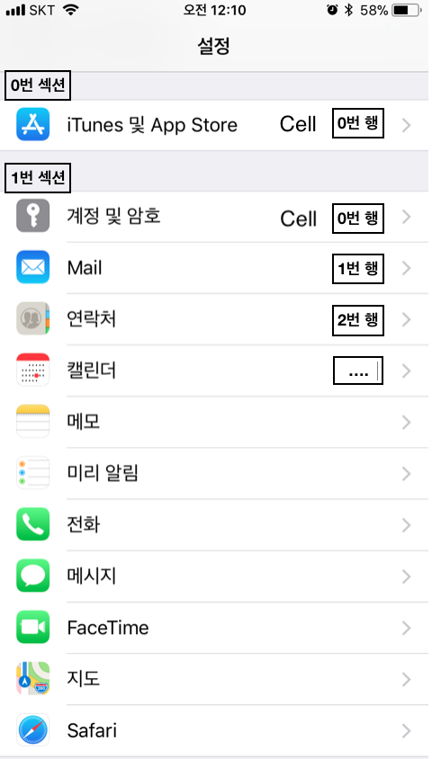
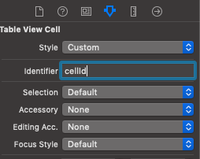
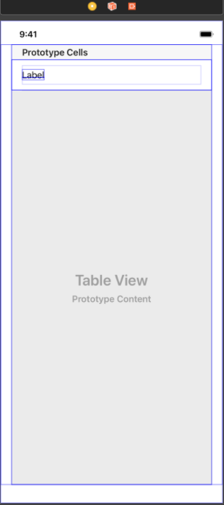

## UITableView

> `테이블뷰`는 하나의 열과 여러 줄의 행을 지닌 수직적 스크롤이 가능한 cell의 모임이다. `cell`이란 테이블뷰의 하나의 행을 말하며 이러한 cell들을 `section`을 이용해 시각적으로 나눌 수 있다. 추가적으로 `header`와 `footer`에 이미지나 텍스트를 추가해 추가정보를 보여줄 수 있다.




### 테이블뷰 만드는 방법

1. tableView, TableViewCell 추가


2. tableViewCell 클릭 후 cellId 설정



3. 인터페이스 만들기 (cell 부분은 tableViewCell.swift 에서 드래그앤드랍)




4. 코드 작성
> ViewController.swift

~~~
import UIKit

class ViewController: UIViewController, UITableViewDelegate, UITableViewDataSource {

    @IBOutlet var tableView: UITableView!
    let cellId = "cellId"
	// cell에 넣을 임시 값
    let data = ["1", "2", "3"]
    override func viewDidLoad() {
        super.viewDidLoad()
        // delegate, dataSource 추가
        self.tableView.delegate = self
        self.tableView.dataSource = self
    }
    func tableView(_ tableView: UITableView, numberOfRowsInSection section: Int) -> Int {
        // cell 갯수 리턴
        return self.data.count
    }
    // cell
    func tableView(_ tableView: UITableView, cellForRowAt indexPath: IndexPath) -> UITableViewCell {
        let cell = self.tableView.dequeueReusableCell(withIdentifier: cellId, for: indexPath) as! TableViewCell
        cell.titleLabel.text = self.data[indexPath.row]
        return cell
    }
}
~~~

> tableViewCell.swift
~~~
import UIKit

class TableViewCell: UITableViewCell {

    @IBOutlet var titleLabel: UILabel!
    
}
~~~

### 테이블 뷰 스타일
- 일반 테이블뷰
	- 더이상 나눠지지 않는 연속적인 행의 리스트(계시판 테이블뷰)
	- 색인을 통한 빠른 탐색을 하거나 옵션을 선택할 때 좋다.
- 그룹 테이블뷰
	- 섹션을 기준으로 그룹화되어있는 리스트 형태
	- 정보를 특정 기준에 따라 개념적으로 구분할 때 적합
	- 사용자가 정보를 빠르게 이해하는 데 도움(전화번호부 ㄱㄴㄷ순 정리)

### reloadData() VS reloadSection()

1. reloadData()
```
func reloadData()
```

> 셀, 섹션 머리글 및 바닥 글, 익덱스 배열 등 (테이블 or Collection)을 구성하는 데 사용되는 모든 데이터를 다시 로드함

2. reloadSection()
```
// 지정된 애니메이션 효과를 사용하여 지정된 섹션을 다시 로드
func reloadSections(_ sections: IndexSet, 
with animation: UITableView.RowAnimation)
```

> Table or Collection 의 데이터 소스에 지정된 **섹션**에 대해 새로운 셀을 요청. 

#### 참고

- [UITableView - UIKit](https://developer.apple.com/documentation/uikit/uitableview)

[돌아가기 > 배우는 내용](https://github.com/kbw2204/swiftNote)