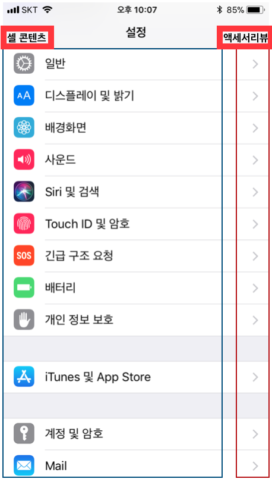
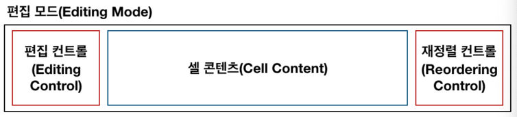

## UITableViewCell

### TableViewCell 구조

- 콘텐츠 영역 : 셀의 왼쪽 부분에서 주로 문자열, 이미지와 혹은 고유 식별자 등이 입력
- 액세서리뷰 영역 : 셀의 오른쪽 작은 부분은 액세서리뷰로 상세보기, 재정렬, 스위치 등과 같은 컨트롤 객체가 위치




테이블뷰를 편집모드(Editing Mode)로 변경시 아래와 같은 구조로 변경
- 재정렬이 가능한 경우, 재정렬 컨트롤이 액세서리뷰에 나타난다. 재정렬 컨트롤을 눌러 셀을 드래그하면 위아래로 순서 변경 가능




### 셀 콘텐츠 프로퍼티
- `textLabel: UILabel` : 주제목 레이블
- `detailTextLabel: UILabel` : 부제목 레이블
- `imageView: UIImageView` : 이미지뷰


### TableViewCell Customize 만들기

1. 커스텀셀을 위한 swift 파일 하나를 만든다.

```
import UIKit

class TableViewCell: UITableViewCell {
    // 사용할 것들 정의
    @IBOutlet var imgView: UIImageView!
    @IBOutlet var name: UILabel!
}
```

2. cell을 Storyboard의 cell에 class를 연결해주고, cell 인터페이스를 꾸며준다.

3. 사용하려는 tableView에 연동된 위치에 tableview 의 cell 정의 부분을 커스텀 셀로 지정해준다.

```
 func tableView(_ tableView: UITableView, cellForRowAt indexPath: IndexPath) -> UITableViewCell {
        
    guard let cell = self.TableView.dequeueReusableCell(withIdentifier: cellId, for: indexPath) as? TableViewCell else {
            fatalError("Could not dequeue cell with identifier: TableViewCell")
        }

        return cell
    }
```


#### 참고

- [UITableViewCell - UIKit](https://developer.apple.com/documentation/uikit/uitableviewcell)
- [TableView Programming Guide for ios](https://developer.apple.com/documentation/uikit/views_and_controls/table_views)
- [Tables - Views - ios Human Interface Guideline](https://developer.apple.com/design/human-interface-guidelines/ios/views/tables/)


[돌아가기 > 배우는 내용](https://github.com/kbw2204/swiftNote)