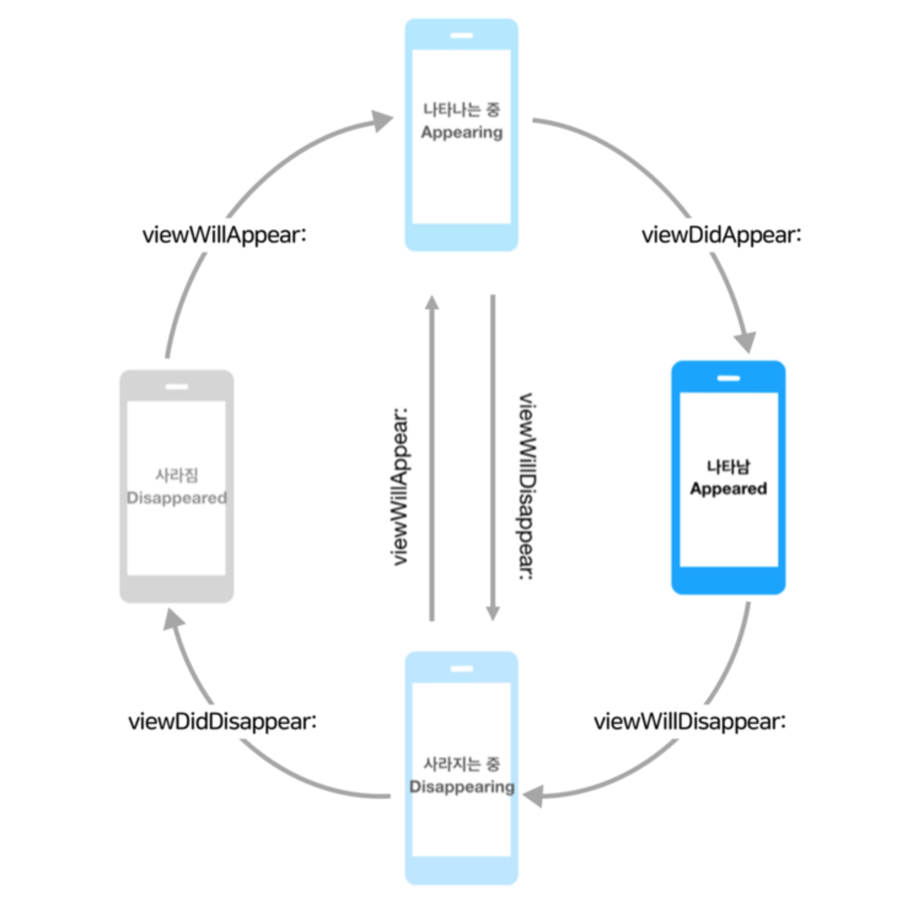

## 뷰의 상태변화 감지 메서드
### 뷰의 생명주기..
> 뷰가 나타기 전의 과정부터 사라지는 과정까지를 뷰의 생명주기 라고 한다.
#### 순서대로 총 5가지의 과정으로 뷰의 생명주기를 설명할 수 있다.
1. ViewDidLoad 
	- **뷰가 로드 되었을 때**
	-뷰가 처음 로딩 될 때 1회 호출되는 메소드로, **초기화 작업을 하기 좋은 시점**
2. viewWillAppear
	- **뷰가 뷰 계층에 추가되고 화면에 표시되기 직전에 호출**
	- 다른 뷰로 이동했다가 되돌아올 때 재호출 되므로, **화면이 나타날때마다 수행해야하는 작업**을 하기 좋은 시점
3. viewDidAppear
	- **뷰가 뷰 계층에 추가되어 화면에 표시되면 호출**
4. viewWillDisappear
	- **뷰가 뷰 계층에서 사라지기 직전 호출**
	- **뷰가 생성된 뒤 발생한 변화를 이전상태로 되돌리기 좋은 시점**
5. viewDidDisappear
	- **뷰가 뷰 계층에서 사라진 후 호출**
	- **뷰를 숨기는 것**과 관련된 추가적인 작업을 하기 좋은 시점
	- 시간이 오래 걸리는 작업은 하지 않는 것이 좋음




### 뷰의 레이아웃 변화 메서드
> 뷰가 생성된 후 bounds 및 위치 등의 레이아웃에 변화가 발생했을 때 호출되는 메서드

- func viewWillLayoutSubviews()
	- **뷰가 서브뷰의 레이아웃을 변경하기 직전에 호출되는 메서드**
	- 서브뷰의 에이아웃을 **변경하기 전**에 수행할 작업을 하기 좋은 시점
- func viewDidLayoutSubviews()
	- **서브뷰의 레이아웃이 변경된 후 호출되는 메서드**
	- 서브뷰의 레이아웃을 **변경 한 후** 추가적인 작업을 수행하기 좋은 시점

### ⭐️ 중요
#### 뷰 컨트롤러에서 위 메서드를 사용하기 위해 pverride 키워드를 명시하고 super를 꼭 호출할 것!

```
override func viewDidLoad() {
	super.viewDidLoad() 
	// view가 메모리에 적재된 시점에서 필요한 코드 작성
}
```

#### 참고
- [UIViewController - UIKit](https://developer.apple.com/documentation/uikit/uiviewcontroller)

[돌아가기 > 배우는 내용](https://github.com/kbw2204/swiftNote)