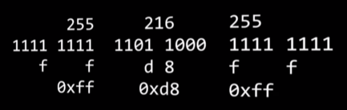
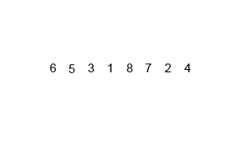

## CS 50 정리노트

## 목차

- [하드웨어](#하드웨어)
	- [기억장치](#기억장치)
- [bit](#bit)
- [ASCII 코드](#ASCII-코드)
- [16진수](#16진수)
- [Image](#Image)
- [VR](#VR)
- [AR](#AR)
- [프레임워크](./framework/README.md)
- [API](./API/README.md)
- 알고리즘
	- [선형 탐색](#선형탐색)
	- [이진 탐색](#이진탐색)
	- [버블 정렬](#버블정렬)
	- [선택 정렬](#선택정렬)
	- [삽입 정렬](#삽입정렬)
	- [힙 정렬](./sort/heap.md)
	- [시간 복잡도](#시간-복잡도)
	- [합병 정렬](#합병정렬)
- 자료구조
  - [stack](./dataStructure/stack.md)
- 운영체제
  - [process](./operatiingSystem/process.md)
  - [thread](./operatiingSystem/thread.md)
- [오버로딩,오버라이딩](#오버로딩,오버라이딩)

## 하드웨어

컴퓨터를 물리적으로 구성하는 요소입니다. 

### 컴퓨터 내의 하드웨어

### 하드웨어의 구성요소

컴퓨터의 하드웨어는 크게 **중앙처리장치**, **기억장치**, **입출력장치**로 구성됩니다.

- **중앙처리장치**

> 프로세서라고도 불리기도 하는데, 입력장치(키보드 같은..)에서 받은 **명령을 실제로 처리**합니다.

- **기억장치**

> 입력된 명령어나 데이터가 저장되는 공간으로, (주기억장치, 보조기억장치)로 나뉩니다.

##### ㄴ주기억장치
> 대표적으로 RAM. RAM은 기억된 정보를 읽어내기도 하고 다른 정보를 기억시킬 수 있는 메모리로써, 응용 프로그램을 **일시적으로** 불러오거나, 데이터를 **일시적으로** 저장하는데 사용되는 **임의 접근 기억 장치** 입니다. 

예) ROM, RAM(속도가 빠름)

##### ㄴ보조기억장치
> 주 기억장치인 RAM이 일시적으로 데이터를 저장하는 것과 달리, 하드드라이브(C:)는 **영구적**으로 데이터를 저장합니다. 이런 하드드라이브 or SDD 등을 보조기억장치라고 합니다.

> 하드디스크는 원판 모양의 플래터를 회전시켜 드라이브에 데이터를 읽고 쓰는 원리입니다. 

> SSD(Solid State Drive)는 하드디스크와는 달리 움직이는 부품 없이 더 빠른 속도로 데이터를 읽고 쓰는데, 이는 순수 전자식으로 작동하기 때문이다. 

> [flash memory](https://ko.wikipedia.org/wiki/플래시_메모리)는 전기적으로 데이터를 지우고 다시 기록할 수 있는 비활성 컴퓨터 기억장치로, 보조기억장치에 속한다.

- **입출력장치**

> 입력장치와 출력장치를 통틀어 입출력장치라고 부른다. 입력장치의 대표적 예는 마우스, 키보드 등이 있고 출력장치는 모니터와 프린트를 들 수 있다.

### 기본적인 흐름

예를 들어서, 컴퓨터에 설치되어 있는 xcode는 ssd에 저장되어 있다. 이 ssd를 사용함에 있어서 빠르게 사용될 메모리는 RAM에 적재되어 빠르게 사용하게 되고 하지만 직접적으로 무언가가 컴퓨터에서 일어날려면 CPU에서 작업해야 함으로 ssd -> ram -> cpu 식으로 흘러간다.

> 이렇게 해석해도 되나..?

[돌아가기 > 목차](#목차)

## 기억장치

컴퓨터가 계산을 수행하기 위해서는 bit와 byte의 형태로 기억장치에 저장할 수 있어야 한다. 컴퓨터가 나중에 data를 검색할 수 있도록 보관을 하는 것인데, 하지만 기억장치는 종류마다 서로 다른 속도를 내고.. 내부에 저장할 수 있는 양이 차이가 있어서, 서로 다른 장단점을 가지고 있다.

### CPU

CPU는 용량이 매우 큰 파일이나 데이터를 처리해야 하지만, **한번에 32 or 64bit의 블록 단위**로 적은 양의 데이터를 조작하고 계산합니다. 하지만 중앙처리장치(CPU)는 이러한 bit들을 빠른 속도로 처리가 가능합니다.

> 이와 반대로 **하드디스크**는 CPU보다 훨씬 많은 양의 데이터를 저장 가능하지만, 데이터를 읽고 쓰는 속도는 느립니다.

### RAM

이 중간쯤 있는 것이 임의 접근 기억장치, RAM입니다. RAM은 hdd보다 훨씬 빠르게 데이터를 읽고 쓰는것이 가능합니다.

> 그래서 RAM은 실행중인 프로그램이나 열려있는 파일들이 더 빨리 접근할 수 있도록 메모리를 저장하는데 사용됩니다.

### L1, L2, L3 캐시

RAM보다 더 빠르게 정보를 읽고 쓸 수 있는데 더 작은 단위의 기억장치들도 있지만, 결과적으로 그 기억장치들의 용량은 더 작습니다. 바로 L1, L2, L3 캐시가 이런 케이스인데, **L1** 캐시가 이 셋 중에 **가장 작고 빠르며**, CPU(중앙처리장치)가 재빨리 받아 처리할 수 있도록 몇 킬로바이트의 데이터만을 저장합니다.

L2캐시는 L1보다 조금 더 크지만, 그만큼 더 느립니다.

L3캐시는 보통 몇 메가바이트를 저장 할 수 있어 셋중에 용량은 가장 크지만 그만큼 가장 느립니다. 

즉 속도비교는 CPU > L1 > L2 > L3 > RAM > SSD > HDD 순 

[돌아가기 > 목차](#목차)

## bit

### 비트란?
비트는 컴퓨터가 연산하기 위해 사용하는 단위이다. 비트는 이진 숫자 라는 "binary digit"의 줄임말이며, **0과 1 두 가지 값만 가질 수 있는 측정 단위입니다.** 이러한 0과 1인 비트들을 함께 사용함으로써 두가지 값만으로도 많은 양의 정보를 저장할 수 있다. 비트들의 모임을 **비트열**이라고 부릅니다.

### 비트열
비트열은 비트들의 모임으로써 여러 비트들을 활용해서 많은 양의 정보들을 나타낼 수 있습니다. 8개의 비트가 모여진 것을 **Byte(바이트)**라고 부르고 바이트는 2^8 = 256 개의 가지수의 바이트가 존재할 수 있습니다.

[돌아가기 > 목차](#목차)

## ASCII 코드

컴퓨터는 텍스트를 비롯한 다양한 형태의 정보를 저장해야 하지만, 컴퓨터가 저장할 수 있는 데이터는 0과 1로된 데이터만 저장할 수 있기 때문에, 0과 1을 이용해 텍스트 문자를 나타내야 합니다. **ASCII(아스키) 코드는 문자를 컴퓨터가 이해할 수 있는 이진 데이터(0과 1)로 혹은 그 반대로 변환하는 표준 방법입니다.**

### ASCII 의 한계

흔히 ASCII 코드는 ASCII 코드 표로 나타냅니다. 이 표는 모든 ASCII 코드 문자와 그에 대응하는 숫자들을 보여주는데, 기본 **ASCII 코드 표에는 7비트만 이용해서 모든 문자들을 나타냅니다**. 이것은 ASCII 코드로 2의7승개, 즉 **128개의 문자를 나타낼 수 있다는 것**을 의미합니다. 확장 ASCII는 8번째 비트를 추가해서 총 256개의 문자를 나타낼 수 있습니다. 소문자와 대문자 통틀어 52개 알파벳 밖에 없으므로, 그 외 남은 공간에 구분 기호, 숫자, 몇몇 기본 심볼들(@ 같은) 같은 다른 종류의 문자들을 나타낼 수 있습니다.

하지만 8비트 ASCII 코드로도 나타낼 수 없는 문자들이 아직 많습니다. 그 이유는 우리가 사용할 수 있는 문자들의 개숫는 256개보다 많이 때문입니다.
> 예 ) 수학 기호, 다른 영어 외 언어들 등..

이때문에 훨신 더 많은 문자들을 포함할 수 있는 **유니코드**(Unicode)가 생기게 됐습니다.
> 유니코드는 100만개 이상의 문자들을 나타낼 수 있는 문자 인코딩 표준입니다. 유니코드의 첫 128개의 문자는 ASCII의 128개의 문자와 동일하므로 서로 호환이 됩니다.

[돌아가기 > 목차](#목차)

## 16진수

JPG 이미지 파일은 항상 255 216 255 로 시작되고, 이는 10진수 이다. 하지만 실제로 컴퓨터는 0과 1만 이해할 수 있기 때문에 2진수로 변환하는 과정이 필요합니다. **하지만** 2진수로 모든 데이터를 표현해보면 너무 길어지기 때문에 16진수로 바꾸어보면 0000 부터 1111까지는 16진수로 표현할 수 있기 때문에 가독성이 좋아집니다.

16진수로 변환 후 **0x**를 붙혀 뒤에 오는 문자들이 16진수임을 알려줍니다.

### CS에선 왜 10진수나 2진수를 잘 사용하지 않고 왜 16진수를 사용할까??

> 이유: 4bit 패턴과 완벽히 대응하기 때문.. 실용성 외에는 특별히 나은 점 없음..

[돌아가기 > 목차](#목차)

## Image

이미지는 여러가지 유형은 여러가지가 있다. **비트맵**(.bmp), **JPG**(.jpg), **PNG**(.png), **GIF**(.gif) 등이 있는데, 각각의 파일 유형들은 장단점이 있다. 

### 사진 파일에 들어있는 정보

하나의 이미지를 다양한 이미지 파일 형식으로 저장할 수 있는데, 저장되는 형식에 따라 파일 안에 들어가 있는 비트 데이터의 구조 또한 다르다. 이 때문에 이미지 파일은 보통 첫 부분에 파일을 구분할 수 있는 구분자를 넣어둔다. JPEG의 첫 부분에는 255 216 255 라는 10진수로 시작을 하게 된다. 이런식으로 첫 부분엔 파일 형식을 구분할 수 있는 정보가 있고, 다음 부분에 나머지 정보들이 저장되게 된다.

### 비트맵 이미지 파일에 들어있는 정보

**BMP** 파일 형식은 이미지 데이터를 가장 단순하게 저장한다. 대신 **압축을 하지 않아 파일 크기가 크다**는 단점이 있다. BMP 파일 형식 역시 첫 부분엔 비트맵 파일에 대한 정보가 있다.

**JPEG** 파일은 이미지를 압축하는 장점을 갖고 있고, GIF 파일이 256 색을 표시할 수 있는 데이 비해 JPEG는 1600만 색상을 나타낼 수 있어 고해상도를 나타내기에 적합하다.
**GIF**는 이미지의 전송을 빠르게 하기 위한 압축저장 방식을 사용한다. JPEG보다 압축률은 낮지만 압축 시 이미지의 손상이 적다.
**PNG**는 GIF와 JPEG의 장점만을 합쳐 놓은 압축방식이다. GIF보다 압축률이 좋고 JPEG보다 원본에 손상이 적어 효과적이다.

[돌아가기 > 목차](#목차)

## VR

가상현실(Virtual Reality, VR)은 가상의 환경이나 상황을 컴퓨터로 만들어서 사람들이 **실제로 그 상황에 들어와 있는 것 처럼 느끼고 상호작용할 수 있도록** 만들어주는 인터페이스를 뜻한다.

### VR의 작동 원리

인간의 눈은 양쪽 눈의 시차가 있기 때문에 보고 있는 것의 **입체감**을 느낄 수 있습니다. 우리의 양쪽 눈은 서로 떨어져 있기 때문에 각각 보는 각도가 달라, **양인시차**가 발생하기 떄문에 원근감을 느끼고 물체를 입체적으로 인식할 수 있습니다. 이원리를 이용하여 VR 기기의 양 렌즈에는 **사람의 양인시차만큼 다른 각도로 촬영된 영상이 재생**되기 때문에 일반 디스플레이에서 영상을 보는 것과 달리 입체감이 느껴지게 됩니다.

또한 사람이 바라보는 방향에 따라 영상을 바꾸기 위해서 **모션 트래킹 센서**라는 것을 사용됩니다. 머리에 씌워진 상태에서 기기안에 가로 세로 높이를 모두 측정하는 센서가 있어 고개를 돌릴 때 마다 영상 화면도 같이 움직일 수 있습니다.

[돌아가기 > 목차](#목차)

## AR

증강 현실(Augmented Reality)은 가상현실(VR)과 비슷한데, 사용자에게 기존의 주변환경과 분리된 전혀 다른 환경을 경험하게 하지 않고 **현재이 환경 위에 영상, 게임 등의 효과를 입히는 기술** 입니다.

### AR의 원리

가상현실(VR)과 함께 가상의 정보를 이용한 기술이 증강현실(AR) 입니다. AR은 현실의 환경에서 가상의 이미지가 겹쳐서 보여지는것 입니다. AR은 카메라를 통해서 보여지는 디스플레이에 출력될 때 가상의 이미지가 덧붙혀서 보여지는 원리로, AR 역시 카메라의 위치와 시선을 계산하여 기울기를 측정하는 센서를 통해 덮어 씌워진 영상도 함께 움직일 수 있습니다.

[돌아가기 > 목차](#목차)

## 선형탐색

선형탐색이란 처음부터 끝까지 **차례대로** 탐색하는 알고리즘 탐색 방법 입니다. 즉 원하는 값을 찾을때까지 모든 자료를 확인해야 합니다.

### 효율성

선형 탐색 알고리즘의 최악의 탐색 길이는 n입니다. 즉 효율적이진 않은 방법인데, 선형 탐색 알고리즘은 자료가 정렬되어 있지 않거나 그 어떤 정보도 없이 하나씩 찾아야 하는 경우에 유용합니다.

### 선형 탐색의 예시

**정렬되어 있기 않은 경우** 어쩔 수 없이 선형탐색을 사용해야 합니다.

[돌아가기 > 목차](#목차)

## 버블정렬

버블정렬이란 **두개의 인접한 자료 값을 비교하면서 위치를 교환**하는 정렬 방법을 말한다. 버블정렬은 단 두 개의 요소만 정렬해주는식으로 반복하기 때문에 접근법은 간단하지만 너무 많은 교환이 필요하기 때문에 낭비가 발생할 수 있다.

### 왜 이름이 버블정렬일까??

그 이유는 버블정렬 과정을 보면 마치 가장 큰 값이 수면위로 떠오르는것 같은 느낌을 주기 때문이라 생각한다..

### 효율성

**n²/2 - n/2**.. 여기서 n/2 값은 n²/2에 비해 아주 작은 값임으로 간단하게.. **O(n²)**라고 표기한다. 만약 인풋값이 100만이라고 생각해보라.. 생각외로 엄청난 노가다다. 그렇기 때문에 알고리즘에서 효율성을 따지게 된 것이라 생각하고.. 최악의 수는 처음부터 끝까지 2개씩 비교하는 작업을 n-1번 실행해줘야 한다.

### Code by Swift

~~~
import Foundation

func bubbleSort(array: [Int]) -> [Int] {
    var arr = array
    let count = arr.count
    for _ in 0 ..< count {
        for j in 1 ..< count {
            if arr[j-1] > arr[j] {
                arr.swapAt(j-1, j)
            }
        }
    }
    return arr
}

let arr = [1,5,25,45,3,54]
print(bubbleSort(array: arr))
~~~

[돌아가기 > 목차](#목차)

## 선택정렬

선택정렬은 array 안의 수 중 가장 작은 수(혹은 가장 큰 수)를 찾아 첫 번째 위치의 수와 교환하는 식의 정렬 방식입니다. **선택정렬은 교환 횟수를 최소화**하는 반면 각 자료를 비교하는 횟수는 증가합니다.

### 효율성

선택정렬은 **O(n²)**, n-1번의 교환이 필요합니다. 하지만 한 번의 교환이 일어나기 위해서는 정렬되지 않은 수의 모든 비교가 이루어져야 하므로 n번의 비교가 이루어 집니다.
선택정렬은 최선의 경우에도 최악의 경우에서 수행하는 횟수만큼 비교와 교환을 해주어야 합니다.

### Code by Swift

~~~
// zedd 분이 짜신 소스
//import UIKit
//var arr = [9,8,7,6,5,4,3,2,1]
//
//for i in 0..<arr.count{
//    var minn : Int =  arr[i];
//    var location : Int = i;
//    for j in i+1..<arr.count{
//        if(minn>arr[j])
//        {
//            minn=arr[j];
//            location = j;
//        }
//    }
//    if i != location{
//        swap(&arr[i],&arr[location])
//    }
//}
//for i in 0..<8{
//    print(arr[i])
//}

import Foundation

func selectSort(array: [Int]) -> [Int] {
    var arr = array
    for i in 0 ..< arr.count {
        var temp = i
        for j in i+1 ..< arr.count {
            if arr[temp] >= arr[j] {
                temp = j
            }
        }
        arr.swapAt(i, temp)
    }
    return arr
}

let arr = [1,5,25,45,3,54]
print(selectSort(array: arr))
~~~

[돌아가기 > 목차](#목차)

## 삽입정렬

삽입정렬은 정렬되지 않은 부분의 자료가 정렬된 부분의 자리로 삽입되는 형태의 정렬 방법 입니다.
두 번째 자료부터 시작하여 그 앞 값들(왼쪽)과 비교하며 삽입할 위치를 정한 후 자료를 삽입하여 정렬하는 알고리즘 입니다.

### 삽입정렬 예제

카드게임에서 손 안에 있는 카드를 정렬할 때

### 효율성

삽입정렬은 **O(n²)**

### Code by Swift

~~~
import Foundation

func insertionSort(array: [Int]) -> [Int] {
    var arr = array
    for i in 1 ..< arr.count {
        let key = arr[i]
        var j = i - 1
        while j>=0 && key < arr[j] {
            arr.swapAt(j, j+1)
            j = j - 1
        }
        arr[j+1] = key
    }
    return arr
}

let arr = [1,5,25,45,3,54]
print(insertionSort(array: arr))
~~~

[돌아가기 > 목차](#목차)

## 합병정렬

합병정렬은 원소가 하 개가 될 때까지 계속해서 반으로 나누다가 모두 나눠지면 좌우 대소비교 후 다시 합쳐나가며 정렬을 하는 방식이다.

> 이렇게 나누어지고 합쳐지는 중간 단계의 배열을 임시로 저장하고 함수가 종료될 때 까지 기억하고 있어야 하기 때문에, 메모리의 필요 공간이 요구됩니다.

### 효율성

**O(n log n)**, 합병정렬은 절반씩 나눈다는 개념에서 처리 횟수가 낮습니다. 이와 같은 시간복잡도를 가지는 정렬 방식에는 힙정렬이 있습니다. 크기가 n개인 배열을 최종적으로 길이가 1인 배열이 될 때 까지 나누는데 분할 과정은, 매번 반씩 감소함으로 밑이 2인 logn 이고, 분할 이후 합병을 진행함으로 시간복잡도가 O(nlogn)이 되는 겁니다.

[돌아가기 > 목차](#목차)

## 이진탐색

이진탐색은 선형탐색과는 다르게 **자료를 절반으로 나눈 후 찾는 값이 어느 쪽에 있는지 파악해 탐색의 범위를 반으로 줄여가는 탐색 알고리즘** 입니다.

### 이진탐색 vs 선형탐색

배열을 여러 번 탐색할 계획이 있다면 이진 탐색이 유용할 것이다. 이진탐색의 경우 반으로 나누는 과정이 필요하기 때문에 자료 수가 적다면 선형탐색이 더 빠르게 작용될 수도 있다. 하지만 보편적으로 이진탐색이 더 효율적이고 빠르다.

[돌아가기 > 목차](#목차)

## 오버로딩,오버라이딩

객체지향 개념에서 다형성을 지원하는 방법으로 메소드 오버로딩, 오버라이딩이 있다.

- `Overloading`: 같은 이름의 메소드를 여러 개 가지면서 매개변수와 같은 유형이 다른 메소드들을 재정의시 앞에 오버로딩을 붙혀준다.
- `Overriding`: **상위 클래스가 가지고 있는** 메소드를 하위 클래스가 재정의해서 사용할 때 앞에 오버라이딩을 붙혀준다.
> 상속관계에 있는 클래스 간 같은 이름의 메소드를 정의할 때 오버라이딩!

구분 | 오버로딩  | 오버라이딩
---------|----------|---------
 메소드 이름  | 동일 | 다름 
 매겨변수, 타입  | 다름  | 동일
 리턴타입 | 상관없음 | 동일

#### 참고

- [hyeonstorage Blog](https://hyeonstorage.tistory.com/185)

[돌아가기 > 목차](#목차)