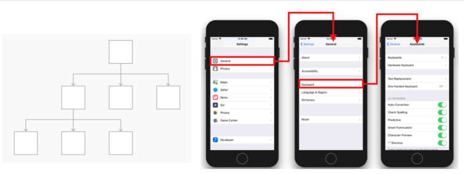

# Project 2 정리 노트
> * 다양한 애플리케이션에서 활용할 수 있는 회원가입 절차 구현
> * 화면전환 방법 습득
> * 공유 데이터 관리
> * 디자인 패턴의 이해향상
> * [Human Interface Guideline](#Human-Interface-Guideline)
## 배우는 내용
- 디자인 패턴
	- Delegation Pattern
	- Singleton
	- Targte-Action
- 화면전환
	- [네비게이션 인터페이스](#네비게이션-인터페이스)
	- [Modality](#Modal)
- UIKit
	- UITextField
	- UIDatePicker
	- UIStackView
	- UIImagePickerController
	- UIGestureRecognizer
	- View Controller States Methods(#뷰의-상태변화-감지-메서드)
- Foundation
	- DateFormatter
- Swift
	- Dictionary의 활용
	- guard 구문의 활용

## Human Interface Guideline
H.I.G는 앱을 개발할 때 필요한 디자인과 동작을 포함한 여러 규칙을 통하여 사용자가 인터페이스를 구성하는 방법에 대한 지침이다.
> 한마디로 가이드라인!
### 왜 H.I.G 문서를 읽어야 하나?
- 개발자가 아닌 사용자의 입장에서 애플리케이션을 바라보고 설계할 수 있다.
- 기준점을 제시하여 협업의 효율성 상승
- 이미 검증된 사용자 경험을 이해하는 과정

### ios Design 테마
- Clarity : 시스템 전체에서 텍스트는 모든 크기에서 읽을 수 있어야 하고, icon 또한 적절하게 써야 함.
- Deference : 유동적인 모션과 선명하고 아름다운 인터페이스는 콘텐츠를 이해하고 상호 작용하도록 도와줌. 일반적으로 콘텐츠는 전체 화면을 채우지만 반투명과 흐림은 종종 더 많은 것을 암시한다. 베젤 및 그림자의 사용을 최소화하여 인터페이스를 밝게 유지하면서 컨텐츠를 최우선한다.
- Depth : 뚜렷한 시각적 계층과 현실적인 동작은 계층을 전달하고 활력을 부여하며 이해를 돕는다. 접촉 및 발격 가능성은 즐거움을 높이고 기능 및 추가 컨텐츠에 대한 액세스를 가능하게 한다. 전환은 콘텐츠를 탐색할 때 깊이감을 제공한다.

### 디자인 원칙
- 심미 무결성
> ex) 사람들이 심각한 작업을 수행하는데 도움이되는 앱은 미묘하고 눈에 거슬리지 않는 그래픽, 표준 컨트롤 및 예측 가능한 동작을 사용하여 집중력을 유지할 수 있습니다. 반면에 게임과 같은 몰입형 앱은 재미 있고 흥분할 수 있는 매력적인 모습을 제공 할 수 있으며 동시에 발견을 장려합니다.
- 일관성
> 일관된 응용프로그램은 인터페이스 요소, 잘 알려진 아이콘, 스타일 및 통일된 용어를 사용하여 익숙한 표준 및 페러다임을 구현합니다. 이러한 앱은 사람들이 생각하는 방식으로 기능과 동작을 합니다.
- 직접 조작
> 컨텐츠를 화면으로 직접 조작하는 것은 사람들을 끌어들이고 이해를 돕습니다. 장치를 회전하거나 제스처를 사용하여 화면 콘텐츠에 영향을 줄 때 직접 조작을 경험합니다. 직접조작을 통해 즉각적이고 가시적인 행동 결과를 볼 수 있습니다.
- 피드백
> 피드백은 행동을 인정하고 사용자들에게 정보를 제공합니다. 진행률 표시와 같이 작성 상태를 전달하며 애니메이션 및 사운드는 작업 결과를 명확하게 보여줍니다.
- 은유
- 사용자 컨트롤
> 대화형 요소를 넣어 친숙하고 예측 가능하게 유지하고 작업이 이미 진행중인 경우에도 작업을 취소하기 쉽게함으로써 사람들이 통제 가능 상태에 있는것처럼 느낄 수 있게 합니다.

#### 참고
- [Human Interface Guideline](https://developer.apple.com/design/human-interface-guidelines/ios/overview/themes/)

[돌아가기 > 배우는 내용](#배우는-내용)

## 네비게이션 인터페이스

### 네비게이션 인터페이스란..
> 뷰 이동을 계층적 구조(드릴 다운 인터페이스)로 사용되는 인터페이스이다.


### 네비게이션 컨트롤러는 왜 쓰는거지..?
> 네비게이션 컨트롤러를 사용하게 되면 네비게이션 스택을 사용하여 다른 뷰 컨트롤러를 관리하게 되는데, 기본적으로 ios 화면전환은 stack과 같은 느낌이다.  인터페이스의 stack이란 화면이 바뀔 때마다 원래 있던 화면 위에 새 화면이 올라가는 형식인데 그래서 다시 이젠 화면으로 돌아갈 때엔 이전에 올렸던 화면을 빼야한다. 여기서 네이게이션 컨트롤러를 사용하면 뷰를 pop 하거나 push를 하기 용의해지는데, 뷰를 pop하게 되면 이전에 올라갔던 화면을 빼주는 역할을 하게 된다. + 추가요청..

### 네비게이션 스택의 팝과 푸쉬
1. 네비게이션 스택의 push
> 네비게이션 스택에 새로운 뷰 컨트롤러가 푸쉬되면서 인스턴스가 생성되고, 내비게이션 스택에 추가

2. 네비게이션 스택의 pop
> 네비게이션 스택에 존재하는 뷰 컨트롤러가 팝 될 때 생성되었던 뷰컨트롤러의 인스턴스는 다른 곳에서 참조되고 있지 않다면 메모리에서 해제되고, 내비게이션 스택에서 삭제됨

### UINavigationController 코드 사용법
```
// 루트 뷰 컨트롤러가 될 뷰 컨트롤러를 생성합니다.
let rootViewController = UIViewController()
// 위에서 생성한 뷰 컨트롤러로 내비게이션 컨트롤러를 생성합니다.
let navigationController = UINavigationController(rootViewController: rootViewController)
```

### 네비게이션 바 지우기
1. 스토리보드에서
> 
2. 코드
```
navigationController?.isNavigationBarHidden = true
```
#### 참고
- [UINavigationBar - UIKit](https://developer.apple.com/documentation/uikit/uinavigationbar)
- [UINavigationController - UIKit](https://developer.apple.com/documentation/uikit/uinavigationcontroller)

[돌아가기 > 배우는 내용](#배우는-내용)

## Modal
### Modal(모달)이란..?
> 화면 전환 기법! 하지만 화면전환(X) 화면위에띄우기(o)

사실, 화면을 전환한다기 보다는 이목을 집중해야 하는 화면을 다른 화면 위로 띄워(Presenting) 표현하는 방식이다.
- ex 1 ) alert 창을 띄울때(present)
- ex 2 ) 이메일이나 문자를 작성하는 화면같이 뜨는 창

그래서 모달은 내비게이션 인터페이스와는 달리 정보의 흐름을 가지고 화면을 이동한다기 보다는 꼭 이목을 끌어야하는 화면에서 사용한다. 내비게이션 인터페이스를 통해 화면을 표현하는 것과는 용도가 완전히 다르다고 볼 수 있다. 그래서 모달로 보이는 화면은 되도록 단순하고 사용자가 빠르게 처리할 수 있는 내용을 표현하는 것이 좋다. 

### 사용 방법
#### 1. StoryBoard
> ctrl버튼 누른상태에서 드래그(present)

#### 2. Code
```
self.present(ViewController, animated: true, completion: nil)
```

### 나타내기(Presenting) VS 보여주기(Showing a View Controller)

1. 보여주기(Showing a View Controller)
> SubView를 보여줄 때 적합, 프레젠테이션..?을 잘 처리 할 수 있음

2. 나타내기(Presenting)
> 모달 방식으로 뷰를 이동, 프레젠테이션을 처리 못 할 수도 있음

### 다른 스토리보드에서 정의된 뷰 나타내는 방법

```
let storyboard: UIStoryboard = UIStoryboard(name: "SecondStoryboard", bundle: nil)ㄴ
if let myViewController: MyViewController = storyboard.instantiateViewController(withIdentifier: "MyViewController") as? MyViewController {
	// 뷰 컨트롤러를 구성 합니다.
	
	// 뷰 컨트롤러를 나타냅니다.
	self.present(myViewController, animated: true, completion: nil)
}
```

[돌아가기 > 배우는 내용](#배우는-내용)


## 뷰의 상태변화 감지 메서드
### 뷰의 생명주기..
> 뷰가 나타기 전의 과정부터 사라지는 과정까지를 뷰의 생명주기 라고 한다.
#### 순서대로 총 5가지의 과정으로 뷰의 생명주기를 설명할 수 있다.
1. ViewDidLoad 
	- **뷰가 로드 되었을 때**
	-뷰가 처음 로딩 될 때 1회 호출되는 메소드로, **초기화 작업을 하기 좋은 시점**
2. viewWillAppear
	- **뷰가 뷰 계층에 추가되고 화면에 표시되기 직전에 호출**
	- 다른 뷰로 이동했다가 되돌아올 때 재호출 되므로, **화면이 나타날때마다 수행해야하는 작업**을 하기 좋은 시점
3. viewDidAppear
	- **뷰가 뷰 계층에 추가되어 화면에 표시되면 호출**
4. viewWillDisappear
	- **뷰가 뷰 계층에서 사라지기 직전 호출**
	- **뷰가 생성된 뒤 발생한 변화를 이전상태로 되돌리기 좋은 시점**
5. viewDidDisappear
	- **뷰가 뷰 계층에서 사라진 후 호출**
	- **뷰를 숨기는 것**과 관련된 추가적인 작업을 하기 좋은 시점
	- 시간이 오래 걸리는 작업은 하지 않는 것이 좋음


### 뷰의 레이아웃 변화 메서드
> 뷰가 생성된 후 bounds 및 위치 등의 레이아웃에 변화가 발생했을 때 호출되는 메서드

- func viewWillLayoutSubviews()
	- **뷰가 서브뷰의 레이아웃을 변경하기 직전에 호출되는 메서드**
	- 서브뷰의 에이아웃을 **변경하기 전**에 수행할 작업을 하기 좋은 시점
- func viewDidLayoutSubviews()
	- **서브뷰의 레이아웃이 변경된 후 호출되는 메서드**
	- 서브뷰의 레이아웃을 **변경 한 후** 추가적인 작업을 수행하기 좋은 시점

### ⭐️ 중요
#### 뷰 컨트롤러에서 위 메서드를 사용하기 위해 pverride 키워드를 명시하고 super를 꼭 호출할 것!

```
override func viewDidLoad() {
	super.viewDidLoad() 
	// view가 메모리에 적재된 시점에서 필요한 코드 작성
}
```

#### 참고
- [UIViewController - UIKit](https://developer.apple.com/documentation/uikit/uiviewcontroller)

[돌아가기 > 배우는 내용](#배우는-내용)