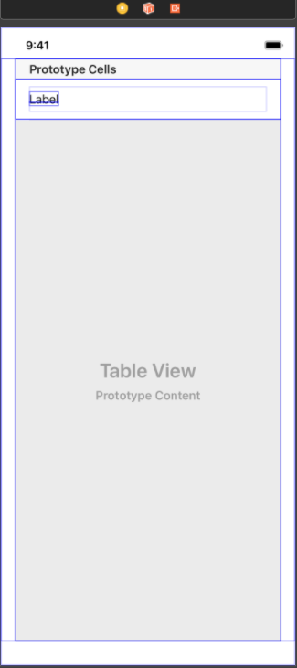

# Project 3 정리 노트

> * TableView 사용 방법
> * 네비게이션 화면 전환
> * Delegation 디자인 패턴
> * JSON 형식 데이터 사용

## 배우는 내용

- UIKit
	- [UITableView](#UITableView)
	- [UITableViewCell](#UITableViewCell)
	- [View Reuse](#뷰의-재사용)
	- [Table View Cell Customize](#TableViewCell-Customize-만들기)
    - [Segue](#Segue)
- Swift
	- [Codable](#Codable)
	- [JSONDecoder](#JSONDecoder-/-JSONEncoder)

## UITableView

> `테이블뷰`는 하나의 열과 여러 줄의 행을 지닌 수직적 스크롤이 가능한 cell의 모임이다. `cell`이란 테이블뷰의 하나의 행을 말하며 이러한 cell들을 `section`을 이용해 시각적으로 나눌 수 있다. 추가적으로 `header`와 `footer`에 이미지나 텍스트를 추가해 추가정보를 보여줄 수 있다.


### 테이블뷰 만드는 방법

1. tableView, TableViewCell 추가


2. tableViewCell 클릭 후 cellId 설정


3. 인터페이스 만들기 (cell 부분은 tableViewCell.swift 에서 드래그앤드랍)




4. 코드 작성
> ViewController.swift

~~~
import UIKit

class ViewController: UIViewController, UITableViewDelegate, UITableViewDataSource {

    @IBOutlet var tableView: UITableView!
    let cellId = "cellId"
	// cell에 넣을 임시 값
    let data = ["1", "2", "3"]
    override func viewDidLoad() {
        super.viewDidLoad()
        // delegate, dataSource 추가
        self.tableView.delegate = self
        self.tableView.dataSource = self
    }
    func tableView(_ tableView: UITableView, numberOfRowsInSection section: Int) -> Int {
        // cell 갯수 리턴
        return self.data.count
    }
    // cell
    func tableView(_ tableView: UITableView, cellForRowAt indexPath: IndexPath) -> UITableViewCell {
        let cell = self.tableView.dequeueReusableCell(withIdentifier: cellId, for: indexPath) as! TableViewCell
        cell.titleLabel.text = self.data[indexPath.row]
        return cell
    }
}
~~~

> tableViewCell.swift
~~~
import UIKit

class TableViewCell: UITableViewCell {

    @IBOutlet var titleLabel: UILabel!
    
}
~~~

### 테이블 뷰 스타일
- 일반 테이블뷰
	- 더이상 나눠지지 않는 연속적인 행의 리스트(계시판 테이블뷰)
	- 색인을 통한 빠른 탐색을 하거나 옵션을 선택할 때 좋다.
- 그룹 테이블뷰
	- 섹션을 기준으로 그룹화되어있는 리스트 형태
	- 정보를 특정 기준에 따라 개념적으로 구분할 때 적합
	- 사용자가 정보를 빠르게 이해하는 데 도움(전화번호부 ㄱㄴㄷ순 정리)

### reloadData() VS reloadSection()

1. reloadData()
```
func reloadData()
```

> 셀, 섹션 머리글 및 바닥 글, 익덱스 배열 등 (테이블 or Collection)을 구성하는 데 사용되는 모든 데이터를 다시 로드함

2. reloadSection()
```
// 지정된 애니메이션 효과를 사용하여 지정된 섹션을 다시 로드
func reloadSections(_ sections: IndexSet, 
with animation: UITableView.RowAnimation)
```

> Table or Collection 의 데이터 소스에 지정된 **섹션**에 대해 새로운 셀을 요청. 


#### 참고

- [UITableView - UIKit](https://developer.apple.com/documentation/uikit/uitableview)

[돌아가기 > 배우는 내용](#배우는-내용)


## UITableViewCell

### TableViewCell 구조

- 콘텐츠 영역 : 셀의 왼쪽 부분에서 주로 문자열, 이미지와 혹은 고유 식별자 등이 입력
- 액세서리뷰 영역 : 셀의 오른쪽 작은 부분은 액세서리뷰로 상세보기, 재정렬, 스위치 등과 같은 컨트롤 객체가 위치


테이블뷰를 편집모드(Editing Mode)로 변경시 아래와 같은 구조로 변경
- 재정렬이 가능한 경우, 재정렬 컨트롤이 액세서리뷰에 나타난다. 재정렬 컨트롤을 눌러 셀을 드래그하면 위아래로 순서 변경 가능


### 셀 콘텐츠 프로퍼티
- `textLabel: UILabel` : 주제목 레이블
- `detailTextLabel: UILabel` : 부제목 레이블
- `imageView: UIImageView` : 이미지뷰


### TableViewCell Customize 만들기

1. 커스텀셀을 위한 swift 파일 하나를 만든다.

```
import UIKit

class TableViewCell: UITableViewCell {
    // 사용할 것들 정의
    @IBOutlet var imgView: UIImageView!
    @IBOutlet var name: UILabel!
}
```

2. cell을 Storyboard의 cell에 class를 연결해주고, cell 인터페이스를 꾸며준다.

3. 사용하려는 tableView에 연동된 위치에 tableview 의 cell 정의 부분을 커스텀 셀로 지정해준다.

```
 func tableView(_ tableView: UITableView, cellForRowAt indexPath: IndexPath) -> UITableViewCell {
        
    guard let cell = self.TableView.dequeueReusableCell(withIdentifier: cellId, for: indexPath) as? TableViewCell else {
            fatalError("Could not dequeue cell with identifier: TableViewCell")
        }

        return cell
    }
```


#### 참고

- [UITableViewCell - UIKit](https://developer.apple.com/documentation/uikit/uitableviewcell)
- [TableView Programming Guide for ios](https://developer.apple.com/documentation/uikit/views_and_controls/table_views)
- [Tables - Views - ios Human Interface Guideline](https://developer.apple.com/design/human-interface-guidelines/ios/views/tables/)


[돌아가기 > 배우는 내용](#배우는-내용)

## 뷰의 재사용

> ios 기기는 한정된 메모리를 가지고 애플리케이션을 구동하기 때문에, 뷰를 재사용함으로써 메모리를 절약하고 성능 또한 향상시킬 수 있다.

예

- UITableViewCell
- UICollectionViewCell

### 재사용 원리

1. 테이블뷰 및 컬렉션뷰에서 셀을 표시하기 위해 데이터 소스에 뷰(셀) 인스턴스를 요청
2. 데이터 소스는 요청마다 새로운 셀을 만드는 대신 재사용 큐 (Reuse Queue)에 재사용을 위해 대기하고있는 셀이 있는지 확인 후 있으면 그 셀에 새로운 데이터를 설정하고, 없으면 새로운 셀을 생성
3. 테이블뷰 및 컬렉션뷰는 데이터 소스가 셀을 반환하면 화면에 표시
4. `사용자가 스크롤을 하게 되면 일부 셀들이 화면 밖으로 사라지면서 다시 재사용 큐에 들어감`
5. 위의 1번부터 4번까지의 과정이 계속 반복.


#### 참고

- [UITableView - UIKit](https://developer.apple.com/documentation/uikit/uitableview)


[돌아가기 > 배우는 내용](#배우는-내용)

## Segue

> `Segue`는 스토리보드에서 뷰 컨트롤러 사이의 `화면전환`을 위해 사용하는 `객체`이다. 

### 주요 프로퍼티
- `var source: UIViewController` : 세그에 전환을 요청하는 뷰 컨트롤러
- `var destination: UIViewController` : 전환될 뷰 컨트롤러
- `var identifier: String?` : 세그 객체의 식별자입니다.

### 주요 메서드

- `func perform()` : 뷰 컨트롤러의 전환 메소드

### Segue 연결 방법

1. `스토리보드`에서 `버튼과 같은 객체`를 클릭 후 `ctrl` 키를 누른 상태에서 이동하고 싶은 뷰에 `드래그 엔 드랍` 합니다.
2. Segue의 종류를 선택합니다.(기본: show)


#### 참고

- [UIStoryboardSegue - UIKit](https://developer.apple.com/documentation/uikit/uistoryboardsegue)


[돌아가기 > 배우는 내용](#배우는-내용)

## Codable

스위프트 4 버전에서는 스위프트의 인스턴스를 다른 데이터 형태로 변환하고 그 반대의 역할을 수행하는 방법을 제공합니다. 스위프트의 인스턴스를 다른 데이터 형태로 변환할 수 있는 기능을 Encodable 프로토콜로 표현하였고, 그 반대의 역할을 할 수 있는 기능을 Decodable로 표현해 두었습니다. 그 둘을 합한 타입을 Codable로 정의해 두었습니다.

> Swift의 인스턴스를 다른데이터로 변환하는 Encodable과 그 반대기능인 Decodable, 이 둘을 합한게 Codable!


```
typealias Codable = Decodable & Encodable
```

### 인코딩과 디코딩

- `인코딩(Encoding)`은 정보의 형태나 형식을 표준화, 보안, 처리 속도 향상, 저장 공간 절약 등을 위해서 다른 형태나 형식으로 변환하는 처리 혹은 그 처리 방식
- `디코딩(Decoding)`은 인코딩의 반대 작업을 수행하는 것

#### Decodable : Swift 타입의 인스턴스로 `디코딩`할 수 있는 프로토콜

#### Encodable : Swift 타입의 인스턴스를 `인코딩`할 수 있는 프로토콜

### 선언 예제

#### Codable

> `Codable`은 JSON 파일 형식을 Swift로 사용할 수 있도록 해주는 `타입`이다. 사용하기 위해선 JSON 파일의 Key값이 일치해야 사용이 가능하다.

```
struct People: Codable {
    var name: String
    var phoneNumber: String
    var age: Int
    var website: URL?
}
```

#### CodingKey

> 쓰는 이유! ~ > JSON 파일의 key 값이 같아야 Codable를 사용할 수 있는데, 이 key값이 Swift 코딩 스타일과 다를경우... 이를 맞춰주기 위해서 ! 사용합니다 ~_~

```
struct Landmark: Codable {
    var name: String
    var foundingYear: Int
    var location: Coordinate
    var vantagePoints: [Coordinate]
    
    enum CodingKeys: String, CodingKey {
        case name = "title"
        case foundingYear = "founding_date"
        
        case location
        case vantagePoints
    }
}
```

### 사용법

> JSON 파일을 읽을 swift 파일을 하나 선언한 후 Codable과 같이 선언을 하는데, JSON 파일 keyValue값 형식에 맞춰서 작성해 준 다음 다음에 배울 JSON파일을 swift 파일을 통해서 읽어주면 된다.

### Swift 코딩 스타일이란..?

```
1. class, enum 의 이름은 대문자 카멜표기법을 사용한다. 
2. enum의 case이름은 소문자 카멜표기법을 사용한다.
```

#### 참고

- [Codable - Swift Standard Library](https://developer.apple.com/documentation/swift/codable)
- [Encodable - Swift Standard Library](https://developer.apple.com/documentation/swift/encodable)
- [Decodable - Swift Standard Library](https://developer.apple.com/documentation/swift/decodable)
- [CodingKey - Swift Standard Library](https://developer.apple.com/documentation/swift/codingkey)

[돌아가기 > 배우는 내용](#배우는-내용)

## JSONDecoder / JSONEncoder

> JSON 파일을 Swift에서 읽고 쓸 수 있게 하는 것, Swift 4부터 JSONDecoder가 Codable 프로토콜을 지원하기 때문에, 이를 이용해서 JSON 형식으로 인코딩 및 디코딩을 할 수 있다.

### JSONEncoder 예제

Codable 프로토콜을 준수하는 GroceryProduct 구조체의 인스턴스를 JSON 데이터로 인코딩하는 방법.

```
struct GroceryProduct: Codable {
    var name: String
    var points: Int
    var description: String?
}

let pear = GroceryProduct(name: "Pear", points: 250, description: "A ripe pear.")

let encoder = JSONEncoder()
encoder.outputFormatting = .prettyPrinted

do {
	let data = try encoder.encode(pear)
	print(String(data: data, encoding: .utf8)!)
} catch {
	print(error)
}

// ----- 출력
 {
   "name" : "Pear",
   "points" : 250,
   "description" : "A ripe pear."
 }

// Tip : encoder.outputFormatting = .prettyPrinted 설정하면 들여쓰기를 통해 가독성이 좋게 출력해줍니다.
```

### JSONDecoder 예제

JSON 데이터를 Codable 프로토콜을 준수하는 GroceryProduct 구조체의 인스턴스로 디코딩하는 방법입니다.

```
struct GroceryProduct: Codable {
    var name: String
    var points: Int
    var description: String?
}

/// 스위프트 4 버전부터 """를 통해 여러 줄 문자열을 사용할 수 있습니다.
let json = """
{
    "name": "Durian",
    "points": 600,
    "description": "A fruit with a distinctive scent."
}
""".data(using: .utf8)!

let decoder = JSONDecoder()

do {
	let product = try decoder.decode(GroceryProduct.self, from: json)
	print(product.name)
} catch {
	print(error)
}
// ----- 출력 
"Durian"

// 출처 : edwith
```

#### 참고

- [JSONEncoder - Foundation](https://developer.apple.com/documentation/foundation/jsonencoder)
- [JSONDecoder - Foundation](https://developer.apple.com/documentation/foundation/jsondecoder)

[돌아가기 > 배우는 내용](#배우는-내용)
