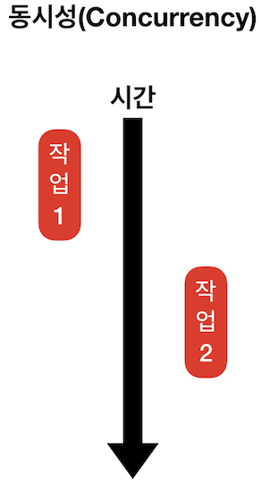
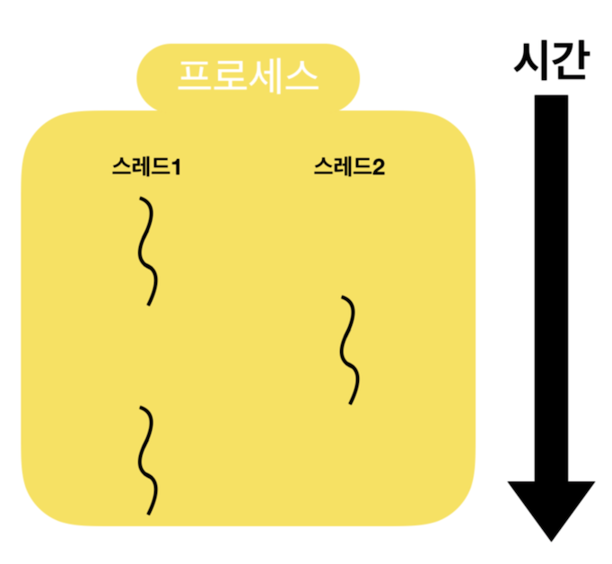
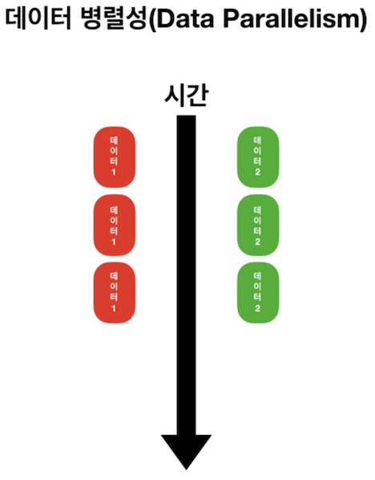
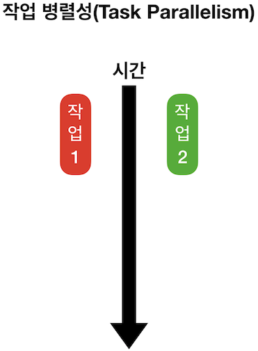
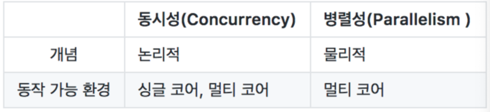

# Project 4 정리 노트

> * Photos Framework
> * 비동기 프로그래밍
> * 사진앨범 구현


## 배우는 내용

- FrameWork
    - [Photos](#photos-FrameWork)
- UIKit
	- [UICollectionView]
	- [UICollectionViewCell]
	- [UICollectionViewFlowLayout]
	- [UINavigationItem]
    - [UIBarButtonItem]
    - [UIStoryboardSegue]
    - [UIScrollView]
- Concurrency Programming(실시간 프로그래밍)
	- [Asynchronous Programming](#동시성-프로그래밍과-비동기-프로그래밍)
	- [OperationQueue](#OperationQueue)

## photos FrameWork

> ios photos FrameWork를 사용해서 쉽게 사진 라이브러리를 포함한 사진 및 비디오에 직접 접근할 수 있다.

### FrameWork란 뭐야..?

소프트웨어의 구체적인 부분에 해당하는 설계와 구현을 재사용이 가능하게끔 일련의 협업화된 형태로 클래스들을 제공하는 것

> 라이브러리랑 비슷하지만, 결국 둘다 쉽게 재사용할 수 있는 것이고.. FrameWork는 전체적인 틀 이라 할 수있고, 라이브러리는 기능을 당담하는 부품같은 것이라 할 수있다.

### Photos FrameWork의 특징 및 개념

Photos FrameWork에는 ios 및 tvOS에서 사용자의 사진 라이브러리와 직접 작업하기 위한 여러가지 기능들이 있다.

- 에셋


- 에셋 컬렉션


- 컬렉션 리스트


- 객체 가져오기 및 변경요청
    - `Photos FrameWork 모델 클래스(PHAsset, PHAssetCollection, PHCollectionList)의 인스턴스`는 사진 애플리케이션에서 `에셋`(이미지, 비디오, 라이브 포토), `에셋 컬렉션`(앨범, 특별한 순간) 및 `사용자가 작업하는 항목`을 `나타냅니다`. 
    - 해당 객체를 사용하여 작업해야 하는 데이터를 가져와서 에셋 및 컬렉션 작업을 할 수 있습니다. 변경 요청을 하려면 변경 요청 객체를 만들고 이를 공유 PHPhotoLibrary 객체에 명시적으로 알려줍니다. 이 아키텍처를 사용하면 다수의 스레드 혹은 다수의 애플리케이션과 동일한 에셋을 사용하여 쉽고 안전하며 효율적으로 작업할 수 있습니다.
- 변경을 관찰
- Photos 애플리케이션의 기능들을 지원
- 에셋과 미리보기 로딩 및 캐싱
- 에셋 콘텐츠 편집

### Photos 관련 객체

- Photos 라이브러리 상호작용
    - `PHPhotoLibrary` : 사용자의 사진 라이브러리에 대한 접근 및 변경을 관리하는 공유 객체.
- 에셋 검색과 조사
    - `PHAsset` : 사진 라이브러리의 이미지, 비디오, 라이브 포토를 나타낸다.
    - `PHAssetCollection` : 특별한 순간, 사용자정의 앨범 또는 스마트 앨범과 같은 사진, 에셋 그룹을 나타낸다.
    - `PHCollectionList` : 특별한 순간, 사용자정의 앨범, 특별한 순간들 연도와 같은 에셋 컬렉션이 포함된 그룹을 나타낸다.
    - `PHCollection` : 에셋 컬렉션 및 컬렉션 리스트의 추상 수퍼 클래스
    - `PHObject` : 모델 객체(에셋 및 컬렉션)의 추상 수퍼 클래스
    - `PHFetchResult` : 가져오기 메서드에서 반환된 에셋 또는 컬렉션의 정렬된 목록
    - `PHFetchOptions` : 에셋 또는 컬렉션 객체를 가져올 때 Photos에서 반환하는 결과에 필터링, 정렬 등 영향을 주는 옵션
- 에셋 콘텐츠 로딩
    - `PHImageManager` : 미리보기 썸네일 및 에셋과 전체 크기의 이미지 또는 비디오 데이터를 검색하거나 생성하는 방법을 제공
    - `PHCachingImageManager` : 많은 에셋을 일괄적으로 미리 로딩하기 위해 최적화된 에셋과 관련된 섬네일 및 전체 크기의 이미지 또는 비디오 데이터를 검색하거나 생성하는 방법을 제공
    - `PHImageRequestOptions` : 이미지 매니저로부터 요청한 에셋 이미지의 영향을 주는 옵션들
    - `PHVideoRequestOptions` : 이미지 매니저로부터 요청한 비디오 에셋 데이터의 영향을 주는 옵션들
    - `PHLivePhotoRequestOptions` : 이미지 매니저로부터 요청한 라이브 포토 에셋의 영향을 주는 옵션들
    - `PHLivePhoto` : 캡처 직전과 직후 순간의 움직임 및 소리가 포함된 라이브 사진을 표현
- 변경 요청
    - `PHAssetChangeRequest` : 사진 라이브러리 변경 블록(클로저)에서 사용하기 위해 에셋의 생성, 삭제, 메타 데이터 수정할 변경 요청 객체
    - `PHAssetCollectionChangeRequest` : 사진 라이브러리 변경 블록(클로저)에서 사용하기 위해 에셋 컬렉션을 생성, 삭제, 수정할 변경 요청 객체
    - `PHCollectionListChangeRequest` : 사진 라이브러리 변경 블록(클로저)에서 사용하기 위해 컬렉션 리스트 생성, 삭제, 수정할 변경 요청 객체
- 에셋 콘텐츠 수정
    - `PHContentEditingInput` : 편집할 에셋의 이미지, 비디오, 라이브 포토의 콘텐츠에 대한 정보와 접근 권한을 제공하는 컨테이너
    - `PHContentEditingOutput` : 에셋의 사진, 비디오, 라이브 포토의 콘텐츠를 편집한 결과를 제공하는 컨테이너
    - `PHAdjustmentData` : 편집 효과를 재구성하거나 되돌릴 수 있는 에셋의 사진, 비디오, 라이브 포토 콘텐츠의 수정사항에 대한 설명들
- Adjustment Data
    - `PHContentEditingInputRequestOptions` : 에셋의 콘텐츠를 수정하도록 요청할 때 이미지, 비디오 데이터전송에 영향을 주는 옵션
    - `PHLivePhotoEditingContext` : 라이브 포토의 사진, 비디오, 오디오 콘텐츠를 수정하기 위한 편집 세션
    - `PHLivePhotoFrame` : 편집 컨텍스트에서 라이브 포토의 단일 프레임에 대한 이미지 콘텐츠를 제공하는 컨테이너
- 변경사항 관찰
    - `PHPhotoLibraryChangeObserver` : 사진 라이브러리에서 발생한 변경사항을 알리기 위해 구현할 수 있는 프로토콜
    - `PHChange` : 사진 라이브러리에서 발생한 변경사항에 대한 설명
    - `PHObjectChangeDetails` : 에셋 또는 컬렉션 객체에서 발생한 변경사항에 대한 설명
    - `PHFetchResultChangeDetails` : 가져오기 결과에 나열된 에셋 또는 컬렉션 객체에서 발생한 변경사항에 대한 설명
- 에셋 리소스 작업
    - `PHAssetResource` : 사진 라이브러리의 사진, 비디오, 라이브 포토 에셋과 관련된 기본 데이터 리소스
    - `PHAssetCreationRequest` : 사진 라이브러리 변경 블록(클로저)에서 사용하기 위해 기본 데이터 리소스에서 새로운 에셋을 생성하라는 요청
    - `PHAssetResourceCreationOptions` : 기본 리소스에서 새로운 에셋을 만드는데 영향을 주는 옵션들
    - `PHAssetResourceManager` : 애샛과 관련된 리소스에 대한 기본 데이터 저장소에 접근하는 방법을 제공
    - `PHAssetResourceRequestOptions` : 에셋 리소스 관리자가 요청한 기본 에셋 데이터 전달에 영향을 주는 옵션


#### 참고

- [Photos](https://developer.apple.com/documentation/photos)
- [PhotosUI](https://developer.apple.com/documentation/photosui)

[돌아가기 > 배우는 내용](#배우는-내용)

## 동시성 프로그래밍과 비동기 프로그래밍

### 비동기 프로그래밍이란..?

> 결과적으로 말하면 여러 작업을 할 때 하나의 작업이 끝나기까지 `기다리지 않고` 별도의 공간에 맡겨둔 뒤 다음 코드를 실행하는 `병렬처리 방식`이다. 비동기 프로그래밍을 알기 위해 알아야 할 개념 중 하나가 쓰레드 이다.

### 동기 프로그래밍은..?

> 요청과 그 결과가 동시에 일어나는.. 프로그래밍 이다.. 그렇기 때문에 한 작업이 요청을 하면 시간이 얼마나 걸리던지 요청한 자리에서 결과가 나올 때 까지 기다려야 하기 때문에 `병렬처리 방식에는 어울리지 않는다.` 즉 이름만 보면 동시에 실행되는 것 같지만 사실은 서로 번갈아 가면서 실행되는 방식..

### 동시성 프로그래밍

> 논리적인 용어로 동시에 실행되는 것처럼 보이는 것입니다. 싱글 코어(멀티 코어에서도 가능)에서 멀티스레드를 동작시키기 위한 방식으로 멀티 태스킹을 위해 여러 개의 스레드가 번갈아 가면서 실행되는 방식입니다. 동시성을 이용한 싱글 코어의 멀티 태스킹은 각 스레드들이 병렬적으로 실행되는 것처럼 보이지만 사실은 서로 번갈아 가면서 실행되고 있는 방식. * 동시성이랑,, 동기 프로그래밍이랑 같은건가..?



### 비동기 프로그래밍을 알기 위해 알아야 할 것들


- 코어
> 프로세서에서 코어는 주요 연산회로입니다. 싱글코어는 말 그대로 하나의 연산회로가 내장되어있는 것이고 듀얼코어는 두 개의 연산회로가 내장된 것을 뜻합니다. 또, 여러 개의 코어를 가진 프로세서를 멀티 프로세서라고 합니다.

- 쓰레드 : 
> 쓰레드는 하나의 프로세스 내에서 실행되는 `작업흐름의 단위`를 말한다. 보통 한 프로세스는 하나의 쓰레드를 가지고 있고 환경에 따라 여러 쓰레드를 동시에 실행할 수 있다. 이러한 방식을 `멀티쓰레딩`이라고 한다. 그리고 프로그램 실행이 시작될 때부터 동작하는 쓰레드를 `메인 쓰레드`라고 하고, 그 외에 생성된 쓰레드를 `서브 쓰레드 or 세컨더리 쓰레드`라고 한다.



### 병렬(Parallelism) 프로그래밍

> 물리적으로 동시에 정확히 실행되는 것을 말한다. 멀티코어에서 멀티 쓰레드를 동작시키는 방식으로 `데이터 병렬성`과 `작업 병렬성`으로 구분된다.

- `데이터 병렬성` : 전체 데이터를 나누어 서브 데이터들로 만든 뒤, 서브 데이터들을 병렬 처리해서 작업을 빠르게 수행하는 방법.



- `작업 병렬성` : 서로 다른 작업을 병렬 처리하는 것



### 동시성과 병렬성의 차이

동시성 프로그래밍과 병렬성 프로그래밍 모두 비동기(Asynchronous) 동작을 구현할 수 있지만, 그 동작 원리가 다르다.



> 동시성은 싱글코어 및 멀티코어에서 모두 구현할 수 있지만, 병렬성은 멀티 코어에서만 구현할 수 있다.

### IOS환경 동시성 프로그래밍 지원 종류

- `Grand Central Dispatch (GCD)` : 멀티 코어와 멀티 프로세싱 환경에서 최적화된 프로그래밍을 할 수 있도록 애플이 개발한 기술.
- `연산 대기열 (Operation Queue)` : 비동기적으로 실행되어야 하는 작업을 객체 지향적인 방법으로 사용
- `Thread` : 멀티스레드 프로그래밍을 위한 애플에서 제공하는 스레드 클래스


#### 참고

- [Thread - Apple Developer Doc](https://developer.apple.com/documentation/foundation/thread)
- [OperationQueue - Apple Developer](https://developer.apple.com/documentation/foundation/operationqueue)


[돌아가기 > 배우는 내용](#배우는-내용)


## OperationQueue

> 연산의 실행을 관리하고 대기열의 동작관리를 한다.

### Operation Queue란..?

`Operation`는 작업과 관련된 코드와 데이터를 나타내는 `추상 클래스`, `Queue`는 대기열, 즉 `Operation Queue`는 작업을 관리하고 대기열의 동작을 관리하는 역할을 한다.

### OperationQueue의 주요 메서드 / 프로퍼티

#### 특정 Operation Queue 가져오기

- `current` : 현재 작업을 시작한 Operation Queue를 반환
```
class var current: OperationQueue? { get }​
```

- `main` : 메인 스레드와 연결된 Operation Queue를 반환합니다.

```
class var main: OperationQueue { get }​
```

#### Queue(대기열)에서 동작(Operation) 관리

- `addOperation(_:)` : 연산 객체(Operation Object)를 대기열(Queue)에 추가.

```
func addOperation(_ op: Operation)
```

- `addOperations(_:waitUntilFinished:)` : 연산 객체(Operation Object) 배열을 대기열(Queue)에 추가

```
func addOperations(_ ops: [Operation], waitUntilFinished wait: Bool)
```

- `addOperation(_:)` : 전달한 클로저를 연산 객체(Operation Object)에 감싸서 대기열(Queue)에 추가

```
func addOperation(_ block: @escaping () -> Void)
```

- `cancelAllOperations()` : 대기 중이거나 실행 중인 모든 연산(Operation)을 취소

```
func cancelAllOperations()
```

- `waitUntilAllOperationsAreFinished()` : 대기 중인 모든 연산(Operation)과 실행 중인 연산(Operation)이 모두 완료될 때까지 현재 스레드로의 접근을 차단

```
func waitUntilAllOperationsAreFinished()
```

#### Operation 실행 관리

- `maxConcurrentOperationCount` : 동시에 실행할 수 있는 연산(Operation)의 최대 수

```
var maxConcurrentOperationCount: Int { get set }​
```

- `qualityOfService` : 대기열 작업을 효율적으로 수행할 수 있도록 여러 우선순위 옵션을 제공

```
var qualityOfService: QualityOfService { get set }
```

#### Operation 중단

- `isSuspended` : 대기열(Queue)의 연산(Operation) 여부를 나타내기 위한 부울 값입니다. false인 경우 대기열(Queue)에 있는 연산(Operation)을 실행하고, true인 경우 대기열(Queue)에 대기 중인 연산(Operation)을 실행하진 않지만 이미 실행 중인 연산(Operation)은 계속 실행됩니다.

```
var isSuspended: Bool { get set }
```

#### Queue의 구성

- `name` : Operation Queue의 이름

```
var name: String? { get set }​
```


#### 참고

- [OperationQueue - Foundation](https://developer.apple.com/documentation/foundation/operationqueue)
- [Operation - Foundation](https://developer.apple.com/documentation/foundation/operation)

[돌아가기 > 배우는 내용](#배우는-내용)