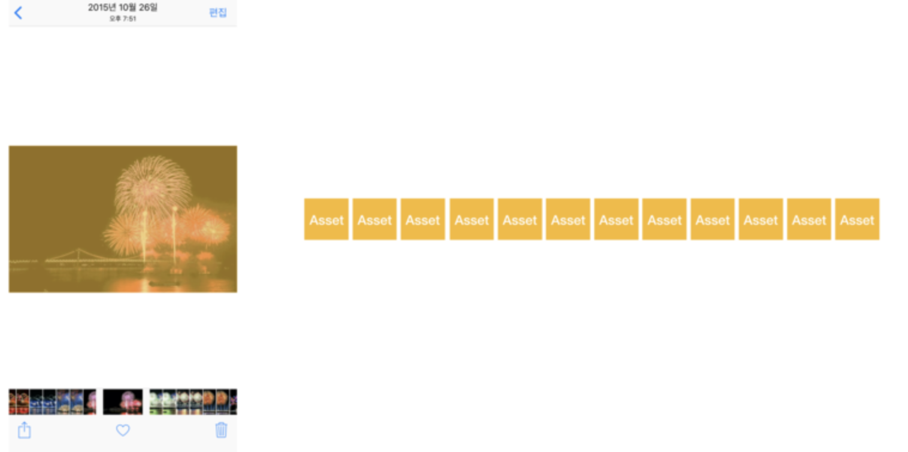
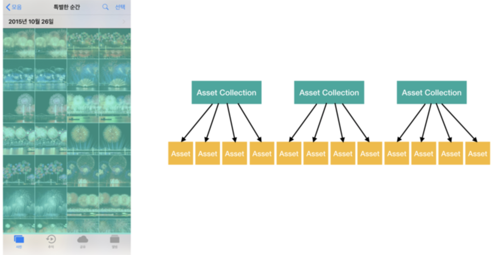
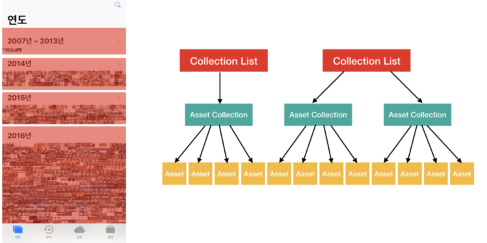

# Project 4 정리 노트

> * Photos Framework
> * 비동기 프로그래밍
> * 사진앨범 구현


## 배우는 내용

- FrameWork
    - [Photos](#photos-FrameWork)
- UIKit
	- [UICollectionView]
	- [UICollectionViewCell]
	- [UICollectionViewFlowLayout]
	- [UINavigationItem]
    - [UIBarButtonItem]
    - [UIStoryboardSegue]
    - [UIScrollView]
- Concurrency Programming(실시간 프로그래밍)
	- [Asynchronous Programming]
	- [OperationQueue]

## photos FrameWork

> ios photos FrameWork를 사용해서 쉽게 사진 라이브러리를 포함한 사진 및 비디오에 직접 접근할 수 있다.

### FrameWork란 뭐야..?

소프트웨어의 구체적인 부분에 해당하는 설계와 구현을 재사용이 가능하게끔 일련의 협업화된 형태로 클래스들을 제공하는 것

> 라이브러리랑 비슷하지만, 결국 둘다 쉽게 재사용할 수 있는 것이고.. FrameWork는 전체적인 틀 이라 할 수있고, 라이브러리는 기능을 당담하는 부품같은 것이라 할 수있다.

### Photos FrameWork의 특징 및 개념

Photos FrameWork에는 ios 및 tvOS에서 사용자의 사진 라이브러리와 직접 작업하기 위한 여러가지 기능들이 있다.

- 에셋


- 에셋 컬렉션


- 컬렉션 리스트


- 객체 가져오기 및 변경요청
    - `Photos FrameWork 모델 클래스(PHAsset, PHAssetCollection, PHCollectionList)의 인스턴스`는 사진 애플리케이션에서 `에셋`(이미지, 비디오, 라이브 포토), `에셋 컬렉션`(앨범, 특별한 순간) 및 `사용자가 작업하는 항목`을 `나타냅니다`. 
    - 해당 객체를 사용하여 작업해야 하는 데이터를 가져와서 에셋 및 컬렉션 작업을 할 수 있습니다. 변경 요청을 하려면 변경 요청 객체를 만들고 이를 공유 PHPhotoLibrary 객체에 명시적으로 알려줍니다. 이 아키텍처를 사용하면 다수의 스레드 혹은 다수의 애플리케이션과 동일한 에셋을 사용하여 쉽고 안전하며 효율적으로 작업할 수 있습니다.
- 변경을 관찰
- Photos 애플리케이션의 기능들을 지원
- 에셋과 미리보기 로딩 및 캐싱
- 에셋 콘텐츠 편집

### Photos 관련 객체

- Photos 라이브러리 상호작용
    - `PHPhotoLibrary` : 사용자의 사진 라이브러리에 대한 접근 및 변경을 관리하는 공유 객체.
- 에셋 검색과 조사
    - `PHAsset` : 사진 라이브러리의 이미지, 비디오, 라이브 포토를 나타낸다.
    - `PHAssetCollection` : 특별한 순간, 사용자정의 앨범 또는 스마트 앨범과 같은 사진, 에셋 그룹을 나타낸다.
    - `PHCollectionList` : 특별한 순간, 사용자정의 앨범, 특별한 순간들 연도와 같은 에셋 컬렉션이 포함된 그룹을 나타낸다.
    - `PHCollection` : 에셋 컬렉션 및 컬렉션 리스트의 추상 수퍼 클래스
    - `PHObject` : 모델 객체(에셋 및 컬렉션)의 추상 수퍼 클래스
    - `PHFetchResult` : 가져오기 메서드에서 반환된 에셋 또는 컬렉션의 정렬된 목록
    - `PHFetchOptions` : 에셋 또는 컬렉션 객체를 가져올 때 Photos에서 반환하는 결과에 필터링, 정렬 등 영향을 주는 옵션
- 에셋 콘텐츠 로딩
    - `PHImageManager` : 미리보기 썸네일 및 에셋과 전체 크기의 이미지 또는 비디오 데이터를 검색하거나 생성하는 방법을 제공
    - `PHCachingImageManager` : 많은 에셋을 일괄적으로 미리 로딩하기 위해 최적화된 에셋과 관련된 섬네일 및 전체 크기의 이미지 또는 비디오 데이터를 검색하거나 생성하는 방법을 제공
    - `PHImageRequestOptions` : 이미지 매니저로부터 요청한 에셋 이미지의 영향을 주는 옵션들
    - `PHVideoRequestOptions` : 이미지 매니저로부터 요청한 비디오 에셋 데이터의 영향을 주는 옵션들
    - `PHLivePhotoRequestOptions` : 이미지 매니저로부터 요청한 라이브 포토 에셋의 영향을 주는 옵션들
    - `PHLivePhoto` : 캡처 직전과 직후 순간의 움직임 및 소리가 포함된 라이브 사진을 표현
- 변경 요청
    - `PHAssetChangeRequest` : 사진 라이브러리 변경 블록(클로저)에서 사용하기 위해 에셋의 생성, 삭제, 메타 데이터 수정할 변경 요청 객체
    - `PHAssetCollectionChangeRequest` : 사진 라이브러리 변경 블록(클로저)에서 사용하기 위해 에셋 컬렉션을 생성, 삭제, 수정할 변경 요청 객체
    - `PHCollectionListChangeRequest` : 사진 라이브러리 변경 블록(클로저)에서 사용하기 위해 컬렉션 리스트 생성, 삭제, 수정할 변경 요청 객체
- 에셋 콘텐츠 수정
    - `PHContentEditingInput` : 편집할 에셋의 이미지, 비디오, 라이브 포토의 콘텐츠에 대한 정보와 접근 권한을 제공하는 컨테이너
    - `PHContentEditingOutput` : 에셋의 사진, 비디오, 라이브 포토의 콘텐츠를 편집한 결과를 제공하는 컨테이너
    - `PHAdjustmentData` : 편집 효과를 재구성하거나 되돌릴 수 있는 에셋의 사진, 비디오, 라이브 포토 콘텐츠의 수정사항에 대한 설명들
- Adjustment Data
    - `PHContentEditingInputRequestOptions` : 에셋의 콘텐츠를 수정하도록 요청할 때 이미지, 비디오 데이터전송에 영향을 주는 옵션
    - `PHLivePhotoEditingContext` : 라이브 포토의 사진, 비디오, 오디오 콘텐츠를 수정하기 위한 편집 세션
    - `PHLivePhotoFrame` : 편집 컨텍스트에서 라이브 포토의 단일 프레임에 대한 이미지 콘텐츠를 제공하는 컨테이너
- 변경사항 관찰
    - `PHPhotoLibraryChangeObserver` : 사진 라이브러리에서 발생한 변경사항을 알리기 위해 구현할 수 있는 프로토콜
    - `PHChange` : 사진 라이브러리에서 발생한 변경사항에 대한 설명
    - `PHObjectChangeDetails` : 에셋 또는 컬렉션 객체에서 발생한 변경사항에 대한 설명
    - `PHFetchResultChangeDetails` : 가져오기 결과에 나열된 에셋 또는 컬렉션 객체에서 발생한 변경사항에 대한 설명
- 에셋 리소스 작업
    - `PHAssetResource` : 사진 라이브러리의 사진, 비디오, 라이브 포토 에셋과 관련된 기본 데이터 리소스
    - `PHAssetCreationRequest` : 사진 라이브러리 변경 블록(클로저)에서 사용하기 위해 기본 데이터 리소스에서 새로운 에셋을 생성하라는 요청
    - `PHAssetResourceCreationOptions` : 기본 리소스에서 새로운 에셋을 만드는데 영향을 주는 옵션들
    - `PHAssetResourceManager` : 애샛과 관련된 리소스에 대한 기본 데이터 저장소에 접근하는 방법을 제공
    - `PHAssetResourceRequestOptions` : 에셋 리소스 관리자가 요청한 기본 에셋 데이터 전달에 영향을 주는 옵션

### Photos FrameWork 사진 가져오기 예제

```
// VC.swift
// info.plist에서 Privacy - Photo Library Usage Description 추가 (권한 메세지 String에 적어줌)

import UIKit
import Photos

class ViewController: UIViewController, UITableViewDataSource {
    
    @IBOutlet var tableView: UITableView!
    
    var fetchResult: PHFetchResult<PHAsset>!
    let imageManager: PHCachingImageManager = PHCachingImageManager()
    let cellId: String = "cellId"
    
    
    override func viewDidLoad() {
        super.viewDidLoad()
        // Do any additional setup after loading the view.
        let photoAurthorizationStatus = PHPhotoLibrary.authorizationStatus()
        
        switch photoAurthorizationStatus {
        case .authorized:
            print("접근 허가됨")
            self.requestCollection()
            self.tableView.reloadData()
        case .denied:
            print("접근 불허")
        case .notDetermined:
            print("아직 응답하지 않음")
            PHPhotoLibrary.requestAuthorization({ (status) in
                switch status {
                case .authorized:
                    print("사용자가 허용함")
                    self.requestCollection()
                    OperationQueue.main.addOperation {
                        self.tableView.reloadData()
                    }
                    
                case .denied:
                    print("사용자가 불허함")
                default:
                    break
                }
            })
        case .restricted:
            print("접근 제한")
        default:
            print("err")
        }
        
    }
    
    func requestCollection() {
        let cameraRoll: PHFetchResult<PHAssetCollection> = PHAssetCollection.fetchAssetCollections(with: .smartAlbum, subtype: .smartAlbumUserLibrary, options: nil)
        
        guard let cameraRollCollection = cameraRoll.firstObject else {
            return
        }
        
        let fetchOptions = PHFetchOptions()
        fetchOptions.sortDescriptors = [NSSortDescriptor(key: "creationDate", ascending: false)]
        self.fetchResult = PHAsset.fetchAssets(in: cameraRollCollection, options: fetchOptions)
    }
    
    func tableView(_ tableView: UITableView, numberOfRowsInSection section: Int) -> Int {
        return self.fetchResult?.count ?? 0
    }
    
    func tableView(_ tableView: UITableView, cellForRowAt indexPath: IndexPath) -> UITableViewCell {
        let cell: UITableViewCell = tableView.dequeueReusableCell(withIdentifier: self.cellId, for: indexPath)
        
        let asset: PHAsset = fetchResult.object(at: indexPath.row)
        
        imageManager.requestImage(for: asset,
                                  targetSize: CGSize(width: 30, height: 30),
                                  contentMode: .aspectFill,
                                  options: nil,
                                  resultHandler: { image, _ in
                                    cell.imageView?.image = image
        })
        
        return cell
    }
}
```

#### 참고

- [Photos](https://developer.apple.com/documentation/photos)
- [PhotosUI](https://developer.apple.com/documentation/photosui)

[돌아가기 > 배우는 내용](#배우는-내용)
