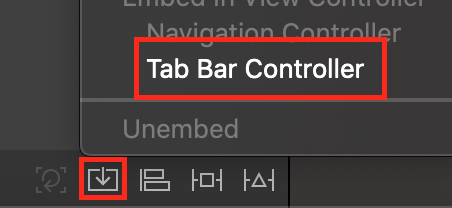

# Project 5 정리 노트

## 배우는 내용

- UIKit
	- [UIAlertController](#UIAlertController)
	- [UITabBarController](#UITabBarController)
- Foundation
	- [URLSession](#URLSession)
	- [Notification](#Notification)
- [DispatchQueue](#DispatchQueue)

## UIAlertController

> 알림 또는 경고창을 띄우는 Controller이다.


### 종류

#### 1. Alert


#### 2. ActionSheet


### UIAlertAction.Style

- default: 기본 스타일
- cancel: 취소하거나 유지 등 변경사항 없을 경우 적용하는 스타일
- destructive: 경고

#### 1. Alert의 Action 스타일


#### 2. ActionSheet의 Action 스타일


### Alert 사용 구분 예

#### 1. Alert 사용 예
- 중요한 액션을 하기 전 경고가 필요한 경우
- 액션을 취소할 기회를 제공해야 하는 경우
- 사용자의 작업을 한 번 더 확인하거나 삭제 등의 작업을 수행하거나 문제 사항을 알릴 때
- 결정이 필요한 중요 정보를 표시할 경우

#### 2. ActionSheet 사용 예
- 사용자가 고를 수 있는 액션 목록이 여러 개일 경우
- 새 작업 창을 열거나, 종료 여부 확인 시
- 사용자의 결정을 되돌리거나 그 동작이 중요하지 않을 경우

### 사용 예시

```
// 1. 컨트롤러를 정의해줌
let alertController: UIAlertControll = UIAlertController(title: "Title", message: "Message", preferredStyle: style)

// 2. 컨트롤러에 넣을 버튼을 만들어준다. 타입 종류는 3가지, default, cancel, destructive 가 있음
// handler 부분이 있는데, 이부분에 액션이 실행 성공시 작동하는 부분을 설정해 줄 수 있음, 필요없을시 handler부분에 nil 넣어주면 됨
let okAction: UIAlertAction = UIAlertAction(title: "OK", style: UIAlertAction.Style.default, handler: {(action: UIAlertAction) in
	print("OK pressed")
})

// 3. 만들어준 Action을 컨트롤러에 추가해줌
alertController.addAction(okAction)

// alertController가 화면에 나타날 수 있도록 present 해준다.
self.present(alertController, animated: true, completion: {
	print("Alert controller shown")
})
```

### 주요 메서드

`func addTextField(configurationHandler: (UITextField) -> Void?)`

### 주의할 점

UIAlertController안에 있는 Action 중, `Style.cancel`은 하나만 존재해야 한다. 그 이유는... **못찾겠다..ㅋ.. 하면 오류뜨는데;**


#### 참고

- [UIAlertController - UIKit](https://developer.apple.com/documentation/uikit/uialertcontroller)
- [UIAlertAction - UIKit](https://developer.apple.com/documentation/uikit/uialertaction)

[돌아가기 > 배우는 내용](#배우는-내용)


## UITabBarController

> Inherits From: UIViewController

### 생성 방법 (in Storyboard)

#### 1. View 끼리 묶기 ( View 다중 선택 후)



#### 2. TabBarController에서 View 추가하기


### 인스펙터창 관련..

- translucent: 탭 막대가 반투명인지 여부를 나타내는 부울 값입니다.


### 생성 방법 (programmatically)

```
import UIKit

class TabBarControllerByCode: UIViewController {
    override func viewDidLoad() {
        super.viewDidLoad()
        // tabBarController 정의
        let tabBarController: UITabBarController = UITabBarController()
        // 추가할 뷰들 정의..
        let firstV = ViewController()
        firstV.title = "firstView"
        firstV.view.backgroundColor = UIColor.orange
        firstV.tabBarItem = UITabBarItem(tabBarSystemItem: .favorites, tag: 0)
        
        let VC = UIViewController()
        VC.title = "secondView"
        VC.view.backgroundColor = UIColor.black
        VC.tabBarItem = UITabBarItem(tabBarSystemItem: .bookmarks, tag: 1)
        // 적용
        let controllers = [firstV, VC]
        tabBarController.viewControllers = controllers
        tabBarController.viewControllers = controllers.map{
            UINavigationController(rootViewController: $0)
        }
        self.view.addSubview(tabBarController.view)
        self.addChild(tabBarController)
    }
}
```

### 사용중인 tabBar 기존 설정 변경하기 예제

```
func initialize() {
	guard let tabBar = self.tabBarController?.tabBar else {
		return
	}
	// 선택되지 않은 탭 색상 변경
	tabBar.unselectedItemTintColor = UIColor(red: 1, green: 1, blue: 1, alpha: 0.7)
}
```

### [UITabBarControllerDelegate(링크)](https://developer.apple.com/documentation/uikit/uitabbarcontrollerdelegate)

> 사용자가 탭바 인터페이스와 상호작용할 때, 탭바 컨트롤러 객체는 이 상호작용에 관한 알림(notification)을 델리게이트 인스턴스로 보낸다. 

- 사용자가 탭을 선택하지 못하게 하거나,
- 탭을 선택한 후 추가 작업을 수행하거나, 
- 탭 관련 사항을 모니터링하고 사용자화할 때 델리게이트를 활용..


#### 참고

- [UITabBarController - UIKit](https://developer.apple.com/documentation/uikit/uitabbarcontroller)
- [UITabBarControllerDelegate - UIKit](https://developer.apple.com/documentation/uikit/uitabbarcontrollerdelegate)
- [Haman Interface Guidelines for iOS - Tab Bars](https://developer.apple.com/design/human-interface-guidelines/ios/bars/tab-bars/)

[돌아가기 > 배우는 내용](#배우는-내용)


## DispatchQueue

> class DispatchQueue: DispatchObject

### DispatchQueue는 뭐야??

> 디스패치큐는 **작업을 연속적 or 동시에 진행**하기는 하지만, 언제나 **먼저 들어오면 먼저 나가는 순서로 실행**(FIFO 큐)됩니다. **Serial Dispatch Queue**(default)는 한 번에 하나의 작업만을 실행하며, 해당 작업이 대기열에서 제외되고 새로운 작업이 시작되기 전까지 기다립니다. 이와는 반대로 **Concurrent Dispatch Queue**는 이미 시작된 작업이 완료될 때까지 기다리지 않고 가능한 많은 작업을 진행합니다. **DispatchQueue의 장점**은 일반 스레드 코드보다 쉽고 효율적으로 코드를 작성할 수 있다는 점입니다.  디스패치큐는 GCD 기술의 일부 입니다.


### Grand Cetral Dispatch

> 줄여서 **GCD**.. 멀티코어와 멀티 프로세싱 환경에서 최적화된 프로그래밍을 할 수 있도록 애플이 개발한 기술.. 실행할 태스크를 Dispatch Queue에 추가하면 GCD는 태스크(작업)에 맞는 스레드를 자동으로 생성해서 실행하고, 작업이 종료되면 해당 스레드를 제거합니다.

### DispatchQueue 특징

- FIFO 큐
- 명확하고 쉬운 인터페이스
- 스레드 관리를 자동으로 해줍니다.
- 어셈블리 레벨에서 튜닝되어 빠른 동작 제공
- 메모리 면에서도 효율적(애플리케이션 메모리를 점유하지 않기 때문)
- 작업중 예외 발생시키지 않습니다.
- 비동기적으로 작업을 queue에 넣어도 데드락이 생기지 않는다.
- Serial DispatchQueue는 lock이나 여러 동기화 연산보다 더 효과적

### 대기열(Queue) 유형


- **Serial**
대기열(Queue)에 등록한 순서대로 작업을 실행합니다. 하나의 작업을 실행하고 실행이 끝날 때까지 대기열(Queue)에 있는 다른 작업을 미루고 있다가 이전 작업이 끝나면 실행합니다.
- **Concurrent**
실행 중인 작업이 끝나기를 기다리지 않고 대기열(Queue)에 있는 작업을 동시에 별도의 스레드를 사용하여 실행합니다. 즉, 병렬처리 방식입니다.
- **Main dispatch queue**
globally available serial queue that executes tasks on the application’s main thread..

### Dispatch Source

> **Dispatch Source**는 특정 시스템 이벤트들을 비동기적으로 처리하기 위한 메커니즘이다. Dispatch Source는 특정 시스템 이벤트가 발생했을 때 그 정보를 캡슐화하고, 이벤트가 일어날 때마다 특정 함수나 클로저를 DispatchQueue를 통해 실행하도록 해줍니다.

- 지원하는 시스템 이벤트
	- 타이머
	- 시그널 : [UNIX의 시그널](https://ko.wikipedia.org/wiki/유닉스_신호)을 의미
	- 파일 디스크립터 관련 이벤트
	- 프로세스 관련 이벤트
	- 그외 각종 커스텀 이벤트

### OperationQueue vs DispatchQueue

#### 1. [OperationQueue](https://developer.apple.com/library/archive/documentation/General/Conceptual/ConcurrencyProgrammingGuide/OperationObjects/OperationObjects.html#//apple_ref/doc/uid/TP40008091-CH101-SW1)

- Operation Queue는 작업 **우선순위와 준비 상태에 따라 대기중인 작업(object)**를 실행합니다.
- Operation Queue에서는 동시에 실행할 수 있는 연산(Operation)의 최대 수를 지정할 수 있습니다.
- Operation Queue에서는 연산(Operation)을 일시 중지, 다시 시작 및 취소를 할 수 있습니다.
- Operation Queue에서는 Objective-C 객체를 사용하여 작업을 캡슐화하고 수행하는 방법을 보여줍니다.

#### 2. [DispatchQueue](https://developer.apple.com/library/archive/documentation/General/Conceptual/ConcurrencyProgrammingGuide/OperationQueues/OperationQueues.html#//apple_ref/doc/uid/TP40008091-CH102-SW1)
	
- FIFO큐, **추가 된 순서대로 한 번에 하나의 작업**을 실행합니다.
- DispatchQueue는 C 기반 애플리케이션에서 태스크를 동시에 실행하는 방법을 보여줍니다.

### 둘 중에 어떤거 사용해야해?

- **Operation Queue** : 비동기적으로 실행되어야 하는 작업을 객체 지향적인 방법으로 사용하는 데 적합합니다. KVO(key Value Observing)를 사용해 작업 진행 상황을 감시하는 방법이 필요할 때도 적합합니다.
- **DispatchQueue** : 작업이 복잡하지 않고 간단하게 처리하거나 특정 유형의 시스템 이벤트를 비동기적으로 처리할 때 적합합니다. 예를 들면 타이머, 프로세스 등의 관련 이벤트입니다.

### 간단한 예제

```
// 1. 이미지를 다운로드하는 경우 이미지 다운로드가 완료될 때까지 모든 기능이 멈춰버리는 동기 메소드 임으로
// 이미지 다운로드같은 경우 백그라운드로 처리해준다. 아래 global메소드는 아무대서나 작동되는 것으로, 백그라운드로 작동됨.
DispatchQueue.global().async {
	guard let imageURL: URL = URL(string: friend.picture.thumbnail) else {return}
	guard let imageData: Data = try? Data(contentsOf: imageURL) else {return}
}

// 이미지 처리, tableview.reload() 와 같은 UI를 처리할 경우 비동기로 처리를 해줘야한다
DispatchQueue.main.async {
	cell.imageView?.image = UIImage(data: imageData)
	// or
	tableView.reload()
}
```

#### 참고

- [DispatchQueue - Apple Developer Documentation](https://developer.apple.com/documentation/dispatch/dispatchqueue)
- [DispatchQos - Apple Developer Documentation](https://developer.apple.com/documentation/dispatch/dispatchqos)
- [Dispatch - Apple Developer Documentation](https://developer.apple.com/documentation/dispatch)
- [Grand Central Dispatch - Wikipedia](https://en.wikipedia.org/wiki/Grand_Central_Dispatch)
- [DispatchQueue - Joshua blog](https://jcsoohwancho.github.io/2019-09-04-동시성-프로그래밍(1)-동시성-기본/)

[돌아가기 > 배우는 내용](#배우는-내용)


## URLSession

### URLSession이란..?

```
class URLSession: NSObject
```

URLSession은 HTTP/HTTPS를 통해 data를 주고받는 API를 제공하는 클래스입니다. 이 API는 인증 지원을 위한 많은 델리게이트 메서드를 제공하며, 애플리케이션이 실행 중이지 않거나 일시 중단된 동안 백그라운드 작업을 통해 콘텐츠를 다운로드하는 것을 수행하기도 합니다. 

**Requset**
서버로 요청을 보낼 때 어떤 (HTTP)메서드를 사용할 것인지, 캐싱 정책은 어떻게 할 것인지 등의 설정을 할 수 있습니다.

**Response**
URL 요청의 응답을 나타내는 객체입니다.

### Session의 유형

URLSession API는 3가지 유형의 세션을 제공합니다. 이 타입은 URLSession 객체가 소유한 configuration 프로퍼티 객체에 의해 결정됩니다.

- **Default** : 기본 세션은 URL 다운로드를 위한 다른 파운데이션 메서드와 유사하게 동작합니다. 디스크에 저장하는 방식입니다.
- **Ephemeral**(임시) : 기본 세션과 유사하지만, 디스크에 어떤 데이터도 저장하지 않고, 메모리에 올려 세션과 연결합니다. 따라서 애플리케이션이 세션을 만료시키면 세션과 관련한 데이터가 사라집니다.
- **Background** : 백그라운드 세션은 별도의 프로세스가 모든 데이터 전송을 처리한다는 점을 제외하고는 기본 세션과 유사합니다.

```
// 사용 예시
let session: URLSession = URLSession(configuration: .default)
```

### URLSessionTask이란..?

```
class URLSessionTask: NSObject
```
**URLSessionTask**는 **세션 작업 하나를 나타내는** 추상클래스 입니다. 하나의 세션 내에서 아래와 같은 3가지 작업 유형을 할 수 있습니다.

- **URLSessionDataTask**
HTTP의 각종 메서드를 이용해 서버로부터 응답 데이터를 받아서 Data 객체를 **가져오는** 작업을 수행합니다.
- **URLsessionUploadTask**
애플리케이션에서 웹 서버로 Data 객체 또는 파일 데이터를 **업로드**하는 작업을 수행합니다. 주로 HTTP의 POST 혹은 PUT 메서드를 이용합니다.
- **URLSessionDownloadTask**
서버로부터 데이터를 **다운로드** 받아서 파일의 형태로 저장하는 작업을 수행합니다. 애플리케이션의 상태가 대기 중이거나 실행 중이 아니라면 **백그라운드 상태에서도 다운로드가 가능**합니다.


### SessionTask 상태 제어

- cancel(): 작업 취소
- resume(): 일시중단된 경우 다시 시작
- suspend(): 작업을 일시중단
- state: 작업의 상태를 반환
```
var state: URLSessionTask.State{ get }
```
- priority: 작업의 우선순위 설정, 반환. 0.0 ~ 1.0 사이값
```
var priority: Float { get set }
```

### 사용 예제

```
guard let url: URL = URL(string: "URL") else {return}
    
let session: URLSession = URLSession(configuration: .default)
// 가져올 땐 dataTask(), 업로드일 땐 uploadTask(), 다운로드 downloadTask()
let dataTask: URLSessionTask = session.dataTask(with: url) { (data: Data?, response: URLResponse?, error: Error?) in
        
	if let error = error {
		print(error.localizedDescription)
			return
	}
	// 가져온 data
	guard let data = data else {return}
}
dataTask.resume()
```


- [URLSession - Foundation](https://developer.apple.com/documentation/foundation/urlsession)
- [URLSessionTask - Foundation](https://developer.apple.com/documentation/foundation/urlsessiontask)

[돌아가기 > 배우는 내용](#배우는-내용)


## Notification

### Notification이란..?

```
struct Notification
```

- **Notification**은 등록된 Notification에 NotificationCenter를 통해 정보를 전달하기 위한 구조체 입니다. 즉 NotificationCenter를 통해 등록된 모든 관찰자들에게 정보를 브로드캐스트하는 컨테이너.

### 주요 프로퍼티

- name: 알람을 식별하는 Tag(필수)

```
var name: Notification.Name
```

> Notification.Name은 NSString의 Wrapper이기 때문에, NSString또는 swift의 String을 이용해 원하는 이름을 줄 수 있습니다. 또한 여러 시스템 프리셋을 제공해서, 필요한 시스템 이벤트를 쉽게 구독하여 받아볼 수 있습니다.

- object: 발송자가 옵저버에게 보내려고 하는 객체. 주로 발송자 객체를 전달하는 데 쓰임

```
var object: Any?
```

- userInfo: 노티피케이션과 관련된 값 or 객체의 저장소..?

```
var userInfo: [AnyHashable: Any]? 
```

### NotificaionCenter

```
class NotificationCenter: NSObject 
```

> 등록 된 관찰자에게 정보를 브로드 캐스트 할 수있는 알림 발송 메커니즘.

- **NotificationCenter**는 등록된 옵저버에게 동시에 Notification을 전달하는 Class 입니다.  NotificationCenter 클래스는 Notification을 발송하면 NotificationCenter에서 메세지를 전달한 옵저버의 처리할 때까지 대기합니다. 즉 흐름이 **동기적**(synchronous)으로 흘러가고 이를 비동기적으로 사용하려면 NotificationQueue를 사용하면 됩니다.
- **NotificationCenter**는 Notification을 전달하는 매커니즘이 담긴 객체로, 모든 애플리케이션은 싱글턴 형태로 기본 NotificationCenter를 제공합니다. 사용자는 이 싱글턴 객체를 참조해, **addObserver** 메소드를 통해서 클로저 자체를 Center에 등록하거나, 객체를 옵저버로 등록할 수 있습니다. 또한 post 메소드를 호출해서 Notification을 전달하도록 요청할 수도 있습니다. 또 더이상 옵저버가 필요 없어진 상황에서는 **removeObserver** 메소드를 호출할 수도 있습니다.

> 등록된 옵저버의 수가 많아질수록, NotificationCenter가 Notification을 보내는 시간이 길어집니다. 이를 고민할 정도로 느려졌다면, Notification을 적절히 카테고리화하여 여러개의 Center를 만드는 것도 고려해볼만 합니다.

> Notification은 단일 앱 안에서만 동작하도록 설계되어 있습니다. 여러 앱 간에 메시지를 보내기 위해서는 DistributedNotificationCenter를 사용해야 합니다. 하지만 해당 클래스가 iOS에는 없기 때문에 앱 개발자들에게는 고려 대상이 아닙니다.

### 개요 설명 (개발자 문서)

개체는 알림 센터에 등록 NSNotification하여 또는 메서드를 사용하여 알림 ( 개체) 을받습니다.
객체가 관찰자로 자신을 추가하면 수신 할 알림을 지정합니다. 따라서 객체는 여러 가지 다른 알림에 대한 관찰자로 자신을 등록하기 위해이 메서드를 여러 번 호출 할 수 있습니다.
addObserver(_:selector:name:object:)addObserver(forName:object:queue:using:)
실행중인 각 앱에는 default알림 센터가 있으며 특정 상황에서 통신을 구성하기 위해 새 알림 센터를 만들 수 있습니다.
알림 센터는 단일 프로그램 내에서만 알림을 전달할 수 있습니다. 다른 프로세스에 알림을 게시하거나 다른 프로세스에서 알림을 받으려면 대신 사용하십시오.DistributedNotificationCenter

### 예제1(일반 노티피케이션)

#### - 옵저버 등록
```
// 등록
NotificationCenter.default.addObserver(self, selector: #selector(didRecieveTestNotification(_:)), name: NSNotification.Name("TestNotification"), object: nil)
 
 // 실행 될 메소드
@objc func didRecieveTestNotification(_ notification: Notification) {
	print("Test Notification")
 }
```
#### - 발송자
```
// 예를들어서
func request() {
	NotificationCenter.default.post(name: NSNotification.Name("TestNotification"), object: nil, userInfo: nil)​
}
// 이렇게 작성되어 있으면 @objc func이 실행됬음 하는 부분에 호출 해주면 노티를 보내고
// 등록된  NotificationCenter에서 노티를 받고 작동이 됨. 
request() 
```

### 예제2(User Info 정보를 담은 노티피케이션)

#### - 옵저버 등록
```
// 등록
NotificationCenter.default.addObserver(self, selector: #selector(didReceiveTestNotification(_:)), name: NSNotification.Name("TestNotification"), object: nil)

// 메소드
@objc func didReceiveTestNotification(_ notification: Notification) {
 		guard let testString: String = notification.userInfo?["TestString"] as? String else { return }
         print("testString :", testString)
 }​
```

#### - 발송자
```
let userInfo: [AnyHashable: Any] = ["TestString":"Hi"]

NotificationCenter.default.post(name: NSNotification.Name("TestNotification"), object: nil, userInfo: userInfo)​
```

### 추가 핸들러 func 만들기 예제

```
let handler: (UIAlertAction) -> Void
handler = { (action: UIAlertAction) in
 ...
 }
```


#### 참고

- [Notification - Foundation](https://developer.apple.com/documentation/foundation/notification)
- [NotificationCenter - Foundation](https://developer.apple.com/documentation/foundation/notificationcenter)
- [NotificationQueue - Foundation](https://developer.apple.com/documentation/foundation/notificationqueue)
- [Notification - Joshua Blog](https://jcsoohwancho.github.io/2019-08-23-NotificationCenter-살펴보기/)


[돌아가기 > 배우는 내용](#배우는-내용)