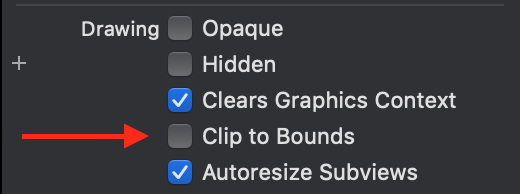

# 오류났던 부분 해결노트

## changing property masks ToBounds in transform-only layer, will have no effect

> 에러났던 해당 뷰컨트롤러의 스택뷰에서 clip To Bounds 설정을 껏더니 해결됬다

> 기본값: false, Clip to Bounds값이 true일 경우 : 서브뷰까지 테두리 기준으로  짤림.

masksToBounds도 같은 역할을 하는데, 차이라면 이건 layer.masksToBounds로 접근

참고: https://zeddios.tistory.com/37