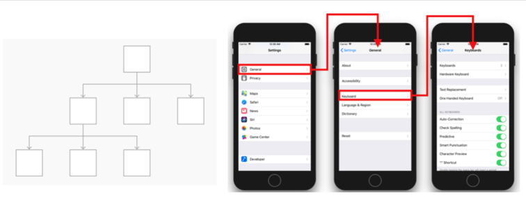

## 네비게이션 인터페이스

### 네비게이션 인터페이스란..
> 뷰 이동을 계층적 구조(드릴 다운 인터페이스)로 사용되는 인터페이스이다.



### 네비게이션 컨트롤러는 왜 쓰는거지..?
> 네비게이션 컨트롤러를 사용하게 되면 네비게이션 스택을 사용하여 다른 뷰 컨트롤러를 관리하게 되는데, 기본적으로 ios 화면전환은 stack과 같은 느낌이다.  인터페이스의 stack이란 화면이 바뀔 때마다 원래 있던 화면 위에 새 화면이 올라가는 형식인데 그래서 다시 이젠 화면으로 돌아갈 때엔 이전에 올렸던 화면을 빼야한다. 여기서 네이게이션 컨트롤러를 사용하면 뷰를 pop 하거나 push를 하기 용의해지는데, 뷰를 pop하게 되면 이전에 올라갔던 화면을 빼주는 역할을 하게 된다. + 추가요청..

### 네비게이션 스택의 팝과 푸쉬
1. 네비게이션 스택의 push
> 네비게이션 스택에 새로운 뷰 컨트롤러가 푸쉬되면서 인스턴스가 생성되고, 내비게이션 스택에 추가
~~~
self.navigationController?.pushViewController(viewController: UIViewController>, animated: true)
~~~

2. 네비게이션 스택의 pop
> 네비게이션 스택에 존재하는 뷰 컨트롤러가 팝 될 때 생성되었던 뷰컨트롤러의 인스턴스는 다른 곳에서 참조되고 있지 않다면 메모리에서 해제되고, 내비게이션 스택에서 삭제됨
~~~
self.navigationController?.popViewController(animated: true)
~~~

### UINavigationController 코드 사용법
```
// 루트 뷰 컨트롤러가 될 뷰 컨트롤러를 생성합니다.
let rootViewController = UIViewController()
// 위에서 생성한 뷰 컨트롤러로 내비게이션 컨트롤러를 생성합니다.
let navigationController = UINavigationController(rootViewController: rootViewController)
```

### 네비게이션 바 지우기
1. 스토리보드에서
> 
2. 코드
```
navigationController?.isNavigationBarHidden = true
```
#### 참고
- [UINavigationBar - UIKit](https://developer.apple.com/documentation/uikit/uinavigationbar)
- [UINavigationController - UIKit](https://developer.apple.com/documentation/uikit/uinavigationcontroller)

[돌아가기 > 배우는 내용](https://github.com/kbw2204/swiftNote)